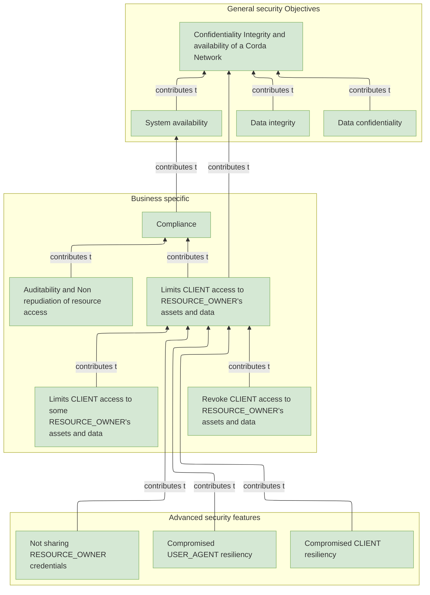

 

 

# OAuth 2.0 Threat Model

Version: rfc6819

Last update: 2023-07-02 11:54:36 

Authors: Example by Security Research team at *R3* based on: https://datatracker.ietf.org/doc/html/rfc6819

- David Cervigni

## Table of contents 

   * **[OAuth 2.0 Threat Model](#oauth-2.0-threat-model)**
     * **[Executive Summary](#executive-summary)**
     * **[Threats Summary](#threats-summary)**
     * **[OAuth 2.0 - scope of analysis](#oauth-2.0---scope-of-analysis)**
       * **[Overview](#overview)**
       * **[Security Objectives](#security-objectives)**
       * **[Linked threat Models](#linked-threat-models)**
       * **[Diagrams](#diagrams)**
       * **[Attackers](#attackers)**
       * **[Assumptions](#assumptions)**
       * **[Assets](#assets)**
         * **[Summary Table](#summary-table)**
         * **[Details](#details)**
     * **[OAuth 2.0 Analysis](#oauth-2.0-analysis)**
     * **[OAuth 2.0 Threats](#oauth-2.0-threats)**
   * **[Authorization Endpoint Threat Model](#authorization-endpoint-threat-model)**
     * **[Authorization Endpoint - scope of analysis](#authorization-endpoint---scope-of-analysis)**
       * **[Overview](#overview)**
       * **[Security Objectives](#security-objectives)**
       * **[Diagrams](#diagrams)**
       * **[Attackers](#attackers)**
       * **[Assumptions](#assumptions)**
       * **[Assets](#assets)**
         * **[Summary Table](#summary-table)**
         * **[Details](#details)**
     * **[Authorization Endpoint Analysis](#authorization-endpoint-analysis)**
     * **[Authorization Endpoint Threats](#authorization-endpoint-threats)**
       * **[`(AuthServerPhishing1)` Password Phishing by Counterfeit Authorization Server](#(authserverphishing1)-password-phishing-by-counterfeit-authorization-server)**
       * **[`(TOO_MUCH_GRANT)` User Unintentionally Grants Too Much Access Scope](#(too_much_grant)-user-unintentionally-grants-too-much-access-scope)**
     * **[Requests For Information](#requests-for-information)**

## Executive Summary

 ##TODO change search to not fully mitigated threats (configure flag correctly on threats yaml)
> This section contains an executive summary of the threats and thier mitigation status

  **No unmitigated threats without operational countermeasures were identified**

## Threats Summary

> This section contains an executive summary of the threats and thier mitigation status

There are a total of **2** identified threats of which **2** are not fully mitigated 
by default, and  **0** are unmitigated without proposed operational controls. 

<table markdown="block" style="print-color-adjust: exact; -webkit-print-color-adjust: exact;">
<tr><th>Threat ID</th><th>CVSS</th><th>Valid when (condition)</th><th>Fully mitigated</th><th>Has Operational   coutnermeasures</th></tr>
<tr markdown="block">
</td><td>
<a href="#(authserverphishing1)-password-phishing-by-counterfeit-authorization-server">OAuth2.AuthorizationEndpoint.AuthServerPhishing1</a> 
</td>
</td><td style="background-color: #f9a009; " > <strong>6.8 (Medium)</strong> </td>
</td><td>
Always valid
</td>

<td style="text-align: center ">
&#10060; </td>

<td style="text-align: center ">
Yes </td>

</tr>
<tr markdown="block">
</td><td>
<a href="#(too_much_grant)-user-unintentionally-grants-too-much-access-scope">OAuth2.AuthorizationEndpoint.TOO_MUCH_GRANT</a> 
</td>
</td><td style="background-color: #f9a009; " > <strong>5.3 (Medium)</strong> </td>
</td><td>
Always valid
</td>

<td style="text-align: center ">
&#10060; </td>

<td style="text-align: center ">
Yes </td>

</tr>
</table>

## OAuth 2.0 - scope of analysis

### Overview

Functional objectives:

  - Allow final users (RESOURCE_OWNERS) to integrate services from third party apps **easily** (without credential creation like new accounts/username/password)
  - Allow users to login to new services without explicitly creating a new set of credentials (authorize a new third party service VS authenticate on a third party service)
  - Allows CLIENT (apps) to delegate/abstract/de-scope authentication

  TODO: describe the authz relationship with OPEN ID Connect , holistic real approach from CLIENT development point of view.

  Non-functional requirements:
  - Integrate third party services **securely**

  Reference: https://datatracker.ietf.org/doc/html/rfc6749

  >The OAuth 2.0 authorization framework enables a third-party
    application to obtain limited access to an HTTP service, either on
    behalf of a resource owner by orchestrating an approval interaction
    between the resource owner and the HTTP service, or by allowing the
    third-party application to obtain access on its own behalf.

  There are 3 type of Authorization Grant:

  - Authorization code
  - Implicit
  - Resource owner password credentials
  - Client credentials

  > [1.3](https://datatracker.ietf.org/doc/html/rfc6749#section-1.3).  Authorization Grant
    An authorization grant is a credential representing the resource
    owner's authorization (to access its protected resources) used by the
    client to obtain an access token.  This specification defines four
    grant types -- authorization code, implicit, resource owner password
    credentials, and client credentials -- as well as an extensibility
    mechanism for defining additional types.
    >
  [1.3.1](https://datatracker.ietf.org/doc/html/rfc6749#section-1.3.1).  Authorization Code
    The authorization code is obtained by using an authorization server
    as an intermediary between the client and resource owner.  Instead of
    requesting authorization directly from the resource owner, the client
    directs the resource owner to an authorization server (via its
    user-agent as defined in [[RFC2616](https://datatracker.ietf.org/doc/html/rfc2616)]), which in turn directs the  resource owner back to the client with the authorization code.
    Before directing the resource owner back to the client with the
    authorization code, the authorization server authenticates the
    resource owner and obtains authorization.  Because the resource owner
    only authenticates with the authorization server, the resource
    owner's credentials are never shared with the client.
    The authorization code provides a few important security benefits,
    such as the ability to authenticate the client, as well as the
    transmission of the access token directly to the client without
    passing it through the resource owner's user-agent and potentially
    exposing it to others, including the resource owner.
      [1.3.2](https://datatracker.ietf.org/doc/html/rfc6749#section-1.3.2).  Implicit
    The implicit grant is a simplified authorization code flow optimized
    for clients implemented in a browser using a scripting language such
    as JavaScript.  In the implicit flow, instead of issuing the client
    an authorization code, the client is issued an access token directly
    (as the result of the resource owner authorization).  The grant type
    is implicit, as no intermediate credentials (such as an authorization
    code) are issued (and later used to obtain an access token).
    When issuing an access token during the implicit grant flow, the
    authorization server does not authenticate the client.  In some
    cases, the client identity can be verified via the redirection URI
    used to deliver the access token to the client.  The access token may
    be exposed to the resource owner or other applications with access to
    the resource owner's user-agent.
    Implicit grants improve the responsiveness and efficiency of some
    clients (such as a client implemented as an in-browser application),
    since it reduces the number of round trips required to obtain an
    access token.  However, this convenience should be weighed against
    the security implications of using implicit grants, such as those
    described in Sections [10.3](https://datatracker.ietf.org/doc/html/rfc6749#section-10.3) and [10.16](https://datatracker.ietf.org/doc/html/rfc6749#section-10.16), especially when the
    authorization code grant type is available.

  
 

### Security Objectives

  **Summary list:**

**General security Objectives**

  - **FULL_CIA**: Confidentiality Integrity and availability of a Corda Network

  - **INTEGRITY**: Data integrity

  - **CONFIDENTIALITY**: Data confidentiality

  - **AVAILABILITY**: System availability

**Business specific**

  - **COMPLIANCE**: Compliance

  - **NON_REPUDIATION**: Auditability and Non repudiation of resource access

  - **CLIENT_ACCESS_LIMITATION**: Limits CLIENT access to RESOURCE_OWNER's assets and data

  - **CLIENT_REVOKE_ACCESS**: Revoke CLIENT access to RESOURCE_OWNER's assets and data

  - **CLIENT_LIMIT_ACCESS**: Limits CLIENT access to some RESOURCE_OWNER's assets and data

**Advanced security features**

  - **NOT_SHARING_OWNER_CREDENTIAL**: Not sharing RESOURCE_OWNER credentials

  - **USER_AGENT_RESILIENCY**: Compromised USER_AGENT resiliency

  - **CLIENT_RESILIENCY**: Compromised CLIENT resiliency

  **Diagram:**

<!-- mermaid start. Do not delete this comment-->

<!-- mermaid end. comment needed to it covert to HTML-->

  **Details:**

<dl markdown="block">
<dt>ID</dt><dd><code><a id="OAuth2.FULL_CIA">FULL_CIA</a></code></dd>
<dt markdown="block">Title</dt>
<dd markdown="block">Confidentiality Integrity and availability of a Corda Network</dd>
<dt markdown="block">Description</dt>
<dd markdown="block">Ability to maintain fundamental confidentiality
integrity and availability of the system
</dd>

</dl>

<dl markdown="block">
<dt>ID</dt><dd><code><a id="OAuth2.INTEGRITY">INTEGRITY</a></code></dd>
<dt markdown="block">Title</dt>
<dd markdown="block">Data integrity</dd>
<dt markdown="block">Description</dt>
<dd markdown="block">Ability to maintain fundamental integrity of the system
</dd>
  <dt markdown="block"> Contributes to:</dt>
  <dd markdown="block">Contributes to <code><a href="#OAuth2.FULL_CIA">FULL_CIA</a></code> *(Confidentiality Integrity and availability of a Corda Network)*</dd>

</dl>

<dl markdown="block">
<dt>ID</dt><dd><code><a id="OAuth2.CONFIDENTIALITY">CONFIDENTIALITY</a></code></dd>
<dt markdown="block">Title</dt>
<dd markdown="block">Data confidentiality</dd>
<dt markdown="block">Description</dt>
<dd markdown="block">Ability to maintain fundamental confidentiality of the system data
</dd>
  <dt markdown="block"> Contributes to:</dt>
  <dd markdown="block">Contributes to <code><a href="#OAuth2.FULL_CIA">FULL_CIA</a></code> *(Confidentiality Integrity and availability of a Corda Network)*</dd>

</dl>

<dl markdown="block">
<dt>ID</dt><dd><code><a id="OAuth2.AVAILABILITY">AVAILABILITY</a></code></dd>
<dt markdown="block">Title</dt>
<dd markdown="block">System availability</dd>
<dt markdown="block">Description</dt>
<dd markdown="block">Ability to maintain fundamental availability of the system
</dd>
  <dt markdown="block"> Contributes to:</dt>
  <dd markdown="block">Contributes to <code><a href="#OAuth2.FULL_CIA">FULL_CIA</a></code> *(Confidentiality Integrity and availability of a Corda Network)*</dd>

</dl>

<dl markdown="block">
<dt>ID</dt><dd><code><a id="OAuth2.COMPLIANCE">COMPLIANCE</a></code></dd>
<dt markdown="block">Title</dt>
<dd markdown="block">Compliance</dd>
<dt markdown="block">Description</dt>
<dd markdown="block">Ability to obtain and maintain maintain compliance with required regulations
</dd>
  <dt markdown="block"> Contributes to:</dt>
  <dd markdown="block">Contributes to <code><a href="#OAuth2.AVAILABILITY">AVAILABILITY</a></code> *(System availability)*</dd>

</dl>

<dl markdown="block">
<dt>ID</dt><dd><code><a id="OAuth2.NON_REPUDIATION">NON_REPUDIATION</a></code></dd>
<dt markdown="block">Title</dt>
<dd markdown="block">Auditability and Non repudiation of resource access</dd>
<dt markdown="block">Description</dt>
<dd markdown="block">Ability to have available evidence of the users and actor mains actions, including:
  - Trackign of CLIENT access to RESOURCE_OWNER's assets and data 
</dd>
  <dt markdown="block"> Contributes to:</dt>
  <dd markdown="block">Contributes to <code><a href="#OAuth2.COMPLIANCE">COMPLIANCE</a></code> *(Compliance)*</dd>

</dl>

<dl markdown="block">
<dt>ID</dt><dd><code><a id="OAuth2.CLIENT_ACCESS_LIMITATION">CLIENT_ACCESS_LIMITATION</a></code></dd>
<dt markdown="block">Title</dt>
<dd markdown="block">Limits CLIENT access to RESOURCE_OWNER's assets and data</dd>
<dt markdown="block">Description</dt>
<dd markdown="block">Limits CLIENT access to RESOURCE_OWNER's assets and data . This includes:

  - Revoke access to CLIENT over time
  - Limit the set of resources accessed by CLIENT (authorization)
</dd>
  <dt markdown="block"> Contributes to:</dt>
  <dd markdown="block">Contributes to <code><a href="#OAuth2.FULL_CIA">FULL_CIA</a></code> *(Confidentiality Integrity and availability of a Corda Network)*</dd>
  <dt markdown="block"> Contributes to:</dt>
  <dd markdown="block">Contributes to <code><a href="#OAuth2.COMPLIANCE">COMPLIANCE</a></code> *(Compliance)*</dd>

</dl>

<dl markdown="block">
<dt>ID</dt><dd><code><a id="OAuth2.CLIENT_REVOKE_ACCESS">CLIENT_REVOKE_ACCESS</a></code></dd>
<dt markdown="block">Title</dt>
<dd markdown="block">Revoke CLIENT access to RESOURCE_OWNER's assets and data</dd>
<dt markdown="block">Description</dt>
<dd markdown="block">Revoke access to CLIENT over time
</dd>
  <dt markdown="block"> Contributes to:</dt>
  <dd markdown="block">Contributes to <code><a href="#OAuth2.CLIENT_ACCESS_LIMITATION">CLIENT_ACCESS_LIMITATION</a></code> *(Limits CLIENT access to RESOURCE_OWNER's assets and data)*</dd>

</dl>

<dl markdown="block">
<dt>ID</dt><dd><code><a id="OAuth2.CLIENT_LIMIT_ACCESS">CLIENT_LIMIT_ACCESS</a></code></dd>
<dt markdown="block">Title</dt>
<dd markdown="block">Limits CLIENT access to some RESOURCE_OWNER's assets and data</dd>
<dt markdown="block">Description</dt>
<dd markdown="block">Limit the set of resources accessed by CLIENT (authorization)
</dd>
  <dt markdown="block"> Contributes to:</dt>
  <dd markdown="block">Contributes to <code><a href="#OAuth2.CLIENT_ACCESS_LIMITATION">CLIENT_ACCESS_LIMITATION</a></code> *(Limits CLIENT access to RESOURCE_OWNER's assets and data)*</dd>

</dl>

<dl markdown="block">
<dt>ID</dt><dd><code><a id="OAuth2.NOT_SHARING_OWNER_CREDENTIAL">NOT_SHARING_OWNER_CREDENTIAL</a></code></dd>
<dt markdown="block">Title</dt>
<dd markdown="block">Not sharing RESOURCE_OWNER credentials</dd>
<dt markdown="block">Description</dt>
<dd markdown="block">Not sharing RESOURCE_OWNER credential with third parties
</dd>
  <dt markdown="block"> Contributes to:</dt>
  <dd markdown="block">Contributes to <code><a href="#OAuth2.CLIENT_ACCESS_LIMITATION">CLIENT_ACCESS_LIMITATION</a></code> *(Limits CLIENT access to RESOURCE_OWNER's assets and data)*</dd>

</dl>

<dl markdown="block">
<dt>ID</dt><dd><code><a id="OAuth2.USER_AGENT_RESILIENCY">USER_AGENT_RESILIENCY</a></code></dd>
<dt markdown="block">Title</dt>
<dd markdown="block">Compromised USER_AGENT resiliency</dd>
<dt markdown="block">Description</dt>
<dd markdown="block">Resiliency for RESOURCE_OWNER's USER_AGENT against attacks like XSS
</dd>
  <dt markdown="block"> Contributes to:</dt>
  <dd markdown="block">Contributes to <code><a href="#OAuth2.CLIENT_ACCESS_LIMITATION">CLIENT_ACCESS_LIMITATION</a></code> *(Limits CLIENT access to RESOURCE_OWNER's assets and data)*</dd>

</dl>

<dl markdown="block">
<dt>ID</dt><dd><code><a id="OAuth2.CLIENT_RESILIENCY">CLIENT_RESILIENCY</a></code></dd>
<dt markdown="block">Title</dt>
<dd markdown="block">Compromised CLIENT resiliency</dd>
<dt markdown="block">Description</dt>
<dd markdown="block">Resiliency for RESOURCE_OWNER's RESOURCES against compromised CLIENT
</dd>
  <dt markdown="block"> Contributes to:</dt>
  <dd markdown="block">Contributes to <code><a href="#OAuth2.CLIENT_ACCESS_LIMITATION">CLIENT_ACCESS_LIMITATION</a></code> *(Limits CLIENT access to RESOURCE_OWNER's assets and data)*</dd>

</dl>

  

### Linked threat Models

  - **Authorization Endpoint** (ID: OAuth2.AuthorizationEndpoint)

### Diagrams

{'assets': [{'ID': 'token', 'type': 'credential', 'title': None, 'description': None, 'inScope': True}]}

> **Note** This section contains the list of attackers, personas, roles and potential threat agents considered to be within the scope of analysis.

### Attackers

**`OAuth2.ANONYMOUS`** (from OAuth2 scope)  
<dl markdown="block">
<dt>Description:</dt><dd markdown="block">Anonymous internet user
</dd>
<dt>In Scope:</dt><dd>Yes</dd>
</dl>

**`OAuth2.RESOURCE_OWNER`** (from OAuth2 scope)  
<dl markdown="block">
<dt>Description:</dt><dd markdown="block">An entity capable of granting access to a protected resource.
When the resource owner is a person, it is referred to as an
end-user.
</dd>
<dt>In Scope:</dt><dd>Yes</dd>
</dl>

**`OAuth2.RESOURCE_SERVER`** (from OAuth2 scope)  
<dl markdown="block">
<dt>Description:</dt><dd markdown="block">The server hosting the protected resources, capable of accepting
and responding to protected resource requests using access tokens.
</dd>
<dt>In Scope:</dt><dd>Yes</dd>
</dl>

**`OAuth2.CLIENT`** (from OAuth2 scope)  
<dl markdown="block">
<dt>Description:</dt><dd markdown="block">An application making protected resource requests on behalf of the
resource owner and with its authorization.  The term "client" does
not imply any particular implementation characteristics (e.g.,
whether the application executes on a server, a desktop, or other
devices).
</dd>
<dt>In Scope:</dt><dd>Yes</dd>
</dl>

**`OAuth2.AUTHORIZATION_SERVER`** (from OAuth2 scope)  
<dl markdown="block">
<dt>Description:</dt><dd markdown="block">The server issuing access tokens to the client after successfully
authenticating the resource owner and obtaining authorization.
</dd>
<dt>In Scope:</dt><dd>Yes</dd>
</dl>

**`OAuth2.CONFIDENTIAL_CLIENT`** (from OAuth2 scope)  
<dl markdown="block">
<dt>Description:</dt><dd markdown="block">Clients capable of maintaining the confidentiality of their
credentials (e.g., client implemented on a secure server with
restricted access to the client credentials), or capable of secure
client authentication using other means.
</dd>
<dt>In Scope:</dt><dd>Yes</dd>
</dl>

**`OAuth2.PUBLIC_CLIENT`** (from OAuth2 scope)  
<dl markdown="block">
<dt>Description:</dt><dd markdown="block">Clients incapable of maintaining the confidentiality of their
credentials (e.g., clients executing on the device used by the
resource owner, such as an installed native application or a web
browser-based application), and incapable of secure client
authentication via any other means.
</dd>
<dt>In Scope:</dt><dd>Yes</dd>
</dl>

**`OAuth2.AUTHORIZATION_GRANT`** (from OAuth2 scope)  
<dl markdown="block">
<dt>Description:</dt><dd markdown="block">An authorization grant is a credential representing the resource
owner's authorization (to access its protected resources) used by the
client to obtain an access token.  This specification defines four
grant types -- authorization code, implicit, resource owner password
credentials, and client credentials -- as well as an extensibility
mechanism for defining additional types.
</dd>
<dt>In Scope:</dt><dd>Yes</dd>
</dl>

### Assumptions

<dl markdown="block">
<dt>None</dt><dd>A Auth server may host several ...
 </dd>
</dl>

### Assets

#### Summary Table

<table markdown="block">
<tr><th>Title(ID)</th><th>Type</th><th>In Scope</th></tr>
</table>

#### Details

## OAuth 2.0 Analysis

> **Note** This section documents the work performed to identify threats and thier mitigations.#
> It may contains notes from the analysis sessions.
> This analysis section may be omitted in future reports.

None  

## OAuth 2.0 Threats

> **Note** This section contains the threat and mitigations identified during the analysis phase.

  **No threat identified or listed **

  
 

# Authorization Endpoint Threat Model

## Authorization Endpoint - scope of analysis

### Overview

None 

### Security Objectives

No Security Objectives defined in this scope

### Diagrams

{'assets': [{'ID': 'token', 'type': 'credential', 'title': None, 'description': None, 'inScope': True}]}

> **Note** This section contains the list of attackers, personas, roles and potential threat agents considered to be within the scope of analysis.

### Attackers

**`OAuth2.AuthorizationEndpoint.ANONYMOUS`** (from OAuth2.AuthorizationEndpoint scope)  
<dl markdown="block">
<dt>Description:</dt><dd markdown="block">Anonymous internet user
</dd>
<dt>In Scope:</dt><dd>Yes</dd>
</dl>

**`OAuth2.AuthorizationEndpoint.CLIENT`** (from OAuth2.AuthorizationEndpoint scope)  
<dl markdown="block">
<dt>Description:</dt><dd markdown="block">Client app
</dd>
<dt>In Scope:</dt><dd>Yes</dd>
</dl>

### Assumptions

<dl markdown="block">
<dt>None</dt><dd>A Auth server may host several ...
 </dd>
</dl>

### Assets

#### Summary Table

<table markdown="block">
<tr><th>Title(ID)</th><th>Type</th><th>In Scope</th></tr>
</table>

#### Details

## Authorization Endpoint Analysis

> **Note** This section documents the work performed to identify threats and thier mitigations.#
> It may contains notes from the analysis sessions.
> This analysis section may be omitted in future reports.

None  

## Authorization Endpoint Threats

> **Note** This section contains the threat and mitigations identified during the analysis phase.

### `(AuthServerPhishing1)` Password Phishing by Counterfeit Authorization Server

```mermaid

flowchart BT

    classDef threat fill:#F8CECC,stroke:#B85450
    classDef attack fill:#F5F5F5,stroke:#666666
    classDef countermeasureIP fill:#D5E8D4,stroke:#82B366
    classDef countermeasureNIP fill:#FFF2CC,stroke:#D6B656  
    classDef default text-align:left
    
    T1["<b>Threat:</b> Spoofing, Elevation of privileges, Information Disclosure
    <b>Impact:</b> Compromised &lt;code&gt;&lt;a href=#quot;#OAuth2.CONFIDENTIALITY#quot;&gt;CONFIDENTIALITY&lt;/a&gt;&lt;/code&gt;: Data confidentiality&lt;br/&gt; Steal users&#x27; passwords&lt;br/&gt; 
    
    "]:::threat
    A1["<b>Attack:</b> A hostile party could take advantage of this
by intercepting the client&#x27;s requests and returning misleading or
otherwise incorrect responses.  This could be achieved using DNS or
Address Resolution Protocol &lpar;ARP&rpar; spoofing.  Wide deployment of OAuth
and similar protocols may [...]"]:::attack --exploits--> T1
    COAuth2.AuthorizationEndpoint.AuthServerPhishing1.AUTH_SERVER_TLS["<b>Countermeasure:</b> TLS for the authorization server"]:::countermeasureIP --mitigates--> A1

    COAuth2.AuthorizationEndpoint.AuthServerPhishing1.USER_PHISHING_AWARENESS["<b>Countermeasure:</b> Users educated to avoid phishing attacks"]:::countermeasureIP --mitigates--> A1

```

<!-- mermaid start. Do not delete this comment-->

<!-- mermaid end. comment needed to it covert to HTML-->

<dl markdown="block">

<dt>Threat Description</dt><dd markdown="block">A hostile party could take advantage of this
by intercepting the client's requests and returning misleading or
otherwise incorrect responses.  This could be achieved using DNS or
Address Resolution Protocol (ARP) spoofing.  Wide deployment of OAuth
and similar protocols may cause users to become inured to the
practice of being redirected to web sites where they are asked to
enter their passwords.  If users are not careful to verify the
authenticity of these web sites before entering their credentials, it
will be possible for attackers to exploit this practice to steal
users' passwords.
</dd>
<dt>Impact</dt><dd markdown="block">Compromised <code><a href="#OAuth2.CONFIDENTIALITY">CONFIDENTIALITY</a></code>: Data confidentiality  Steal users' passwords  </dd>

<dt>CVSS</dt>
<dd>

<strong>Base score:</strong> 6.8 (Medium) 
 
<strong>Vector:</strong><code>CVSS:3.0/AV:N/AC:H/PR:L/UI:N/S:U/C:H/I:H/A:N</code>
</dd>
</dl>

#### Counter-measures for `AuthServerPhishing1` 

<dl markdown="block">
    
**`AUTH_SERVER_TLS` TLS for the authorization server** 
<dd markdown="block">
Authorization servers should consider such attacks when developing
services based on OAuth and should require the use of transport-
layer security for any requests where the authenticity of the
authorization server or of request responses is an issue (see
Section 5.1.2).
</dd>

<dd markdown="block">
<strong>Countermeasure implemented?</strong> 
&#10004;   <strong>Public and disclosable?</strong> 
&#10004;   <strong>Is operational?</strong>&#10004;
    (operated by AUTHORIZATION_SERVER)
</dd>

    
**`USER_PHISHING_AWARENESS` Users educated to avoid phishing attacks** 
<dd markdown="block">
Authorization servers should attempt to educate users about the
risks posed by phishing attacks and should provide mechanisms that
make it easy for users to confirm the authenticity of their sites.
Section 5.1.2).
</dd>

<dd markdown="block">
<strong>Countermeasure implemented?</strong> 
&#10004;   <strong>Public and disclosable?</strong> 
&#10004;   <strong>Is operational?</strong>&#10004;
    (operated by AUTHORIZATION_SERVER)
</dd>

</dl>

### `(TOO_MUCH_GRANT)` User Unintentionally Grants Too Much Access Scope

```mermaid

flowchart BT

    classDef threat fill:#F8CECC,stroke:#B85450
    classDef attack fill:#F5F5F5,stroke:#666666
    classDef countermeasureIP fill:#D5E8D4,stroke:#82B366
    classDef countermeasureNIP fill:#FFF2CC,stroke:#D6B656  
    classDef default text-align:left
    
    T1["<b>Threat:</b> Spoofing, Elevation of privileges, Information Disclosure
    <b>Impact:</b> Compromised &lt;code&gt;&lt;a href=#quot;#OAuth2.CONFIDENTIALITY#quot;&gt;CONFIDENTIALITY&lt;/a&gt;&lt;/code&gt;: Data confidentiality&lt;br/&gt; Disclosure of  RESOURCE_OWNER&#x27;s RESOURCES&lt;br/&gt; 
    
    "]:::threat
    A1["<b>Attack:</b> When obtaining end-user authorization, the end user may not
understand the scope of the access being granted and to whom, or they
may end up providing a client with access to resources that should
not be permitted."]:::attack --exploits--> T1
    COAuth2.AuthorizationEndpoint.TOO_MUCH_GRANT.AUTH_SERVER_RE_CHECK_GRANTS["<b>Countermeasure:</b> AUTHORIZATION_SERVER policy discretional decision"]:::countermeasureIP --mitigates--> A1

    COAuth2.AuthorizationEndpoint.TOO_MUCH_GRANT.USER_AUTH_AWARENESS["<b>Countermeasure:</b> Users educated to avoid phishing attacks"]:::countermeasureIP --mitigates--> A1

```

<!-- mermaid start. Do not delete this comment-->

<!-- mermaid end. comment needed to it covert to HTML-->

<dl markdown="block">

<dt>Threat Description</dt><dd markdown="block">When obtaining end-user authorization, the end user may not
understand the scope of the access being granted and to whom, or they
may end up providing a client with access to resources that should
not be permitted.
</dd>
<dt>Impact</dt><dd markdown="block">Compromised <code><a href="#OAuth2.CONFIDENTIALITY">CONFIDENTIALITY</a></code>: Data confidentiality  Disclosure of  RESOURCE_OWNER's RESOURCES  </dd>

<dt>CVSS</dt>
<dd>

<strong>Base score:</strong> 5.3 (Medium) 
 
<strong>Vector:</strong><code>CVSS:3.0/AV:N/AC:H/PR:L/UI:N/S:U/C:H/I:N/A:N</code>
</dd>
</dl>

#### Counter-measures for `TOO_MUCH_GRANT` 

<dl markdown="block">
    
**`AUTH_SERVER_RE_CHECK_GRANTS` AUTHORIZATION_SERVER policy discretional decision** 
<dd markdown="block">
Narrow the scope, based on the client.  When obtaining end-user
authorization and where the client requests scope, the
authorization server may want to consider whether to honor that
scope based on the client identifier.  That decision is between
the client and authorization server and is outside the scope of
this spec.  The authorization server may also want to consider
what scope to grant based on the client type, e.g., providing
lower scope to public clients (Section 5.1.5.1).
</dd>

<dd markdown="block">
<strong>Countermeasure implemented?</strong> 
&#10004;   <strong>Public and disclosable?</strong> 
&#10004;   <strong>Is operational?</strong>&#10004;
    (operated by AUTHORIZATION_SERVER)
</dd>

    
**`USER_AUTH_AWARENESS` Users educated to avoid phishing attacks** 
<dd markdown="block">
Authorization servers should attempt to educate users about the
risks posed by phishing attacks and should provide mechanisms that
make it easy for users to confirm the authenticity of their sites.
Section 5.1.2).
</dd>

<dd markdown="block">
<strong>Countermeasure implemented?</strong> 
&#10004;   <strong>Public and disclosable?</strong> 
&#10004;   <strong>Is operational?</strong>&#10004;
    (operated by AUTHORIZATION_SERVER)
</dd>

</dl>

## Requests For Information

<ol></ol>

