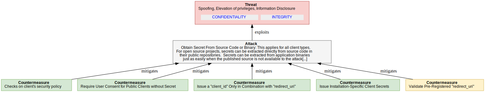
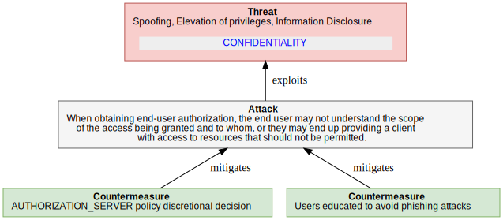
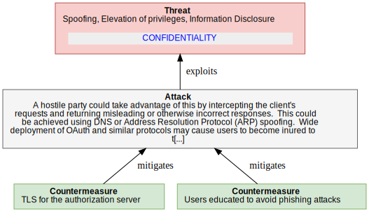
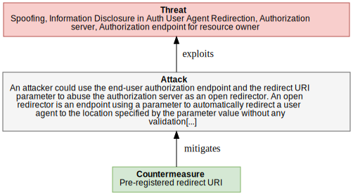
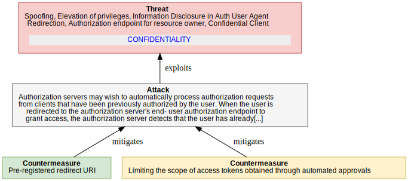
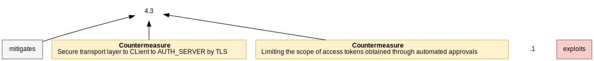
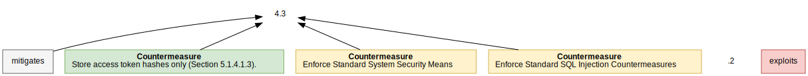
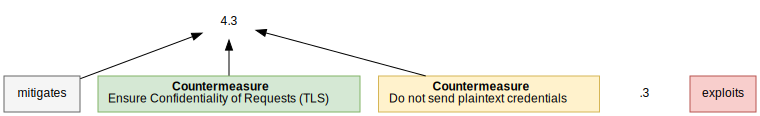
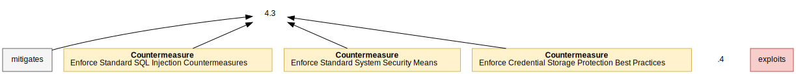
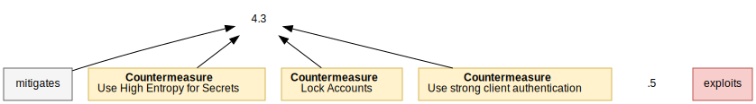

 

 

# OAuth 2.0 Threat Model

Version: rfc6819

Last update: 2023-09-15 11:58:27 

Authors: Example by David Cervigni, based on: https://datatracker.ietf.org/doc/html/rfc6819

## Table of contents 

   * **[OAuth 2.0 Threat Model](#oauth-2.0-threat-model)**
     * **[Executive Summary](#executive-summary)**
     * **[Threats Summary](#threats-summary)**
     * **[OAuth 2.0 - scope of analysis](#oauth-2.0---scope-of-analysis)**
       * **[Overview](#overview)**
       * **[Security Objectives](#security-objectives)**
       * **[Linked threat Models](#linked-threat-models)**
       * **[Diagrams](#diagrams)**
       * **[Attackers](#attackers)**
       * **[Assumptions](#assumptions)**
       * **[Assets](#assets)**
         * **[Summary Table](#summary-table)**
         * **[Details](#details)**
     * **[OAuth 2.0 Analysis](#oauth-2.0-analysis)**
     * **[OAuth 2.0 Threats](#oauth-2.0-threats)**
   * **[Client Threat Model](#client-threat-model)**
     * **[Client - scope of analysis](#client---scope-of-analysis)**
       * **[Overview](#overview)**
       * **[Security Objectives](#security-objectives)**
       * **[Diagrams](#diagrams)**
       * **[Assets](#assets)**
         * **[Summary Table](#summary-table)**
         * **[Details](#details)**
     * **[Client Analysis](#client-analysis)**
     * **[Client Threats](#client-threats)**
       * **[`(Client_Secrets_disclosure)` Client Secrets Disclosure and impersonation](#(client_secrets_disclosure)-client-secrets-disclosure-and-impersonation)**
       * **[`(TOO_MUCH_GRANT)` User Unintentionally Grants Too Much Access Scope](#(too_much_grant)-user-unintentionally-grants-too-much-access-scope)**
   * **[Authorization Server Threat Model](#authorization-server-threat-model)**
     * **[Authorization Server - scope of analysis](#authorization-server---scope-of-analysis)**
       * **[Overview](#overview)**
       * **[Security Objectives](#security-objectives)**
       * **[Diagrams](#diagrams)**
       * **[Attackers](#attackers)**
       * **[Assumptions](#assumptions)**
       * **[Assets](#assets)**
         * **[Summary Table](#summary-table)**
         * **[Details](#details)**
     * **[Authorization Server Analysis](#authorization-server-analysis)**
     * **[Authorization Server Threats](#authorization-server-threats)**
       * **[`(AuthServerPhishing1)` Password Phishing by Counterfeit Authorization Server](#(authserverphishing1)-password-phishing-by-counterfeit-authorization-server)**
       * **[`(TOO_MUCH_GRANT)` User Unintentionally Grants Too Much Access Scope](#(too_much_grant)-user-unintentionally-grants-too-much-access-scope)**
       * **[`(OPEN_REDIRECTOR)` Authorization server open redirect](#(open_redirector)-authorization-server-open-redirect)**
       * **[`(PUBLIC_CLIENT_SPOOFING1)` Malicious Client Obtains Existing Authorization by Fraud](#(public_client_spoofing1)-malicious-client-obtains-existing-authorization-by-fraud)**
       * **[`(4.3.1_EAVESDROPPING_ACCESS_TOKENS1)` Eavesdropping Access Tokens](#(4.3.1_eavesdropping_access_tokens1)-eavesdropping-access-tokens)**
       * **[`(4.3.2_AS_DB_TOKEN_DISCLOSURE)` Obtaining Access Tokens from Authorization Server Database](#(4.3.2_as_db_token_disclosure)-obtaining-access-tokens-from-authorization-server-database)**
       * **[`(4.3.3_CLIENT_CREDENTIALS_DISCLOSURE)` Disclosure of Client Credentials during Transmission](#(4.3.3_client_credentials_disclosure)-disclosure-of-client-credentials-during-transmission)**
       * **[`(4.3.4_CLIENT_CREDENTIALS_DISCLOSURE)` Obtaining Client Secret from Authorization Server Database](#(4.3.4_client_credentials_disclosure)-obtaining-client-secret-from-authorization-server-database)**
       * **[`(4.3.5_CLIENT_SECRET_BRUTE_FORCE)` Obtaining Client Secret by Online Guessing](#(4.3.5_client_secret_brute_force)-obtaining-client-secret-by-online-guessing)**
     * **[Requests For Information](#requests-for-information)**
   * **[Annex 1](#annex-1)**
   * **[Corda NextGen operational security hardening guides](#corda-nextgen-operational-security-hardening-guides)**
   * **[Operational guide for AUTHORIZATION_SERVER](#operational-guide-for-authorization_server)**
     * **[Limiting the scope of access tokens obtained through automated approvals](#limiting-the-scope-of-access-tokens-obtained-through-automated-approvals)**
     * **[Secure transport layer to client to auth_server by tls](#secure-transport-layer-to-client-to-auth_server-by-tls)**
     * **[Checks on client's security policy](#checks-on-clients-security-policy)**
     * **[Require user consent for public clients without secret](#require-user-consent-for-public-clients-without-secret)**
     * **[Issue a "client_id" only in combination with "redirect_uri"](#issue-a-"client_id"-only-in-combination-with-"redirect_uri")**
     * **[Validate pre-registered "redirect_uri"](#validate-pre-registered-"redirect_uri")**
     * **[Tls for the authorization server](#tls-for-the-authorization-server)**
     * **[Users educated to avoid phishing attacks](#users-educated-to-avoid-phishing-attacks)**
     * **[Authorization_server policy discretional decision](#authorization_server-policy-discretional-decision)**
     * **[Users educated to avoid phishing attacks](#users-educated-to-avoid-phishing-attacks)**
     * **[Authorization_server policy discretional decision](#authorization_server-policy-discretional-decision)**
     * **[Users educated to avoid phishing attacks](#users-educated-to-avoid-phishing-attacks)**
   * **[Operational guide for The operators in the Authorization Server.](#operational-guide-for-the-operators-in-the-authorization-server.)**
     * **[Enforce standard system security means](#enforce-standard-system-security-means)**
     * **[Enforce credential storage protection best practices](#enforce-credential-storage-protection-best-practices)**
     * **[Issue installation-specific client secrets](#issue-installation-specific-client-secrets)**
   * **[Operational guide for The operators of the CLIENT.](#operational-guide-for-the-operators-of-the-client.)**
     * **[Ensure confidentiality of requests (tls)](#ensure-confidentiality-of-requests-(tls))**
   * **[Annex 2](#annex-2)**
   * **[Keys classification](#keys-classification)**
     * **[Credentials](#credentials)**

## Executive Summary

 ##TODO change search to not fully mitigated threats (configure flag correctly on threats yaml)
> This section contains an executive summary of the threats and thier mitigation status

There are **1** unmitigated threats without proposed operational controls. 

<table markdown="block" style="print-color-adjust: exact; -webkit-print-color-adjust: exact;">
<tr><th>Threat ID</th><th>CVSS</th><th>Always valid</th></tr>
<tr markdown="block">
</td><td>
<a href="#(open_redirector)-authorization-server-open-redirect">OAuth2.0.AuthorizationServer.OPEN_REDIRECTOR</a> 
</td>
</td><td style="background-color: #df3d03; " > <strong>8.2 (High)</strong> </td>
</td><td  style="text-align: center ">
Yes
</td>
</tr>
</table>

## Threats Summary

> This section contains an executive summary of the threats and thier mitigation status

There are a total of **11** identified threats of which **6** are not fully mitigated 
by default, and  **1** are unmitigated without proposed operational controls. 

<table markdown="block" style="print-color-adjust: exact; -webkit-print-color-adjust: exact;">
<tr><th>Threat ID</th><th>CVSS</th><th>Valid when (condition)</th><th>Fully mitigated</th><th>Has Operational   coutnermeasures</th></tr>
<tr markdown="block">
</td><td>
<a href="#(open_redirector)-authorization-server-open-redirect">OAuth2.0.AuthorizationServer.OPEN_REDIRECTOR</a> 
</td>
</td><td style="background-color: #df3d03; " > <strong>8.2 (High)</strong> </td>
</td><td>
Always valid
</td>

<td style="text-align: center ">
&#10060; </td>

<td style="text-align: center ">
No </td>

</tr>
<tr markdown="block">
</td><td>
<a href="#(public_client_spoofing1)-malicious-client-obtains-existing-authorization-by-fraud">OAuth2.0.AuthorizationServer.PUBLIC_CLIENT_SPOOFING1</a> 
</td>
</td><td style="background-color: #df3d03; " > <strong>8.1 (High)</strong> </td>
</td><td>
Always valid
</td>

<td style="text-align: center ">
&#10060; </td>

<td style="text-align: center ">
Yes </td>

</tr>
<tr markdown="block">
</td><td>
<a href="#(client_secrets_disclosure)-client-secrets-disclosure-and-impersonation">OAuth2.0.Client.Client_Secrets_disclosure</a> 
</td>
</td><td style="background-color: #f9a009; " > <strong>6.8 (Medium)</strong> </td>
</td><td>
Always valid
</td>

<td style="text-align: center ">
&#10060; </td>

<td style="text-align: center ">
Yes </td>

</tr>
<tr markdown="block">
</td><td>
<a href="#(authserverphishing1)-password-phishing-by-counterfeit-authorization-server">OAuth2.0.AuthorizationServer.AuthServerPhishing1</a> 
</td>
</td><td style="background-color: #f9a009; " > <strong>6.8 (Medium)</strong> </td>
</td><td>
Always valid
</td>

<td style="text-align: center ">
&#10060; </td>

<td style="text-align: center ">
Yes </td>

</tr>
<tr markdown="block">
</td><td>
<a href="#(too_much_grant)-user-unintentionally-grants-too-much-access-scope">OAuth2.0.Client.TOO_MUCH_GRANT</a> 
</td>
</td><td style="background-color: #f9a009; " > <strong>5.3 (Medium)</strong> </td>
</td><td>
Always valid
</td>

<td style="text-align: center ">
&#10060; </td>

<td style="text-align: center ">
Yes </td>

</tr>
<tr markdown="block">
</td><td>
<a href="#(too_much_grant)-user-unintentionally-grants-too-much-access-scope">OAuth2.0.AuthorizationServer.TOO_MUCH_GRANT</a> 
</td>
</td><td style="background-color: #f9a009; " > <strong>5.3 (Medium)</strong> </td>
</td><td>
Always valid
</td>

<td style="text-align: center ">
&#10060; </td>

<td style="text-align: center ">
Yes </td>

</tr>
<tr markdown="block">
</td><td>
<a href="#(4.3.2_as_db_token_disclosure)-obtaining-access-tokens-from-authorization-server-database">OAuth2.0.AuthorizationServer.4.3.2_AS_DB_TOKEN_DISCLOSURE</a> 
</td>
</td><td style="background-color: #df3d03; " > <strong>8.1 (High)</strong> </td>
</td><td>
Always valid
</td>

<td style="text-align: center ">
&#10004; </td>

<td style="text-align: center ">
Yes </td>

</tr>
<tr markdown="block">
</td><td>
<a href="#(4.3.5_client_secret_brute_force)-obtaining-client-secret-by-online-guessing">OAuth2.0.AuthorizationServer.4.3.5_CLIENT_SECRET_BRUTE_FORCE</a> 
</td>
</td><td style="background-color: #df3d03; " > <strong>7.7 (High)</strong> </td>
</td><td>
Always valid
</td>

<td style="text-align: center ">
&#10004; </td>

<td style="text-align: center ">
No </td>

</tr>
<tr markdown="block">
</td><td>
<a href="#(4.3.1_eavesdropping_access_tokens1)-eavesdropping-access-tokens">OAuth2.0.AuthorizationServer.4.3.1_EAVESDROPPING_ACCESS_TOKENS1</a> 
</td>
</td><td style="background-color: #df3d03; " > <strong>7.4 (High)</strong> </td>
</td><td>
Always valid
</td>

<td style="text-align: center ">
&#10004; </td>

<td style="text-align: center ">
Yes </td>

</tr>
<tr markdown="block">
</td><td>
<a href="#(4.3.3_client_credentials_disclosure)-disclosure-of-client-credentials-during-transmission">OAuth2.0.AuthorizationServer.4.3.3_CLIENT_CREDENTIALS_DISCLOSURE</a> 
</td>
</td><td style="background-color: #df3d03; " > <strong>7.4 (High)</strong> </td>
</td><td>
Always valid
</td>

<td style="text-align: center ">
&#10004; </td>

<td style="text-align: center ">
Yes </td>

</tr>
<tr markdown="block">
</td><td>
<a href="#(4.3.4_client_credentials_disclosure)-obtaining-client-secret-from-authorization-server-database">OAuth2.0.AuthorizationServer.4.3.4_CLIENT_CREDENTIALS_DISCLOSURE</a> 
</td>
</td><td style="background-color: #df3d03; " > <strong>7.4 (High)</strong> </td>
</td><td>
Always valid
</td>

<td style="text-align: center ">
&#10004; </td>

<td style="text-align: center ">
Yes </td>

</tr>
</table>

## OAuth 2.0 - scope of analysis

### Overview

Functional objectives:

  - Allow final users (RESOURCE_OWNERS) to integrate services from third party apps **easily** (without credential creation like new accounts/username/password)
  - Allow users to login to new services without explicitly creating a new set of credentials (authorize a new third party service VS authenticate on a third party service)
  - Allows CLIENT (apps) to delegate/abstract/de-scope authentication

  TODO: describe the authz relationship with OPEN ID Connect , holistic real approach from CLIENT development point of view.

  Non-functional requirements:
  - Integrate third party services **securely**

  Reference: https://datatracker.ietf.org/doc/html/rfc6749

  >The OAuth 2.0 authorization framework enables a third-party
    application to obtain limited access to an HTTP service, either on
    behalf of a resource owner by orchestrating an approval interaction
    between the resource owner and the HTTP service, or by allowing the
    third-party application to obtain access on its own behalf.

  There are 3 type of Authorization Grant:

  - Authorization code
  - Implicit
  - Resource owner password credentials
  - Client credentials

  > [1.3](https://datatracker.ietf.org/doc/html/rfc6749#section-1.3).  Authorization Grant
    An authorization grant is a credential representing the resource
    owner's authorization (to access its protected resources) used by the
    client to obtain an access token.  This specification defines four
    grant types -- authorization code, implicit, resource owner password
    credentials, and client credentials -- as well as an extensibility
    mechanism for defining additional types.
    >
  [1.3.1](https://datatracker.ietf.org/doc/html/rfc6749#section-1.3.1).  Authorization Code
    The authorization code is obtained by using an authorization server
    as an intermediary between the client and resource owner.  Instead of
    requesting authorization directly from the resource owner, the client
    directs the resource owner to an authorization server (via its
    user-agent as defined in [[RFC2616](https://datatracker.ietf.org/doc/html/rfc2616)]), which in turn directs the  resource owner back to the client with the authorization code.
    Before directing the resource owner back to the client with the
    authorization code, the authorization server authenticates the
    resource owner and obtains authorization.  Because the resource owner
    only authenticates with the authorization server, the resource
    owner's credentials are never shared with the client.
    The authorization code provides a few important security benefits,
    such as the ability to authenticate the client, as well as the
    transmission of the access token directly to the client without
    passing it through the resource owner's user-agent and potentially
    exposing it to others, including the resource owner.
      [1.3.2](https://datatracker.ietf.org/doc/html/rfc6749#section-1.3.2).  Implicit
    The implicit grant is a simplified authorization code flow optimized
    for clients implemented in a browser using a scripting language such
    as JavaScript.  In the implicit flow, instead of issuing the client
    an authorization code, the client is issued an access token directly
    (as the result of the resource owner authorization).  The grant type
    is implicit, as no intermediate credentials (such as an authorization
    code) are issued (and later used to obtain an access token).
    When issuing an access token during the implicit grant flow, the
    authorization server does not authenticate the client.  In some
    cases, the client identity can be verified via the redirection URI
    used to deliver the access token to the client.  The access token may
    be exposed to the resource owner or other applications with access to
    the resource owner's user-agent.
    Implicit grants improve the responsiveness and efficiency of some
    clients (such as a client implemented as an in-browser application),
    since it reduces the number of round trips required to obtain an
    access token.  However, this convenience should be weighed against
    the security implications of using implicit grants, such as those
    described in Sections [10.3](https://datatracker.ietf.org/doc/html/rfc6749#section-10.3) and [10.16](https://datatracker.ietf.org/doc/html/rfc6749#section-10.16), especially when the
    authorization code grant type is available.

  
 

### Security Objectives

  **Summary list:**

**General security Objectives**

  - **FULL_CIA**: Confidentiality Integrity and availability of a Corda Network

  - **INTEGRITY**: Data integrity

  - **CONFIDENTIALITY**: Data confidentiality

  - **AVAILABILITY**: System availability

**Business specific**

  - **COMPLIANCE**: Compliance

  - **NON_REPUDIATION**: Auditability and Non repudiation of resource access

  - **CLIENT_ACCESS_LIMITATION**: Limits CLIENT access to RESOURCE_OWNER's assets and data

  - **CLIENT_REVOKE_ACCESS**: Revoke CLIENT access to RESOURCE_OWNER's assets and data

  - **CLIENT_LIMIT_ACCESS**: Limits CLIENT access to some RESOURCE_OWNER's assets and data

**Advanced security features**

  - **NOT_SHARING_OWNER_CREDENTIAL**: Not sharing RESOURCE_OWNER credentials

  - **USER_AGENT_RESILIENCY**: Compromised USER_AGENT resiliency

  - **CLIENT_RESILIENCY**: Compromised CLIENT resiliency

  **Diagram:**
  
  **Details:**

<dl markdown="block">
<dt>ID</dt><dd><code><a id="OAuth2.0.FULL_CIA">FULL_CIA</a></code></dd>
<dt markdown="block">Title</dt>
<dd markdown="block">Confidentiality Integrity and availability of a Corda Network</dd>
<dt markdown="block">Description</dt>
<dd markdown="block">Ability to maintain fundamental confidentiality
integrity and availability of the system
</dd>

</dl>

<dl markdown="block">
<dt>ID</dt><dd><code><a id="OAuth2.0.INTEGRITY">INTEGRITY</a></code></dd>
<dt markdown="block">Title</dt>
<dd markdown="block">Data integrity</dd>
<dt markdown="block">Description</dt>
<dd markdown="block">Ability to maintain fundamental integrity of the system
</dd>
  <dt markdown="block"> Contributes to:</dt>
  <dd markdown="block">Contributes to <code><a href="#OAuth2.0.FULL_CIA">FULL_CIA</a></code> *(Confidentiality Integrity and availability of a Corda Network)*</dd>

</dl>

<dl markdown="block">
<dt>ID</dt><dd><code><a id="OAuth2.0.CONFIDENTIALITY">CONFIDENTIALITY</a></code></dd>
<dt markdown="block">Title</dt>
<dd markdown="block">Data confidentiality</dd>
<dt markdown="block">Description</dt>
<dd markdown="block">Ability to maintain fundamental confidentiality of the system data
</dd>
  <dt markdown="block"> Contributes to:</dt>
  <dd markdown="block">Contributes to <code><a href="#OAuth2.0.FULL_CIA">FULL_CIA</a></code> *(Confidentiality Integrity and availability of a Corda Network)*</dd>

</dl>

<dl markdown="block">
<dt>ID</dt><dd><code><a id="OAuth2.0.AVAILABILITY">AVAILABILITY</a></code></dd>
<dt markdown="block">Title</dt>
<dd markdown="block">System availability</dd>
<dt markdown="block">Description</dt>
<dd markdown="block">Ability to maintain fundamental availability of the system
</dd>
  <dt markdown="block"> Contributes to:</dt>
  <dd markdown="block">Contributes to <code><a href="#OAuth2.0.FULL_CIA">FULL_CIA</a></code> *(Confidentiality Integrity and availability of a Corda Network)*</dd>

</dl>

<dl markdown="block">
<dt>ID</dt><dd><code><a id="OAuth2.0.COMPLIANCE">COMPLIANCE</a></code></dd>
<dt markdown="block">Title</dt>
<dd markdown="block">Compliance</dd>
<dt markdown="block">Description</dt>
<dd markdown="block">Ability to obtain and maintain maintain compliance with required regulations
</dd>
  <dt markdown="block"> Contributes to:</dt>
  <dd markdown="block">Contributes to <code><a href="#OAuth2.0.AVAILABILITY">AVAILABILITY</a></code> *(System availability)*</dd>

</dl>

<dl markdown="block">
<dt>ID</dt><dd><code><a id="OAuth2.0.NON_REPUDIATION">NON_REPUDIATION</a></code></dd>
<dt markdown="block">Title</dt>
<dd markdown="block">Auditability and Non repudiation of resource access</dd>
<dt markdown="block">Description</dt>
<dd markdown="block">Ability to have available evidence of the users and actor mains actions, including:
  - Trackign of CLIENT access to RESOURCE_OWNER's assets and data 
</dd>
  <dt markdown="block"> Contributes to:</dt>
  <dd markdown="block">Contributes to <code><a href="#OAuth2.0.COMPLIANCE">COMPLIANCE</a></code> *(Compliance)*</dd>

</dl>

<dl markdown="block">
<dt>ID</dt><dd><code><a id="OAuth2.0.CLIENT_ACCESS_LIMITATION">CLIENT_ACCESS_LIMITATION</a></code></dd>
<dt markdown="block">Title</dt>
<dd markdown="block">Limits CLIENT access to RESOURCE_OWNER's assets and data</dd>
<dt markdown="block">Description</dt>
<dd markdown="block">Limits CLIENT access to RESOURCE_OWNER's assets and data . This includes:

  - Revoke access to CLIENT over time
  - Limit the set of resources accessed by CLIENT (authorization)
</dd>
  <dt markdown="block"> Contributes to:</dt>
  <dd markdown="block">Contributes to <code><a href="#OAuth2.0.FULL_CIA">FULL_CIA</a></code> *(Confidentiality Integrity and availability of a Corda Network)*</dd>
  <dt markdown="block"> Contributes to:</dt>
  <dd markdown="block">Contributes to <code><a href="#OAuth2.0.COMPLIANCE">COMPLIANCE</a></code> *(Compliance)*</dd>

</dl>

<dl markdown="block">
<dt>ID</dt><dd><code><a id="OAuth2.0.CLIENT_REVOKE_ACCESS">CLIENT_REVOKE_ACCESS</a></code></dd>
<dt markdown="block">Title</dt>
<dd markdown="block">Revoke CLIENT access to RESOURCE_OWNER's assets and data</dd>
<dt markdown="block">Description</dt>
<dd markdown="block">Revoke access to CLIENT over time
</dd>
  <dt markdown="block"> Contributes to:</dt>
  <dd markdown="block">Contributes to <code><a href="#OAuth2.0.CLIENT_ACCESS_LIMITATION">CLIENT_ACCESS_LIMITATION</a></code> *(Limits CLIENT access to RESOURCE_OWNER's assets and data)*</dd>

</dl>

<dl markdown="block">
<dt>ID</dt><dd><code><a id="OAuth2.0.CLIENT_LIMIT_ACCESS">CLIENT_LIMIT_ACCESS</a></code></dd>
<dt markdown="block">Title</dt>
<dd markdown="block">Limits CLIENT access to some RESOURCE_OWNER's assets and data</dd>
<dt markdown="block">Description</dt>
<dd markdown="block">Limit the set of resources accessed by CLIENT (authorization)
</dd>
  <dt markdown="block"> Contributes to:</dt>
  <dd markdown="block">Contributes to <code><a href="#OAuth2.0.CLIENT_ACCESS_LIMITATION">CLIENT_ACCESS_LIMITATION</a></code> *(Limits CLIENT access to RESOURCE_OWNER's assets and data)*</dd>

</dl>

<dl markdown="block">
<dt>ID</dt><dd><code><a id="OAuth2.0.NOT_SHARING_OWNER_CREDENTIAL">NOT_SHARING_OWNER_CREDENTIAL</a></code></dd>
<dt markdown="block">Title</dt>
<dd markdown="block">Not sharing RESOURCE_OWNER credentials</dd>
<dt markdown="block">Description</dt>
<dd markdown="block">Not sharing RESOURCE_OWNER credential with third parties
</dd>
  <dt markdown="block"> Contributes to:</dt>
  <dd markdown="block">Contributes to <code><a href="#OAuth2.0.CLIENT_ACCESS_LIMITATION">CLIENT_ACCESS_LIMITATION</a></code> *(Limits CLIENT access to RESOURCE_OWNER's assets and data)*</dd>

</dl>

<dl markdown="block">
<dt>ID</dt><dd><code><a id="OAuth2.0.USER_AGENT_RESILIENCY">USER_AGENT_RESILIENCY</a></code></dd>
<dt markdown="block">Title</dt>
<dd markdown="block">Compromised USER_AGENT resiliency</dd>
<dt markdown="block">Description</dt>
<dd markdown="block">Resiliency for RESOURCE_OWNER's USER_AGENT against attacks like XSS
</dd>
  <dt markdown="block"> Contributes to:</dt>
  <dd markdown="block">Contributes to <code><a href="#OAuth2.0.CLIENT_ACCESS_LIMITATION">CLIENT_ACCESS_LIMITATION</a></code> *(Limits CLIENT access to RESOURCE_OWNER's assets and data)*</dd>

</dl>

<dl markdown="block">
<dt>ID</dt><dd><code><a id="OAuth2.0.CLIENT_RESILIENCY">CLIENT_RESILIENCY</a></code></dd>
<dt markdown="block">Title</dt>
<dd markdown="block">Compromised CLIENT resiliency</dd>
<dt markdown="block">Description</dt>
<dd markdown="block">Resiliency for RESOURCE_OWNER's RESOURCES against compromised CLIENT
</dd>
  <dt markdown="block"> Contributes to:</dt>
  <dd markdown="block">Contributes to <code><a href="#OAuth2.0.CLIENT_ACCESS_LIMITATION">CLIENT_ACCESS_LIMITATION</a></code> *(Limits CLIENT access to RESOURCE_OWNER's assets and data)*</dd>

</dl>

  

### Linked threat Models

  - **Client** (ID: OAuth2.0.Client)
  - **Authorization Server** (ID: OAuth2.0.AuthorizationServer)

### Diagrams

None

> **Note** This section contains the list of attackers, personas, roles and potential threat agents considered to be within the scope of analysis.

### Attackers

**`OAuth2.0.ANONYMOUS`** (from OAuth2.0 scope)  
<dl markdown="block">
<dt>Description:</dt><dd markdown="block">Anonymous internet user
</dd>
<dt>In Scope:</dt><dd>Yes</dd>
</dl>

**`OAuth2.0.RESOURCE_OWNER`** (from OAuth2.0 scope)  
<dl markdown="block">
<dt>Description:</dt><dd markdown="block">An entity capable of granting access to a protected resource.
When the resource owner is a person, it is referred to as an
end-user.
</dd>
<dt>In Scope:</dt><dd>Yes</dd>
</dl>

**`OAuth2.0.RESOURCE_SERVER`** (from OAuth2.0 scope)  
<dl markdown="block">
<dt>Description:</dt><dd markdown="block">The server hosting the protected resources, capable of accepting
and responding to protected resource requests using access tokens.
</dd>
<dt>In Scope:</dt><dd>Yes</dd>
</dl>

**`OAuth2.0.CLIENT_OPERATOR`** (from OAuth2.0 scope)  
<dl markdown="block">
<dt>Description:</dt><dd markdown="block">The operators of the CLIENT.
</dd>
<dt>In Scope:</dt><dd>Yes</dd>
</dl>

**`OAuth2.0.AUTHORIZATION_SERVER_OPERATOR`** (from OAuth2.0 scope)  
<dl markdown="block">
<dt>Description:</dt><dd markdown="block">The operators in the Authorization Server.
</dd>
<dt>In Scope:</dt><dd>Yes</dd>
</dl>

### Assumptions

<dl markdown="block">
<dt>ATT1</dt><dd>the attacker has full access to the network between the client and
authorization servers and the client and the resource server,
respectively.  The attacker may eavesdrop on any communications
 </dd>
</dl>

<dl markdown="block">
<dt>ATT2</dt><dd>an attacker has unlimited resources to mount an attack.
 </dd>
</dl>

<dl markdown="block">
<dt>ATT3</dt><dd>two of the three parties involved in the OAuth protocol may
collude to mount an attack against the 3rd party.  For example,
the client and authorization server may be under control of an
attacker and collude to trick a user to gain access to resources.
 </dd>
</dl>

<dl markdown="block">
<dt>ARC1</dt><dd>The OAuth protocol leaves deployments with a certain degree of
freedom regarding how to implement and apply the standard.  The core
specification defines the core concepts of an authorization server
and a resource server.  Both servers can be implemented in the same
server entity, or they may also be different entities.  The latter is
typically the case for multi-service providers with a single
authentication and authorization system and is more typical in
middleware architectures.
 </dd>
</dl>

<dl markdown="block">
<dt>ARC2</dt><dd>The following data elements are stored or accessible on the
 authorization server:

 o  usernames and passwords

 o  client ids and secrets

 o  client-specific refresh tokens

 o  client-specific access tokens (in the case of handle-based design;
     see Section 3.1)

 o  HTTPS certificate/key

 o  per-authorization process (in the case of handle-based design;
     Section 3.1): "redirect_uri", "client_id", authorization "code"
 </dd>
</dl>

<dl markdown="block">
<dt>ARC3</dt><dd>The following data elements are stored or accessible on the resource
server:

o  user data (out of scope)

o  HTTPS certificate/key

o  either authorization server credentials (handle-based design; see
    Section 3.1) or authorization server shared secret/public key
    (assertion-based design; see Section 3.1)

o  access tokens (per request)

It is assumed that a resource server has no knowledge of refresh
tokens, user passwords, or client secrets.
 </dd>
</dl>

<dl markdown="block">
<dt>ARC4</dt><dd>In OAuth, a client is an application making protected resource
requests on behalf of the resource owner and with its authorization.
There are different types of clients with different implementation
and security characteristics, such as web, user-agent-based, and
native applications.  A full definition of the different client types
and profiles is given in [RFC6749], Section 2.1.

The following data elements are stored or accessible on the client:

o  client id (and client secret or corresponding client credential)

o  one or more refresh tokens (persistent) and access tokens
    (transient) per end user or other security-context or delegation
    context

o  trusted certification authority (CA) certificates (HTTPS)

o  per-authorization process: "redirect_uri", authorization "code"
 </dd>
</dl>

### Assets

#### Summary Table

<table markdown="block">
<tr><th>Title(ID)</th><th>Type</th><th>In Scope</th></tr>
<tr markdown="block"><td markdown="block">Client <code><strong markdown="block">CLIENT</code>
</td><td>system</td>
</td><td>&#x2714;&#xFE0F;</td>
</tr>
<tr markdown="block"><td markdown="block">Confidential Client <code><strong markdown="block">CONFIDENTIAL_CLIENT</code>
</td><td>system</td>
</td><td>&#x2714;&#xFE0F;</td>
</tr>
<tr markdown="block"><td markdown="block">Confidential Client <code><strong markdown="block">PUBLIC_CLIENT</code>
</td><td>system</td>
</td><td>&#x2714;&#xFE0F;</td>
</tr>
<tr markdown="block"><td markdown="block">Authorization Grant <code><strong markdown="block">AUTHORIZATION_GRANT</code>
</td><td>credential</td>
</td><td>&#x2714;&#xFE0F;</td>
</tr>
<tr markdown="block"><td markdown="block">Access Token <code><strong markdown="block">ACCESS_TOKEN</code>
</td><td>system</td>
</td><td>&#x2714;&#xFE0F;</td>
</tr>
<tr markdown="block"><td markdown="block">Client secret for authentication with AUTH_SERVER <code><strong markdown="block">CLIENT_SECRETS</code>
</td><td>credentials</td>
</td><td>&#x2714;&#xFE0F;</td>
</tr>
<tr markdown="block"><td markdown="block">Authorization server <code><strong markdown="block">AUTH_SERVER</code>
</td><td>system</td>
</td><td>&#x2714;&#xFE0F;</td>
</tr>
<tr markdown="block"><td markdown="block">Auth User Agent Redirection <code><strong markdown="block">DF_AUTH_REDIRECT</code>
</td><td>dataflow</td>
</td><td>&#x2714;&#xFE0F;</td>
</tr>
<tr markdown="block"><td markdown="block">Auth server sending the access token to the client <code><strong markdown="block">DF_ACCESS_TOKEN_CL</code>
</td><td>dataflow</td>
</td><td>&#x2714;&#xFE0F;</td>
</tr>
<tr markdown="block"><td markdown="block">Client requesting Authorization Server for the Access Token <code><strong markdown="block">DF_AUTH_GRANT_AS</code>
</td><td>dataflow</td>
</td><td>&#x2714;&#xFE0F;</td>
</tr>
<tr markdown="block"><td markdown="block">Public Client <code><strong markdown="block">CONFIDENTIAL_CLIENT</code>
</td><td>system</td>
</td><td>&#x2714;&#xFE0F;</td>
</tr>
<tr markdown="block"><td markdown="block">Public Client <code><strong markdown="block">PUBLIC_CLIENT</code>
</td><td>system</td>
</td><td>&#x2714;&#xFE0F;</td>
</tr>
<tr markdown="block"><td markdown="block">Client Identifier <code><strong markdown="block">CLIENT_ID</code>
</td><td>data</td>
</td><td>&#x2714;&#xFE0F;</td>
</tr>
</table>

#### Details

<a name='client-(system-in-scope---id-<code>client</code>)'></a>
##### Client (system in scope - ID: <code>CLIENT</code>) 

 
<dl markdown="block">
An application requesting access from the RESOURCE_OWNER (TODO: refine this description)

</dl>
 

<a name='confidential-client-(system-in-scope---id-<code>confidential_client</code>)'></a>
##### Confidential Client (system in scope - ID: <code>CONFIDENTIAL_CLIENT</code>) 

 
<dl markdown="block">
Clients capable of maintaining the confidentiality of their
credentials (e.g., client implemented on a secure server with
restricted access to the client credentials), or capable of secure
client authentication using other means.

<dt>Specifies, inherit analysis and attribute from:</dt>

<dd markdown="block"> Client  (<a href="#OAuth2.0.CLIENT">CLIENT</a>) </dd>
</dl>
 

<a name='confidential-client-(system-in-scope---id-<code>public_client</code>)'></a>
##### Confidential Client (system in scope - ID: <code>PUBLIC_CLIENT</code>) 

 
<dl markdown="block">
Clients incapable of maintaining the confidentiality of their
credentials (e.g., clients executing on the device used by the
resource owner, such as an installed native application or a web
browser-based application), and incapable of secure client
authentication via any other means.

<dt>Specifies, inherit analysis and attribute from:</dt>

<dd markdown="block"> Client  (<a href="#OAuth2.0.CLIENT">CLIENT</a>) </dd>
</dl>
 

<a name='authorization-grant-(credential-in-scope---id-<code>authorization_grant</code>)'></a>
##### Authorization Grant (credential in scope - ID: <code>AUTHORIZATION_GRANT</code>) 

 
<dl markdown="block">
An authorization grant is a credential representing the resource
owner's authorization (to access its protected resources) used by the
client to obtain an access token.  This specification defines four
grant types -- authorization code, implicit, resource owner password
credentials, and client credentials -- as well as an extensibility
mechanism for defining additional types.

</dl>
 

<a name='access-token-(system-in-scope---id-<code>access_token</code>)'></a>
##### Access Token (system in scope - ID: <code>ACCESS_TOKEN</code>) 

 
<dl markdown="block">
Access tokens are credentials used to access protected resources.  An
access token is a string representing an authorization issued to the
client.  The string is usually opaque to the client.  Tokens
represent specific scopes and durations of access, granted by the
resource owner, and enforced by the resource server and authorization
server.

The token may denote an identifier used to retrieve the authorization
information or may self-contain the authorization information in a
verifiable manner (i.e., a token string consisting of some data and a
signature).  Additional authentication credentials, which are beyond
the scope of this specification, may be required in order for the
client to use a token.

The access token provides an abstraction layer, replacing different
authorization constructs (e.g., username and password) with a single
token understood by the resource server.  This abstraction enables
issuing access tokens more restrictive than the authorization grant
used to obtain them, as well as removing the resource server's need
to understand a wide range of authentication methods.

Access tokens can have different formats, structures, and methods of
utilization (e.g., cryptographic properties) based on the resource
server security requirements.  Access token attributes and the
methods used to access protected resources are beyond the scope of
this specification and are defined by companion specifications such
as [RFC6750].

</dl>
 

<a name='client-secret-for-authentication-with-auth_server-(credentials-in-scope---id-<code>client_secrets</code>)'></a>
##### Client secret for authentication with AUTH_SERVER (credentials in scope - ID: <code>CLIENT_SECRETS</code>) 

 
<dl markdown="block">
Secrets held by CLIENT to authentication to the Authorization Server

</dl>
 

<a name='authorization-server-(system-in-scope---id-<code>auth_server</code>)'></a>
##### Authorization server (system in scope - ID: <code>AUTH_SERVER</code>) 

 
<dl markdown="block">
The server issuing access tokens to the client after successfully
authenticating the resource owner and obtaining authorization.

</dl>
 

<a name='auth-user-agent-redirection-(dataflow-in-scope---id-<code>df_auth_redirect</code>)'></a>
##### Auth User Agent Redirection (dataflow in scope - ID: <code>DF_AUTH_REDIRECT</code>) 

 
<dl markdown="block">
User Agent Redirection for Client authorization request. this is part of DF_AUTH_REQUEST
</dl>
 

<a name='auth-server-sending-the-access-token-to-the-client-(dataflow-in-scope---id-<code>df_access_token_cl</code>)'></a>
##### Auth server sending the access token to the client (dataflow in scope - ID: <code>DF_ACCESS_TOKEN_CL</code>) 

 
<dl markdown="block">
Auth server sending the access token to the client after resource owner approval
</dl>
 

<a name='client-requesting-authorization-server-for-the-access-token-(dataflow-in-scope---id-<code>df_auth_grant_as</code>)'></a>
##### Client requesting Authorization Server for the Access Token (dataflow in scope - ID: <code>DF_AUTH_GRANT_AS</code>) 

 
<dl markdown="block">
Client requesting Authorization Server for the Access Token after resource owner approval
</dl>
 

<a name='public-client-(system-in-scope---id-<code>confidential_client</code>)'></a>
##### Public Client (system in scope - ID: <code>CONFIDENTIAL_CLIENT</code>) 

 
<dl markdown="block">
Clients capable of maintaining the confidentiality of their
credentials (e.g., client implemented on a secure server with
restricted access to the client credentials), or capable of secure
client authentication using other means.
For example a web application. A web application is a confidential client running on a web
server.  Resource owners access the client via an HTML user
interface rendered in a user-agent on the device used by the
resource owner.  The client credentials as well as any access
token issued to the client are stored on the web server and are
not exposed to or accessible by the resource owner.

</dl>
 

<a name='public-client-(system-in-scope---id-<code>public_client</code>)'></a>
##### Public Client (system in scope - ID: <code>PUBLIC_CLIENT</code>) 

 
<dl markdown="block">
Clients incapable of maintaining the confidentiality of their
credentials (e.g., clients executing on the device used by the
resource owner, such as an installed native application or a web
browser-based application), and incapable of secure client
authentication via any other means.
For example a user-agent-based application or a native applications.

</dl>
 

<a name='client-identifier-(data-in-scope---id-<code>client_id</code>)'></a>
##### Client Identifier (data in scope - ID: <code>CLIENT_ID</code>) 

 
<dl markdown="block">
The authorization server issues the registered client a client
identifier -- a unique string representing the registration
information provided by the client.  The client identifier is not a
secret; it is exposed to the resource owner and MUST NOT be used
alone for client authentication.  The client identifier is unique to
the authorization server.

The client identifier string size is left undefined by this
specification.  The client should avoid making assumptions about the
identifier size.  The authorization server SHOULD document the size
of any identifier it issues.

</dl>
 

## OAuth 2.0 Analysis

> **Note** This section documents the work performed to identify threats and thier mitigations.#
> It may contains notes from the analysis sessions.
> This analysis section may be omitted in future reports.

None  

## OAuth 2.0 Threats

> **Note** This section contains the threat and mitigations identified during the analysis phase.

  **No threat identified or listed **

  
 

# Client Threat Model

## Client - scope of analysis

### Overview

None 

### Security Objectives

No Security Objectives defined in this scope

### Diagrams

None

> **Note** This section contains the list of attackers, personas, roles and potential threat agents considered to be within the scope of analysis.

### Assets

#### Summary Table

<table markdown="block">
<tr><th>Title(ID)</th><th>Type</th><th>In Scope</th></tr>
</table>

#### Details

## Client Analysis

> **Note** This section documents the work performed to identify threats and thier mitigations.#
> It may contains notes from the analysis sessions.
> This analysis section may be omitted in future reports.

None  

## Client Threats

> **Note** This section contains the threat and mitigations identified during the analysis phase.

### `(Client_Secrets_disclosure)` Client Secrets Disclosure and impersonation

<dl markdown="block">

<dt>Threat Description</dt><dd markdown="block">Obtain Secret From Source Code or Binary:
This applies for all client types.  For open source projects, secrets
can be extracted directly from source code in their public
repositories.  Secrets can be extracted from application binaries
just as easily when the published source is not available to the
attacker.  Even if an application takes significant measures to
obfuscate secrets in their application distribution, one should
consider that the secret can still be reverse-engineered by anyone
with access to a complete functioning application bundle or binary.
</dd>
<dt>Impact</dt><dd markdown="block">- Client authentication of access to the authorization server can be
bypassed.
- Stolen refresh tokens or authorization "codes" can be replayed.
- Client spoofing/impersonation
  <code><a href="#OAuth2.0.CONFIDENTIALITY">CONFIDENTIALITY</a></code><code><a href="#OAuth2.0.INTEGRITY">INTEGRITY</a></code></dd>

<dt>CVSS</dt>
<dd>

<strong>Base score:</strong> 6.8 (Medium) 
 
<strong>Vector:</strong><code>CVSS:3.0/AV:N/AC:H/PR:L/UI:N/S:U/C:H/I:H/A:N</code>
</dd>
</dl>

#### Counter-measures for `Client_Secrets_disclosure` 

<dl markdown="block">
    
**`5.2.3.1_CLIENT_CHECK1` Checks on client's security policy** 
<dd markdown="block">
Don't issue secrets to public clients or clients with
inappropriate security policy
</dd>

<dd markdown="block">
<strong>Countermeasure implemented?</strong> 
&#10004;   <strong>Public and disclosable?</strong> 
&#10004;   <strong>Is operational?</strong>&#10004;
    (operated by AUTHORIZATION_SERVER)
</dd>

    
**`5.2.3.2.User_Consent1` Require User Consent for Public Clients without Secret** 
<dd markdown="block">
Authorization servers should not allow automatic authorization for
public clients.  The authorization server may issue an individual
client id but should require that all authorizations are approved by
the end user.  For clients without secrets, this is a countermeasure
against the following threat:
  -  Impersonation of public client applications.
</dd>

<dd markdown="block">
<strong>Countermeasure implemented?</strong> 
&#10004;   <strong>Public and disclosable?</strong> 
&#10004;   <strong>Is operational?</strong>&#10004;
    (operated by AUTHORIZATION_SERVER)
</dd>

    
**`5.2.3.3_client_id_to_redirect_uri` Issue a "client_id" Only in Combination with "redirect_uri"** 
<dd markdown="block">
The authorization server may issue a "client_id" and bind the
  "client_id" to a certain pre-configured "redirect_uri".  Any
  authorization request with another redirect URI is refused
  automatically.  Alternatively, the authorization server should not
  accept any dynamic redirect URI for such a "client_id" and instead
  should always redirect to the well-known pre-configured redirect URI.
  This is a countermeasure for clients without secrets against the
  following threats:

  -  Cross-site scripting attacks

  -  Impersonation of public client applications
</dd>

<dd markdown="block">
<strong>Countermeasure implemented?</strong> 
&#10004;   <strong>Public and disclosable?</strong> 
&#10004;   <strong>Is operational?</strong>&#10004;
    (operated by AUTHORIZATION_SERVER)
</dd>

    
**`5.2.3.4_SPECIFIC_CLIENT_SECRETS` Issue Installation-Specific Client Secrets** 
<dd markdown="block">
An authorization server may issue separate client identifiers and
corresponding secrets to the different installations of a particular
client (i.e., software package).  The effect of such an approach
would be to turn otherwise "public" clients back into "confidential"
clients.

For web applications, this could mean creating one "client_id" and
"client_secret" for each web site on which a software package is
installed.  So, the provider of that particular site could request a
client id and secret from the authorization server during the setup
of the web site.  This would also allow the validation of some of the
properties of that web site, such as redirect URI, web site URL, and
whatever else proves useful.  The web site provider has to ensure the
security of the client secret on the site.

For native applications, things are more complicated because every
copy of a particular application on any device is a different
installation.  Installation-specific secrets in this scenario will
require obtaining a "client_id" and "client_secret" either

1.  during the download process from the application market, or

2.  during installation on the device.

Either approach will require an automated mechanism for issuing
client ids and secrets, which is currently not defined by OAuth.

The first approach would allow the achievement of a certain level of
trust in the authenticity of the application, whereas the second
option only allows the authentication of the installation but not the
validation of properties of the client.  But this would at least help
to prevent several replay attacks.  Moreover, installation-specific
"client_ids" and secrets allow the selective revocation of all
refresh tokens of a specific installation at once.
</dd>

<dd markdown="block">
<strong>Countermeasure implemented?</strong> 
&#10004;   <strong>Public and disclosable?</strong> 
&#10004;   <strong>Is operational?</strong>&#10004;
    (operated by AUTHORIZATION_SERVER_OPERATOR)
</dd>

    
**`5.2.3.5_VALIDATE_REDIRECT_URI` Validate Pre-Registered "redirect_uri"** 
<dd markdown="block">
An authorization server should require all clients to register their
"redirect_uri", and the "redirect_uri" should be the full URI as
defined in [RFC6749].  The way that this registration is performed is
out of scope of this document.  As per the core spec, every actual
redirect URI sent with the respective "client_id" to the end-user
authorization endpoint must match the registered redirect URI.  Where
it does not match, the authorization server should assume that the
inbound GET request has been sent by an attacker and refuse it.
Note: The authorization server should not redirect the user agent
back to the redirect URI of such an authorization request.
Validating the pre-registered "redirect_uri" is a countermeasure
against the following threats:

o  Authorization "code" leakage through counterfeit web site: allows
    authorization servers to detect attack attempts after the first
    redirect to an end-user authorization endpoint (Section 4.4.1.7).

o  Open redirector attack via a client redirection endpoint
    (Section 4.1.5).

o  Open redirector phishing attack via an authorization server
    redirection endpoint (Section 4.2.4).

The underlying assumption of this measure is that an attacker will
need to use another redirect URI in order to get access to the
authorization "code".  Deployments might consider the possibility of
an attacker using spoofing attacks to a victim's device to circumvent
this security measure.

Note: Pre-registering clients might not scale in some deployments
(manual process) or require dynamic client registration (not
specified yet).  With the lack of dynamic client registration, a
pre-registered "redirect_uri" only works for clients bound to certain
deployments at development/configuration time.  As soon as dynamic
resource server discovery is required, the pre-registered
"redirect_uri" may no longer be feasible.
5_Validate_redirect_uri

Note: An invalid redirect URI indicates an
invalid client, whereas a valid redirect URI does not necessarily
indicate a valid client. The level of confidence depends on the
client type. For web applications, the level of confidence is
high, since the redirect URI refers to the globally unique network
endpoint of this application, whose fully qualified domain name
(FQDN) is also validated using HTTPS server authentication by the
user agent. In contrast, for native clients, the redirect URI
typically refers to device local resources, e.g., a custom scheme.
So, a malicious client on a particular device can use the valid
redirect URI the legitimate client uses on all other devices.
</dd>

<dd markdown="block">
<strong>Countermeasure implemented?</strong> 
&#10060;   <strong>Public and disclosable?</strong> 
&#10004;   <strong>Is operational?</strong>&#10004;
    (operated by AUTHORIZATION_SERVER)
</dd>

</dl>

### `(TOO_MUCH_GRANT)` User Unintentionally Grants Too Much Access Scope

<dl markdown="block">

<dt>Threat Description</dt><dd markdown="block">When obtaining end-user authorization, the end user may not
understand the scope of the access being granted and to whom, or they
may end up providing a client with access to resources that should
not be permitted.
</dd>
<dt>Impact</dt><dd markdown="block">Disclosure of  RESOURCE_OWNER's RESOURCES  <code><a href="#OAuth2.0.CONFIDENTIALITY">CONFIDENTIALITY</a></code></dd>

<dt>CVSS</dt>
<dd>

<strong>Base score:</strong> 5.3 (Medium) 
 
<strong>Vector:</strong><code>CVSS:3.0/AV:N/AC:H/PR:L/UI:N/S:U/C:H/I:N/A:N</code>
</dd>
</dl>

#### Counter-measures for `TOO_MUCH_GRANT` 

<dl markdown="block">
    
**`AUTH_SERVER_RE_CHECK_GRANTS` AUTHORIZATION_SERVER policy discretional decision** 
<dd markdown="block">
Narrow the scope, based on the client.  When obtaining end-user
authorization and where the client requests scope, the
authorization server may want to consider whether to honor that
scope based on the client identifier.  That decision is between
the client and authorization server and is outside the scope of
this spec.  The authorization server may also want to consider
what scope to grant based on the client type, e.g., providing
lower scope to public clients (Section 5.1.5.1).
</dd>

<dd markdown="block">
<strong>Countermeasure implemented?</strong> 
&#10004;   <strong>Public and disclosable?</strong> 
&#10004;   <strong>Is operational?</strong>&#10004;
    (operated by AUTHORIZATION_SERVER)
</dd>

    
**`USER_AUTH_AWARENESS` Users educated to avoid phishing attacks** 
<dd markdown="block">
Authorization servers should attempt to educate users about the
risks posed by phishing attacks and should provide mechanisms that
make it easy for users to confirm the authenticity of their sites.
Section 5.1.2).
</dd>

<dd markdown="block">
<strong>Countermeasure implemented?</strong> 
&#10004;   <strong>Public and disclosable?</strong> 
&#10004;   <strong>Is operational?</strong>&#10004;
    (operated by AUTHORIZATION_SERVER)
</dd>

</dl>

  
 

# Authorization Server Threat Model

## Authorization Server - scope of analysis

### Overview

None 

### Security Objectives

No Security Objectives defined in this scope

### Diagrams

None

> **Note** This section contains the list of attackers, personas, roles and potential threat agents considered to be within the scope of analysis.

### Attackers

**`OAuth2.0.AuthorizationServer.ANONYMOUS`** (from OAuth2.0.AuthorizationServer scope)  
<dl markdown="block">
<dt>Description:</dt><dd markdown="block">Anonymous internet user
</dd>
<dt>In Scope:</dt><dd>Yes</dd>
</dl>

**`OAuth2.0.AuthorizationServer.CLIENT`** (from OAuth2.0.AuthorizationServer scope)  
<dl markdown="block">
<dt>Description:</dt><dd markdown="block">Client app
</dd>
<dt>In Scope:</dt><dd>Yes</dd>
</dl>

### Assumptions

<dl markdown="block">
<dt>None</dt><dd>A Auth server may host several ...
 </dd>
</dl>

### Assets

#### Summary Table

<table markdown="block">
<tr><th>Title(ID)</th><th>Type</th><th>In Scope</th></tr>
<tr markdown="block"><td markdown="block">Authorization server token endpoint <code><strong markdown="block">AUTH_SERVER_TOKEN_ENDPOINT</code>
</td><td>endpoint</td>
</td><td>&#x2714;&#xFE0F;</td>
</tr>
<tr markdown="block"><td markdown="block">Authorization endpoint for resource owner <code><strong markdown="block">AUTH_SERVER_AUTH_ENDPOINT</code>
</td><td>endpoint</td>
</td><td>&#x2714;&#xFE0F;</td>
</tr>
</table>

#### Details

<a name='authorization-server-token-endpoint-(endpoint-in-scope---id-<code>auth_server_token_endpoint</code>)'></a>
##### Authorization server token endpoint (endpoint in scope - ID: <code>AUTH_SERVER_TOKEN_ENDPOINT</code>) 

 
<dl markdown="block">
Authorization server's endpoint for DF_AUTH_GRANT_AS and DF_ACCESS_TOKEN_CL

</dl>
 

<a name='authorization-endpoint-for-resource-owner-(endpoint-in-scope---id-<code>auth_server_auth_endpoint</code>)'></a>
##### Authorization endpoint for resource owner (endpoint in scope - ID: <code>AUTH_SERVER_AUTH_ENDPOINT</code>) 

 
<dl markdown="block">
Authorization server's endpoint for DF_AUTH_REDIRECT

</dl>
 

## Authorization Server Analysis

> **Note** This section documents the work performed to identify threats and thier mitigations.#
> It may contains notes from the analysis sessions.
> This analysis section may be omitted in future reports.

None  

## Authorization Server Threats

> **Note** This section contains the threat and mitigations identified during the analysis phase.

### `(AuthServerPhishing1)` Password Phishing by Counterfeit Authorization Server

<dl markdown="block">

<dt>Threat Description</dt><dd markdown="block">A hostile party could take advantage of this
by intercepting the client's requests and returning misleading or
otherwise incorrect responses.  This could be achieved using DNS or
Address Resolution Protocol (ARP) spoofing.  Wide deployment of OAuth
and similar protocols may cause users to become inured to the
practice of being redirected to web sites where they are asked to
enter their passwords.  If users are not careful to verify the
authenticity of these web sites before entering their credentials, it
will be possible for attackers to exploit this practice to steal
users' passwords.
</dd>
<dt>Impact</dt><dd markdown="block">Steal users' passwords  <code><a href="#OAuth2.0.CONFIDENTIALITY">CONFIDENTIALITY</a></code></dd>

<dt>CVSS</dt>
<dd>

<strong>Base score:</strong> 6.8 (Medium) 
 
<strong>Vector:</strong><code>CVSS:3.0/AV:N/AC:H/PR:L/UI:N/S:U/C:H/I:H/A:N</code>
</dd>
</dl>

#### Counter-measures for `AuthServerPhishing1` 

<dl markdown="block">
    
**`5.1.2_AUTH_SERVER_AUTHENTICATION` TLS for the authorization server** 
<dd markdown="block">
Authorization servers should consider such attacks when developing
services based on OAuth and should require the use of transport-
layer security for any requests where the authenticity of the
authorization server or of request responses is an issue (see
Section 5.1.2).

HTTPS server authentication or similar means can be used to
authenticate the identity of a server. The goal is to reliably bind
the fully qualified domain name of the server to the public key
presented by the server during connection establishment (see
[RFC2818]).
The client should validate the binding of the server to its domain
name. If the server fails to prove that binding, the communication
is considered a man-in-the-middle attack. This security measure
depends on the certification authorities the client trusts for that
purpose. Clients should carefully select those trusted CAs and
protect the storage for trusted CA certificates from modifications.
This is a countermeasure against the following threats:
 o Spoofing
 o Proxying
 o Phishing by counterfeit servers
</dd>

<dd markdown="block">
<strong>Countermeasure implemented?</strong> 
&#10004;   <strong>Public and disclosable?</strong> 
&#10004;   <strong>Is operational?</strong>&#10004;
    (operated by AUTHORIZATION_SERVER)
</dd>

    
**`USER_PHISHING_AWARENESS` Users educated to avoid phishing attacks** 
<dd markdown="block">
Authorization servers should attempt to educate users about the
risks posed by phishing attacks and should provide mechanisms that
make it easy for users to confirm the authenticity of their sites.
Section 5.1.2).
</dd>

<dd markdown="block">
<strong>Countermeasure implemented?</strong> 
&#10004;   <strong>Public and disclosable?</strong> 
&#10004;   <strong>Is operational?</strong>&#10004;
    (operated by AUTHORIZATION_SERVER)
</dd>

</dl>

### `(TOO_MUCH_GRANT)` User Unintentionally Grants Too Much Access Scope

<dl markdown="block">

<dt>Threat Description</dt><dd markdown="block">When obtaining end-user authorization, the end user may not
understand the scope of the access being granted and to whom, or they
may end up providing a client with access to resources that should
not be permitted.
</dd>
<dt>Impact</dt><dd markdown="block">Disclosure of  RESOURCE_OWNER's RESOURCES  <code><a href="#OAuth2.0.CONFIDENTIALITY">CONFIDENTIALITY</a></code></dd>

<dt>CVSS</dt>
<dd>

<strong>Base score:</strong> 5.3 (Medium) 
 
<strong>Vector:</strong><code>CVSS:3.0/AV:N/AC:H/PR:L/UI:N/S:U/C:H/I:N/A:N</code>
</dd>
</dl>

#### Counter-measures for `TOO_MUCH_GRANT` 

<dl markdown="block">
    
**`AUTH_SERVER_RE_CHECK_GRANTS` AUTHORIZATION_SERVER policy discretional decision** 
<dd markdown="block">
Narrow the scope, based on the client.  When obtaining end-user
authorization and where the client requests scope, the
authorization server may want to consider whether to honor that
scope based on the client identifier.  That decision is between
the client and authorization server and is outside the scope of
this spec.  The authorization server may also want to consider
what scope to grant based on the client type, e.g., providing
lower scope to public clients (Section 5.1.5.1).
</dd>

<dd markdown="block">
<strong>Countermeasure implemented?</strong> 
&#10004;   <strong>Public and disclosable?</strong> 
&#10004;   <strong>Is operational?</strong>&#10004;
    (operated by AUTHORIZATION_SERVER)
</dd>

    
**`USER_AUTH_AWARENESS` Users educated to avoid phishing attacks** 
<dd markdown="block">
Authorization servers should attempt to educate users about the
risks posed by phishing attacks and should provide mechanisms that
make it easy for users to confirm the authenticity of their sites.
Section 5.1.2).
</dd>

<dd markdown="block">
<strong>Countermeasure implemented?</strong> 
&#10004;   <strong>Public and disclosable?</strong> 
&#10004;   <strong>Is operational?</strong>&#10004;
    (operated by AUTHORIZATION_SERVER)
</dd>

</dl>

### `(OPEN_REDIRECTOR)` Authorization server open redirect

<dl markdown="block">

<dt>Assets (IDs) involved in this threat:</dt>

<dd markdown="block"> - <code><a href="#OAuth2.0.DF_AUTH_REDIRECT">DF_AUTH_REDIRECT</a></code> - Auth User Agent Redirection</dd>
<dd markdown="block"> - <code><a href="#OAuth2.0.AUTH_SERVER">AUTH_SERVER</a></code> - Authorization server</dd>
<dd markdown="block"> - <code><a href="#OAuth2.0.AuthorizationServer.AUTH_SERVER_AUTH_ENDPOINT">AUTH_SERVER_AUTH_ENDPOINT</a></code> - Authorization endpoint for resource owner</dd>

<dt>Threat Description</dt><dd markdown="block">An attacker could use the end-user authorization endpoint and the
redirect URI parameter to abuse the authorization server as an open
redirector. An open redirector is an endpoint using a parameter to
automatically redirect a user agent to the location specified by the
parameter value without any validation.
</dd>
<dt>Impact</dt><dd markdown="block">Phishing attacks can be executed exploiting AUTH_SERVER open redirect  </dd>

<dt>CVSS</dt>
<dd>

<strong>Base score:</strong> 8.2 (High) 
 
<strong>Vector:</strong><code>CVSS:3.1/AV:N/AC:L/PR:N/UI:R/S:C/C:H/I:L/A:N</code>
</dd>
</dl>

#### Counter-measures for `OPEN_REDIRECTOR` 

<dl markdown="block">
    
**`PRE_REGISTERED_REDIRECT_URI` Pre-registered redirect URI** 
<dd markdown="block">
Require clients to register any full redirect URIs (Section 5.2.3.5).
Don’t redirect to a redirect URI if the client identifier or
redirect URI can’t be verified (Section 5.2.3.5).
Authorization servers should not automatically process repeat
authorizations to public clients unless the client is validated
using a pre-registered redirect URI (Section 5.2.3.5).
</dd>

<dd markdown="block">
<strong>Countermeasure implemented?</strong> 
&#10004;   <strong>Public and disclosable?</strong> 
&#10004;  </dd>

</dl>

### `(PUBLIC_CLIENT_SPOOFING1)` Malicious Client Obtains Existing Authorization by Fraud

<dl markdown="block">

<dt>Assets (IDs) involved in this threat:</dt>

<dd markdown="block"> - <code><a href="#OAuth2.0.DF_AUTH_REDIRECT">DF_AUTH_REDIRECT</a></code> - Auth User Agent Redirection</dd>
<dd markdown="block"> - <code><a href="#OAuth2.0.AuthorizationServer.AUTH_SERVER_AUTH_ENDPOINT">AUTH_SERVER_AUTH_ENDPOINT</a></code> - Authorization endpoint for resource owner</dd>
<dd markdown="block"> - <code><a href="#OAuth2.0.PUBLIC_CLIENT">PUBLIC_CLIENT</a></code> - Confidential Client</dd>

<dt>Threat Description</dt><dd markdown="block">Authorization servers may wish to automatically process authorization
requests from clients that have been previously authorized by the
user. When the user is redirected to the authorization server's end-
user authorization endpoint to grant access, the authorization server
detects that the user has already granted access to that particular
client. Instead of prompting the user for approval, the
authorization server automatically redirects the user back to the
client.

A malicious client may exploit that feature and try to obtain such an
authorization "code" instead of the legitimate client.
</dd>
<dt>Impact</dt><dd markdown="block">Disclosure of RESOURCE_OWNER's RESOURCES  <code><a href="#OAuth2.0.CONFIDENTIALITY">CONFIDENTIALITY</a></code></dd>

<dt>CVSS</dt>
<dd>

<strong>Base score:</strong> 8.1 (High) 
 
<strong>Vector:</strong><code>CVSS:3.1/AV:N/AC:L/PR:N/UI:R/S:U/C:H/I:H/A:N</code>
</dd>
</dl>

#### Counter-measures for `PUBLIC_CLIENT_SPOOFING1` 

<dl markdown="block">
    
**Reference to `OAuth2.0.AuthorizationServer.OPEN_REDIRECTOR.PRE_REGISTERED_REDIRECT_URI` Pre-registered redirect URI** 
<dd markdown="block">
Require clients to register any full redirect URIs (Section 5.2.3.5).
Don’t redirect to a redirect URI if the client identifier or
redirect URI can’t be verified (Section 5.2.3.5).
Authorization servers should not automatically process repeat
authorizations to public clients unless the client is validated
using a pre-registered redirect URI (Section 5.2.3.5).
</dd>

<dd markdown="block">
<strong>Countermeasure implemented?</strong> 
&#10004;   <strong>Public and disclosable?</strong> 
&#10004;  </dd>

    
**`REDUCED_ACCESS_TOKEN_SCOPE` Limiting the scope of access tokens obtained through automated approvals** 
<dd markdown="block">
Authorization servers can mitigate the risks associated with
automatic processing by limiting the scope of access tokens
obtained through automated approvals (Section 5.1.5.1).
</dd>

<dd markdown="block">
<strong>Countermeasure implemented?</strong> 
&#10060;   <strong>Public and disclosable?</strong> 
&#10004;   <strong>Is operational?</strong>&#10004;
    (operated by AUTHORIZATION_SERVER)
</dd>

</dl>

### `(4.3.1_EAVESDROPPING_ACCESS_TOKENS1)` Eavesdropping Access Tokens

<dl markdown="block">

<dt>Assets (IDs) involved in this threat:</dt>

<dd markdown="block"> - <code><a href="#OAuth2.0.DF_ACCESS_TOKEN_CL">DF_ACCESS_TOKEN_CL</a></code> - Auth server sending the access token to the client</dd>
<dd markdown="block"> - <code><a href="#OAuth2.0.DF_AUTH_GRANT_AS">DF_AUTH_GRANT_AS</a></code> - Client requesting Authorization Server for the Access Token</dd>
<dd markdown="block"> - <code><a href="#OAuth2.0.AuthorizationServer.AUTH_SERVER_TOKEN_ENDPOINT">AUTH_SERVER_TOKEN_ENDPOINT</a></code> - Authorization server token endpoint</dd>

<dt>Threat Description</dt><dd markdown="block">Attackers may attempt to eavesdrop access tokens in transit from the
authorization server to the client.
</dd>
<dt>Impact</dt><dd markdown="block">The attacker is able to access all resources with the
permissions covered by the scope of the particular access token.
  <code><a href="#OAuth2.0.CONFIDENTIALITY">CONFIDENTIALITY</a></code><code><a href="#OAuth2.0.INTEGRITY">INTEGRITY</a></code></dd>

<dt>CVSS</dt>
<dd>

<strong>Base score:</strong> 7.4 (High) 
 
<strong>Vector:</strong><code>CVSS:3.1/AV:N/AC:H/PR:N/UI:N/S:U/C:H/I:H/A:N</code>
</dd>
</dl>

#### Counter-measures for `4.3.1_EAVESDROPPING_ACCESS_TOKENS1` 

<dl markdown="block">
    
**`CLIENT_AUTH_SERVER_TLS` Secure transport layer to CLient to AUTH_SERVER by TLS** 
<dd markdown="block">
As per the core OAuth spec, the authorization servers must ensure
that these transmissions are protected using transport-layer
mechanisms such as TLS (see Section 5.1.1).
</dd>

<dd markdown="block">
<strong>Countermeasure implemented?</strong> 
&#10060;   <strong>Public and disclosable?</strong> 
&#10004;   <strong>Is operational?</strong>&#10004;
    (operated by AUTHORIZATION_SERVER)
</dd>

    
**Reference to `OAuth2.0.AuthorizationServer.PUBLIC_CLIENT_SPOOFING1.REDUCED_ACCESS_TOKEN_SCOPE` Limiting the scope of access tokens obtained through automated approvals** 
<dd markdown="block">
Authorization servers can mitigate the risks associated with
automatic processing by limiting the scope of access tokens
obtained through automated approvals (Section 5.1.5.1).
</dd>

<dd markdown="block">
<strong>Countermeasure implemented?</strong> 
&#10060;   <strong>Public and disclosable?</strong> 
&#10004;   <strong>Is operational?</strong>&#10004;
    (operated by AUTHORIZATION_SERVER)
</dd>

</dl>

### `(4.3.2_AS_DB_TOKEN_DISCLOSURE)` Obtaining Access Tokens from Authorization Server Database

<dl markdown="block">

<dt>Assets (IDs) involved in this threat:</dt>

<dd markdown="block"> - <code><a href="#OAuth2.0.ACCESS_TOKEN">ACCESS_TOKEN</a></code> - Access Token</dd>
<dd markdown="block"> - <code><a href="#OAuth2.0.AUTH_SERVER">AUTH_SERVER</a></code> - Authorization server</dd>

<dt>Threat Description</dt><dd markdown="block">An attacker may obtain access
tokens from the authorization server’s database by gaining access to
the database or launching a SQL injection attack. 

This threat is applicable if the authorization server stores access
tokens as handles in a database.
</dd>
<dt>Impact</dt><dd markdown="block">The attacker is able to access all resources for all tokens in Auth Server.
  <code><a href="#OAuth2.0.CONFIDENTIALITY">CONFIDENTIALITY</a></code><code><a href="#OAuth2.0.INTEGRITY">INTEGRITY</a></code></dd>

<dt>CVSS</dt>
<dd>

<strong>Base score:</strong> 8.1 (High) 
 
<strong>Vector:</strong><code>CVSS:3.1/AV:N/AC:H/PR:N/UI:N/S:U/C:H/I:H/A:H</code>
</dd>
</dl>

#### Counter-measures for `4.3.2_AS_DB_TOKEN_DISCLOSURE` 

<dl markdown="block">
    
**`5.1.4.1.3_HASHED_TOKEN_DB` Store access token hashes only (Section 5.1.4.1.3).** 
<dd markdown="block">
Store access token hashes only (Section 5.1.4.1.3).
</dd>

<dd markdown="block">
<strong>Countermeasure implemented?</strong> 
&#10004;   <strong>Public and disclosable?</strong> 
&#10004;  </dd>

    
**`5.1.4.1.1_SYS_SEC` Enforce Standard System Security Means** 
<dd markdown="block">
A server system may be locked down so that no attacker may get access
to sensitive configuration files and databases.
</dd>

<dd markdown="block">
<strong>Countermeasure implemented?</strong> 
&#10060;   <strong>Public and disclosable?</strong> 
&#10004;   <strong>Is operational?</strong>&#10004;
    (operated by AUTHORIZATION_SERVER_OPERATOR)
</dd>

    
**`5.1.4.1.2_SQL_SEC` Enforce Standard SQL Injection Countermeasures** 
<dd markdown="block">
If a client identifier or other authentication component is queried
or compared against a SQL database, it may become possible for an
injection attack to occur if parameters received are not validated
before submission to the database.
 o Ensure that server code is using the minimum database privileges
possible to reduce the "surface" of possible attacks.
 o Avoid dynamic SQL using concatenated input. If possible, use
static SQL.
 o When using dynamic SQL, parameterize queries using bind arguments.
Bind arguments eliminate the possibility of SQL injections.
 o Filter and sanitize the input. For example, if an identifier has
a known format, ensure that the supplied value matches the
identifier syntax rules.
</dd>

<dd markdown="block">
<strong>Countermeasure implemented?</strong> 
&#10060;   <strong>Public and disclosable?</strong> 
&#10004;  </dd>

</dl>

### `(4.3.3_CLIENT_CREDENTIALS_DISCLOSURE)` Disclosure of Client Credentials during Transmission

<dl markdown="block">

<dt>Assets (IDs) involved in this threat:</dt>

<dd markdown="block"> - <code><a href="#OAuth2.0.DF_AUTH_GRANT_AS">DF_AUTH_GRANT_AS</a></code> - Client requesting Authorization Server for the Access Token</dd>

<dt>Threat Description</dt><dd markdown="block">An attacker could attempt to eavesdrop the transmission of client
credentials between the client and server during the client
authentication process or during OAuth token requests.
</dd>
<dt>Impact</dt><dd markdown="block">Revelation of a client credential enabling phishing or impersonation of a client service.
  <code><a href="#OAuth2.0.CONFIDENTIALITY">CONFIDENTIALITY</a></code><code><a href="#OAuth2.0.INTEGRITY">INTEGRITY</a></code></dd>

<dt>CVSS</dt>
<dd>

<strong>Base score:</strong> 7.4 (High) 
 
<strong>Vector:</strong><code>CVSS:3.1/AV:N/AC:H/PR:N/UI:N/S:U/C:H/I:H/A:N</code>
</dd>
</dl>

#### Counter-measures for `4.3.3_CLIENT_CREDENTIALS_DISCLOSURE` 

<dl markdown="block">
    
**`5.1.1_CONFIDENTIAL_REQUESTS` Ensure Confidentiality of Requests (TLS)** 
<dd markdown="block">
This is applicable to all requests sent from the client to the
authorization server or resource server. While OAuth provides a
mechanism for verifying the integrity of requests, it provides no
guarantee of request confidentiality. Unless further precautions are
taken, eavesdroppers will have full access to request content and may
be able to mount interception or replay attacks by using the contents
of requests, e.g., secrets or tokens.
Attacks can be mitigated by using transport-layer mechanisms such as
TLS [RFC5246]. A virtual private network (VPN), e.g., based on IPsec
VPNs [RFC4301], may be considered as well.
Note: This document assumes end-to-end TLS protected connections
between the respective protocol entities. Deployments deviating from
this assumption by offloading TLS in between (e.g., on the data
center edge) must refine this threat model in order to account for
the additional (mainly insider) threat this may cause.
This is a countermeasure against the following threats:
 o Replay of access tokens obtained on the token’s endpoint or the
resource server’s endpoint
 o Replay of refresh tokens obtained on the token’s endpoint
Replay of authorization "codes" obtained on the token’s endpoint
(redirect?)
 o Replay of user passwords and client secrets
</dd>

<dd markdown="block">
<strong>Countermeasure implemented?</strong> 
&#10004;   <strong>Public and disclosable?</strong> 
&#10004;   <strong>Is operational?</strong>&#10004;
    (operated by CLIENT_OPERATOR)
</dd>

    
**`CONFIDENTIAL_CREDENTIALS_REQUESTS` Do not send plaintext credentials** 
<dd markdown="block">
Use alternative authentication means that do not require the
sending of plaintext credentials over the wire (e.g., Hash-based
Message Authentication Code).
</dd>

<dd markdown="block">
<strong>Countermeasure implemented?</strong> 
&#10060;   <strong>Public and disclosable?</strong> 
&#10004;  </dd>

</dl>

### `(4.3.4_CLIENT_CREDENTIALS_DISCLOSURE)` Obtaining Client Secret from Authorization Server Database

<dl markdown="block">

<dt>Assets (IDs) involved in this threat:</dt>

<dd markdown="block"> - <code><a href="#OAuth2.0.CLIENT_SECRETS">CLIENT_SECRETS</a></code> - Client secret for authentication with AUTH_SERVER</dd>

<dt>Threat Description</dt><dd markdown="block">An attacker may obtain valid "client_id"/secret combinations from the
authorization server’s database by gaining access to the database or
launching a SQL injection attack.
</dd>
<dt>Impact</dt><dd markdown="block">Disclosure of all "client_id"/secret combinations. This
allows the attacker to act on behalf of legitimate clients.
  <code><a href="#OAuth2.0.CONFIDENTIALITY">CONFIDENTIALITY</a></code><code><a href="#OAuth2.0.INTEGRITY">INTEGRITY</a></code></dd>

<dt>CVSS</dt>
<dd>

<strong>Base score:</strong> 7.4 (High) 
 
<strong>Vector:</strong><code>CVSS:3.1/AV:N/AC:H/PR:N/UI:N/S:U/C:H/I:H/A:N</code>
</dd>
</dl>

#### Counter-measures for `4.3.4_CLIENT_CREDENTIALS_DISCLOSURE` 

<dl markdown="block">
    
**Reference to `OAuth2.0.AuthorizationServer.4.3.2_AS_DB_TOKEN_DISCLOSURE.5.1.4.1.2_SQL_SEC` Enforce Standard SQL Injection Countermeasures** 
<dd markdown="block">
If a client identifier or other authentication component is queried
or compared against a SQL database, it may become possible for an
injection attack to occur if parameters received are not validated
before submission to the database.
 o Ensure that server code is using the minimum database privileges
possible to reduce the "surface" of possible attacks.
 o Avoid dynamic SQL using concatenated input. If possible, use
static SQL.
 o When using dynamic SQL, parameterize queries using bind arguments.
Bind arguments eliminate the possibility of SQL injections.
 o Filter and sanitize the input. For example, if an identifier has
a known format, ensure that the supplied value matches the
identifier syntax rules.
</dd>

<dd markdown="block">
<strong>Countermeasure implemented?</strong> 
&#10060;   <strong>Public and disclosable?</strong> 
&#10004;  </dd>

    
**Reference to `OAuth2.0.AuthorizationServer.4.3.2_AS_DB_TOKEN_DISCLOSURE.5.1.4.1.1_SYS_SEC` Enforce Standard System Security Means** 
<dd markdown="block">
A server system may be locked down so that no attacker may get access
to sensitive configuration files and databases.
</dd>

<dd markdown="block">
<strong>Countermeasure implemented?</strong> 
&#10060;   <strong>Public and disclosable?</strong> 
&#10004;   <strong>Is operational?</strong>&#10004;
    (operated by AUTHORIZATION_SERVER_OPERATOR)
</dd>

    
**`5.1.4.1_CRED_PROTECTION` Enforce Credential Storage Protection Best Practices** 
<dd markdown="block">
Administrators should undertake industry best practices to protect
the storage of credentials (for example, see [OWASP]). Such
practices may include but are not limited to the following
sub-sections.
</dd>

<dd markdown="block">
<strong>Countermeasure implemented?</strong> 
&#10060;   <strong>Public and disclosable?</strong> 
&#10004;   <strong>Is operational?</strong>&#10004;
    (operated by AUTHORIZATION_SERVER_OPERATOR)
</dd>

</dl>

### `(4.3.5_CLIENT_SECRET_BRUTE_FORCE)` Obtaining Client Secret by Online Guessing

<dl markdown="block">

<dt>Assets (IDs) involved in this threat:</dt>

<dd markdown="block"> - <code><a href="#OAuth2.0.CLIENT_SECRETS">CLIENT_SECRETS</a></code> - Client secret for authentication with AUTH_SERVER</dd>

  <dt>Attackers/threat agents:</dt>

<dd markdown="block"> - <code><a href="#OAuth2.0.ANONYMOUS">ANONYMOUS</a></code></dd>
  

<dt>Threat Description</dt><dd markdown="block">An attacker may try to guess valid "client_id"/secret pairs.
</dd>
<dt>Impact</dt><dd markdown="block">Disclosure of a single "client_id"/secret pair.
  <code><a href="#OAuth2.0.CONFIDENTIALITY">CONFIDENTIALITY</a></code><code><a href="#OAuth2.0.INTEGRITY">INTEGRITY</a></code></dd>

<dt>CVSS</dt>
<dd>

<strong>Base score:</strong> 7.7 (High) 
 
<strong>Vector:</strong><code>CVSS:3.1/AV:N/AC:H/PR:N/UI:N/S:U/C:H/I:H/A:L</code>
</dd>
</dl>

#### Counter-measures for `4.3.5_CLIENT_SECRET_BRUTE_FORCE` 

<dl markdown="block">
    
**`5.1.4.2.2_HIGH_ENTROPY_SECRETS` Use High Entropy for Secrets** 
<dd markdown="block">
When creating secrets not intended for usage by human users (e.g.,
client secrets or token handles), the authorization server should
include a reasonable level of entropy in order to mitigate the risk
of guessing attacks. The token value should be >=128 bits long and
constructed from a cryptographically strong random or pseudo-random
number sequence (see [RFC4086] for best current practice) generated
by the authorization server.
</dd>

<dd markdown="block">
<strong>Countermeasure implemented?</strong> 
&#10060;   <strong>Public and disclosable?</strong> 
&#10004;  </dd>

    
**`5.1.4.2.3_LOCK_ACCOUNTS` Lock Accounts** 
<dd markdown="block">
Online attacks on passwords can be mitigated by locking the
respective accounts after a certain number of failed attempts.
Note: This measure can be abused to lock down legitimate service users.
</dd>

<dd markdown="block">
<strong>Countermeasure implemented?</strong> 
&#10060;   <strong>Public and disclosable?</strong> 
&#10004;  </dd>

    
**`5.2.3.7_STRONG_CLIENT_AUTHENTICATION` Use strong client authentication** 
<dd markdown="block">
By using an alternative form of authentication such as client
assertion [OAuth-ASSERTIONS], the need to distribute a
"client_secret" is eliminated. This may require the use of a secure
private key store or other supplemental authentication system as
specified by the client assertion issuer in its authentication
process. (e.g., client_assertion/client_token)
</dd>

<dd markdown="block">
<strong>Countermeasure implemented?</strong> 
&#10060;   <strong>Public and disclosable?</strong> 
&#10004;  </dd>

</dl>

## Requests For Information

<ol></ol>

# Annex 1

 

 
 

# Corda NextGen operational security hardening guides

# Operational guide for AUTHORIZATION_SERVER

## Limiting the scope of access tokens obtained through automated approvals

**ID:** `OAuth2.0.AuthorizationServer.PUBLIC_CLIENT_SPOOFING1.REDUCED_ACCESS_TOKEN_SCOPE`

**Mitigates:** Malicious Client Obtains Existing Authorization by Fraud

**Operated by: **AUTHORIZATION_SERVER

Authorization servers can mitigate the risks associated with
automatic processing by limiting the scope of access tokens
obtained through automated approvals (Section 5.1.5.1).

## Secure transport layer to client to auth_server by tls

**ID:** `OAuth2.0.AuthorizationServer.4.3.1_EAVESDROPPING_ACCESS_TOKENS1.CLIENT_AUTH_SERVER_TLS`

**Mitigates:** Eavesdropping Access Tokens

**Operated by: **AUTHORIZATION_SERVER

As per the core OAuth spec, the authorization servers must ensure
that these transmissions are protected using transport-layer
mechanisms such as TLS (see Section 5.1.1).

## Checks on client's security policy

**ID:** `OAuth2.0.Client.Client_Secrets_disclosure.5.2.3.1_CLIENT_CHECK1`

**Mitigates:** Client Secrets Disclosure and impersonation

**Operated by: **AUTHORIZATION_SERVER

Don't issue secrets to public clients or clients with
inappropriate security policy

## Require user consent for public clients without secret

**ID:** `OAuth2.0.Client.Client_Secrets_disclosure.5.2.3.2.User_Consent1`

**Mitigates:** Client Secrets Disclosure and impersonation

**Operated by: **AUTHORIZATION_SERVER

Authorization servers should not allow automatic authorization for
public clients.  The authorization server may issue an individual
client id but should require that all authorizations are approved by
the end user.  For clients without secrets, this is a countermeasure
against the following threat:
  -  Impersonation of public client applications.

## Issue a "client_id" only in combination with "redirect_uri"

**ID:** `OAuth2.0.Client.Client_Secrets_disclosure.5.2.3.3_client_id_to_redirect_uri`

**Mitigates:** Client Secrets Disclosure and impersonation

**Operated by: **AUTHORIZATION_SERVER

The authorization server may issue a "client_id" and bind the
  "client_id" to a certain pre-configured "redirect_uri".  Any
  authorization request with another redirect URI is refused
  automatically.  Alternatively, the authorization server should not
  accept any dynamic redirect URI for such a "client_id" and instead
  should always redirect to the well-known pre-configured redirect URI.
  This is a countermeasure for clients without secrets against the
  following threats:

  -  Cross-site scripting attacks

  -  Impersonation of public client applications

## Validate pre-registered "redirect_uri"

**ID:** `OAuth2.0.Client.Client_Secrets_disclosure.5.2.3.5_VALIDATE_REDIRECT_URI`

**Mitigates:** Client Secrets Disclosure and impersonation

**Operated by: **AUTHORIZATION_SERVER

An authorization server should require all clients to register their
"redirect_uri", and the "redirect_uri" should be the full URI as
defined in [RFC6749].  The way that this registration is performed is
out of scope of this document.  As per the core spec, every actual
redirect URI sent with the respective "client_id" to the end-user
authorization endpoint must match the registered redirect URI.  Where
it does not match, the authorization server should assume that the
inbound GET request has been sent by an attacker and refuse it.
Note: The authorization server should not redirect the user agent
back to the redirect URI of such an authorization request.
Validating the pre-registered "redirect_uri" is a countermeasure
against the following threats:

o  Authorization "code" leakage through counterfeit web site: allows
    authorization servers to detect attack attempts after the first
    redirect to an end-user authorization endpoint (Section 4.4.1.7).

o  Open redirector attack via a client redirection endpoint
    (Section 4.1.5).

o  Open redirector phishing attack via an authorization server
    redirection endpoint (Section 4.2.4).

The underlying assumption of this measure is that an attacker will
need to use another redirect URI in order to get access to the
authorization "code".  Deployments might consider the possibility of
an attacker using spoofing attacks to a victim's device to circumvent
this security measure.

Note: Pre-registering clients might not scale in some deployments
(manual process) or require dynamic client registration (not
specified yet).  With the lack of dynamic client registration, a
pre-registered "redirect_uri" only works for clients bound to certain
deployments at development/configuration time.  As soon as dynamic
resource server discovery is required, the pre-registered
"redirect_uri" may no longer be feasible.
5_Validate_redirect_uri

Note: An invalid redirect URI indicates an
invalid client, whereas a valid redirect URI does not necessarily
indicate a valid client. The level of confidence depends on the
client type. For web applications, the level of confidence is
high, since the redirect URI refers to the globally unique network
endpoint of this application, whose fully qualified domain name
(FQDN) is also validated using HTTPS server authentication by the
user agent. In contrast, for native clients, the redirect URI
typically refers to device local resources, e.g., a custom scheme.
So, a malicious client on a particular device can use the valid
redirect URI the legitimate client uses on all other devices.

## Tls for the authorization server

**ID:** `OAuth2.0.AuthorizationServer.AuthServerPhishing1.5.1.2_AUTH_SERVER_AUTHENTICATION`

**Mitigates:** Password Phishing by Counterfeit Authorization Server

**Operated by: **AUTHORIZATION_SERVER

Authorization servers should consider such attacks when developing
services based on OAuth and should require the use of transport-
layer security for any requests where the authenticity of the
authorization server or of request responses is an issue (see
Section 5.1.2).

HTTPS server authentication or similar means can be used to
authenticate the identity of a server. The goal is to reliably bind
the fully qualified domain name of the server to the public key
presented by the server during connection establishment (see
[RFC2818]).
The client should validate the binding of the server to its domain
name. If the server fails to prove that binding, the communication
is considered a man-in-the-middle attack. This security measure
depends on the certification authorities the client trusts for that
purpose. Clients should carefully select those trusted CAs and
protect the storage for trusted CA certificates from modifications.
This is a countermeasure against the following threats:
 o Spoofing
 o Proxying
 o Phishing by counterfeit servers

## Users educated to avoid phishing attacks

**ID:** `OAuth2.0.AuthorizationServer.AuthServerPhishing1.USER_PHISHING_AWARENESS`

**Mitigates:** Password Phishing by Counterfeit Authorization Server

**Operated by: **AUTHORIZATION_SERVER

Authorization servers should attempt to educate users about the
risks posed by phishing attacks and should provide mechanisms that
make it easy for users to confirm the authenticity of their sites.
Section 5.1.2).

## Authorization_server policy discretional decision

**ID:** `OAuth2.0.Client.TOO_MUCH_GRANT.AUTH_SERVER_RE_CHECK_GRANTS`

**Mitigates:** User Unintentionally Grants Too Much Access Scope

**Operated by: **AUTHORIZATION_SERVER

Narrow the scope, based on the client.  When obtaining end-user
authorization and where the client requests scope, the
authorization server may want to consider whether to honor that
scope based on the client identifier.  That decision is between
the client and authorization server and is outside the scope of
this spec.  The authorization server may also want to consider
what scope to grant based on the client type, e.g., providing
lower scope to public clients (Section 5.1.5.1).

## Users educated to avoid phishing attacks

**ID:** `OAuth2.0.Client.TOO_MUCH_GRANT.USER_AUTH_AWARENESS`

**Mitigates:** User Unintentionally Grants Too Much Access Scope

**Operated by: **AUTHORIZATION_SERVER

Authorization servers should attempt to educate users about the
risks posed by phishing attacks and should provide mechanisms that
make it easy for users to confirm the authenticity of their sites.
Section 5.1.2).

## Authorization_server policy discretional decision

**ID:** `OAuth2.0.AuthorizationServer.TOO_MUCH_GRANT.AUTH_SERVER_RE_CHECK_GRANTS`

**Mitigates:** User Unintentionally Grants Too Much Access Scope

**Operated by: **AUTHORIZATION_SERVER

Narrow the scope, based on the client.  When obtaining end-user
authorization and where the client requests scope, the
authorization server may want to consider whether to honor that
scope based on the client identifier.  That decision is between
the client and authorization server and is outside the scope of
this spec.  The authorization server may also want to consider
what scope to grant based on the client type, e.g., providing
lower scope to public clients (Section 5.1.5.1).

## Users educated to avoid phishing attacks

**ID:** `OAuth2.0.AuthorizationServer.TOO_MUCH_GRANT.USER_AUTH_AWARENESS`

**Mitigates:** User Unintentionally Grants Too Much Access Scope

**Operated by: **AUTHORIZATION_SERVER

Authorization servers should attempt to educate users about the
risks posed by phishing attacks and should provide mechanisms that
make it easy for users to confirm the authenticity of their sites.
Section 5.1.2).

# Operational guide for The operators in the Authorization Server.
[...]

## Enforce standard system security means

**ID:** `OAuth2.0.AuthorizationServer.4.3.2_AS_DB_TOKEN_DISCLOSURE.5.1.4.1.1_SYS_SEC`

**Mitigates:** Obtaining Access Tokens from Authorization Server Database

**Operated by: **AUTHORIZATION_SERVER_OPERATOR

A server system may be locked down so that no attacker may get access
to sensitive configuration files and databases.

## Enforce credential storage protection best practices

**ID:** `OAuth2.0.AuthorizationServer.4.3.4_CLIENT_CREDENTIALS_DISCLOSURE.5.1.4.1_CRED_PROTECTION`

**Mitigates:** Obtaining Client Secret from Authorization Server Database

**Operated by: **AUTHORIZATION_SERVER_OPERATOR

Administrators should undertake industry best practices to protect
the storage of credentials (for example, see [OWASP]). Such
practices may include but are not limited to the following
sub-sections.

## Issue installation-specific client secrets

**ID:** `OAuth2.0.Client.Client_Secrets_disclosure.5.2.3.4_SPECIFIC_CLIENT_SECRETS`

**Mitigates:** Client Secrets Disclosure and impersonation

**Operated by: **AUTHORIZATION_SERVER_OPERATOR

An authorization server may issue separate client identifiers and
corresponding secrets to the different installations of a particular
client (i.e., software package).  The effect of such an approach
would be to turn otherwise "public" clients back into "confidential"
clients.

For web applications, this could mean creating one "client_id" and
"client_secret" for each web site on which a software package is
installed.  So, the provider of that particular site could request a
client id and secret from the authorization server during the setup
of the web site.  This would also allow the validation of some of the
properties of that web site, such as redirect URI, web site URL, and
whatever else proves useful.  The web site provider has to ensure the
security of the client secret on the site.

For native applications, things are more complicated because every
copy of a particular application on any device is a different
installation.  Installation-specific secrets in this scenario will
require obtaining a "client_id" and "client_secret" either

1.  during the download process from the application market, or

2.  during installation on the device.

Either approach will require an automated mechanism for issuing
client ids and secrets, which is currently not defined by OAuth.

The first approach would allow the achievement of a certain level of
trust in the authenticity of the application, whereas the second
option only allows the authentication of the installation but not the
validation of properties of the client.  But this would at least help
to prevent several replay attacks.  Moreover, installation-specific
"client_ids" and secrets allow the selective revocation of all
refresh tokens of a specific installation at once.

# Operational guide for The operators of the CLIENT.
[...]

## Ensure confidentiality of requests (tls)

**ID:** `OAuth2.0.AuthorizationServer.4.3.3_CLIENT_CREDENTIALS_DISCLOSURE.5.1.1_CONFIDENTIAL_REQUESTS`

**Mitigates:** Disclosure of Client Credentials during Transmission

**Operated by: **CLIENT_OPERATOR

This is applicable to all requests sent from the client to the
authorization server or resource server. While OAuth provides a
mechanism for verifying the integrity of requests, it provides no
guarantee of request confidentiality. Unless further precautions are
taken, eavesdroppers will have full access to request content and may
be able to mount interception or replay attacks by using the contents
of requests, e.g., secrets or tokens.
Attacks can be mitigated by using transport-layer mechanisms such as
TLS [RFC5246]. A virtual private network (VPN), e.g., based on IPsec
VPNs [RFC4301], may be considered as well.
Note: This document assumes end-to-end TLS protected connections
between the respective protocol entities. Deployments deviating from
this assumption by offloading TLS in between (e.g., on the data
center edge) must refine this threat model in order to account for
the additional (mainly insider) threat this may cause.
This is a countermeasure against the following threats:
 o Replay of access tokens obtained on the token’s endpoint or the
resource server’s endpoint
 o Replay of refresh tokens obtained on the token’s endpoint
Replay of authorization "codes" obtained on the token’s endpoint
(redirect?)
 o Replay of user passwords and client secrets

# Annex 2

 

 

# Keys classification

  

## Credentials

  

<table markdown="block" style="print-color-adjust: exact; -webkit-print-color-adjust: exact;">
  <tr>
    <th>Title (ID)</th><th>Description</th><th>Properties</th>
  </tr>

  <tr>
    <td><strong><a href="#OAuth2.0.AUTHORIZATION_GRANT">Authorization Grant</a></strong></td>
    <td><b>
    
    credential
    </b> An authorization grant is a credential representing the resource
owner's authorization (to access its protected resources) used by the
client to obtain an access token.  This specification defines four
grant types -- authorization code, implicit, resource owner password
credentials, and client credentials -- as well as an extensibility
mechanism for defining additional types.
</td>
    <td></td>
  </tr>
</table>

