 

 

# OAuth 2.0 Threat Model

Version: rfc6819

Last update: 2023-09-29 14:53:03 

Authors: Example by David Cervigni, based on: https://datatracker.ietf.org/doc/html/rfc6819

## Table of contents 

   * **[OAuth 2.0 Threat Model](#oauth-2.0-threat-model)**
     * **[Executive Summary](#executive-summary)**
     * **[Threats Summary](#threats-summary)**
     * **[OAuth 2.0 - scope of analysis](#oauth-2.0---scope-of-analysis)**
       * **[Overview](#overview)**
       * **[Security Objectives](#security-objectives)**
       * **[Linked threat Models](#linked-threat-models)**
       * **[Diagrams](#diagrams)**
       * **[Attackers](#attackers)**
       * **[Assumptions](#assumptions)**
       * **[Assets](#assets)**
         * **[Summary Table](#summary-table)**
         * **[Details](#details)**
     * **[OAuth 2.0 Analysis](#oauth-2.0-analysis)**
     * **[OAuth 2.0 Threats](#oauth-2.0-threats)**
   * **[Client Threat Model](#client-threat-model)**
     * **[Client - scope of analysis](#client---scope-of-analysis)**
       * **[Overview](#overview)**
       * **[Security Objectives](#security-objectives)**
       * **[Diagrams](#diagrams)**
       * **[Assets](#assets)**
         * **[Summary Table](#summary-table)**
         * **[Details](#details)**
     * **[Client Analysis](#client-analysis)**
     * **[Client Threats](#client-threats)**
       * **[`(Client_Secrets_disclosure)` Client Secrets Disclosure and impersonation](#(client_secrets_disclosure)-client-secrets-disclosure-and-impersonation)**
       * **[`(TOO_MUCH_GRANT)` User Unintentionally Grants Too Much Access Scope](#(too_much_grant)-user-unintentionally-grants-too-much-access-scope)**
   * **[Authorization Server Threat Model](#authorization-server-threat-model)**
     * **[Authorization Server - scope of analysis](#authorization-server---scope-of-analysis)**
       * **[Overview](#overview)**
       * **[Security Objectives](#security-objectives)**
       * **[Diagrams](#diagrams)**
       * **[Attackers](#attackers)**
       * **[Assumptions](#assumptions)**
       * **[Assets](#assets)**
         * **[Summary Table](#summary-table)**
         * **[Details](#details)**
     * **[Authorization Server Analysis](#authorization-server-analysis)**
     * **[Authorization Server Threats](#authorization-server-threats)**
       * **[`(AuthServerPhishing1)` Password Phishing by Counterfeit Authorization Server](#(authserverphishing1)-password-phishing-by-counterfeit-authorization-server)**
       * **[`(TOO_MUCH_GRANT)` User Unintentionally Grants Too Much Access Scope](#(too_much_grant)-user-unintentionally-grants-too-much-access-scope)**
       * **[`(OPEN_REDIRECTOR)` Authorization server open redirect](#(open_redirector)-authorization-server-open-redirect)**
       * **[`(PUBLIC_CLIENT_SPOOFING1)` Malicious Client Obtains Existing Authorization by Fraud](#(public_client_spoofing1)-malicious-client-obtains-existing-authorization-by-fraud)**
       * **[`(4_3_1_EAVESDROPPING_ACCESS_TOKENS1)` Eavesdropping Access Tokens](#(4_3_1_eavesdropping_access_tokens1)-eavesdropping-access-tokens)**
       * **[`(4_3_2_AS_DB_TOKEN_DISCLOSURE)` Obtaining Access Tokens from Authorization Server Database](#(4_3_2_as_db_token_disclosure)-obtaining-access-tokens-from-authorization-server-database)**
       * **[`(4_3_3_CLIENT_CREDENTIALS_DISCLOSURE)` Disclosure of Client Credentials during Transmission](#(4_3_3_client_credentials_disclosure)-disclosure-of-client-credentials-during-transmission)**
       * **[`(4_3_4_CLIENT_CREDENTIALS_DISCLOSURE)` Obtaining Client Secret from Authorization Server Database](#(4_3_4_client_credentials_disclosure)-obtaining-client-secret-from-authorization-server-database)**
       * **[`(4_3_5_CLIENT_SECRET_BRUTE_FORCE)` Obtaining Client Secret by Online Guessing](#(4_3_5_client_secret_brute_force)-obtaining-client-secret-by-online-guessing)**
   * **[Flows Threat Model](#flows-threat-model)**
     * **[Flows - scope of analysis](#flows---scope-of-analysis)**
       * **[Overview](#overview)**
       * **[Security Objectives](#security-objectives)**
       * **[Linked threat Models](#linked-threat-models)**
       * **[Diagrams](#diagrams)**
       * **[Assets](#assets)**
         * **[Summary Table](#summary-table)**
         * **[Details](#details)**
     * **[Flows Analysis](#flows-analysis)**
     * **[Flows Threats](#flows-threats)**
   * **[Authorization "code" flow Threat Model](#authorization-"code"-flow-threat-model)**
     * **[Authorization "code" flow - scope of analysis](#authorization-"code"-flow---scope-of-analysis)**
       * **[Overview](#overview)**
       * **[Security Objectives](#security-objectives)**
       * **[Diagrams](#diagrams)**
       * **[Assumptions](#assumptions)**
       * **[Assets](#assets)**
         * **[Summary Table](#summary-table)**
         * **[Details](#details)**
     * **[Authorization "code" flow Analysis](#authorization-"code"-flow-analysis)**
     * **[Authorization "code" flow Threats](#authorization-"code"-flow-threats)**
       * **[`(4_4_1_1_AUTH_CODE_DISCLOSURE)` Eavesdropping or Leaking Authorization codes](#(4_4_1_1_auth_code_disclosure)-eavesdropping-or-leaking-authorization-codes)**
       * **[`(4_4_1_2_AUTH_CODE_DISCLOSURE_DB)` Obtaining Authorization codes from AuthorizationServer Database](#(4_4_1_2_auth_code_disclosure_db)-obtaining-authorization-codes-from-authorizationserver-database)**
       * **[`(4_4_1_3_AUTH_CODE_BRUTE_FORCE)` Online Guessing of Authorization codes](#(4_4_1_3_auth_code_brute_force)-online-guessing-of-authorization-codes)**
       * **[`(4_4_1_4_CLIENT_SPOOFING1)` Malicious Client Obtains Authorization](#(4_4_1_4_client_spoofing1)-malicious-client-obtains-authorization)**
       * **[`(4_4_1_5_CLIENT_SPOOFING2)` Authorization code Phishing](#(4_4_1_5_client_spoofing2)-authorization-code-phishing)**
       * **[`(4_4_1_6_CLIENT_SPOOFING3)` Authorization code Phishing](#(4_4_1_6_client_spoofing3)-authorization-code-phishing)**
       * **[`(4_4_1_7_CLIENT_SPOOFING4)` Authorization code Leakage through Counterfeit Client](#(4_4_1_7_client_spoofing4)-authorization-code-leakage-through-counterfeit-client)**
       * **[`(4_4_1_8_CSRF_ON_REDIRECT)` CSRF Attack against redirect-uri](#(4_4_1_8_csrf_on_redirect)-csrf-attack-against-redirect-uri)**
       * **[`(4_4_1_9_CLICKJACKING)` Clickjacking Attack against Authorization](#(4_4_1_9_clickjacking)-clickjacking-attack-against-authorization)**
       * **[`(4_4_1_10_RESOURCE_OWNER_SPOOFING1)` Resource Owner Impersonation](#(4_4_1_10_resource_owner_spoofing1)-resource-owner-impersonation)**
       * **[`(4_4_1_11_DOS_TOKEN_ENTROPY)` Resource Owner Impersonation](#(4_4_1_11_dos_token_entropy)-resource-owner-impersonation)**
       * **[`(4_4_1_12_DOS2)` DoS Using Manufactured Authorization "codes"](#(4_4_1_12_dos2)-dos-using-manufactured-authorization-"codes")**
       * **[`(4_4_1_13_CODE_SUBSTITUTION)` DoS Using Manufactured Authorization "codes"](#(4_4_1_13_code_substitution)-dos-using-manufactured-authorization-"codes")**
   * **[Implicit Grant flow Threat Model](#implicit-grant-flow-threat-model)**
     * **[Implicit Grant flow - scope of analysis](#implicit-grant-flow---scope-of-analysis)**
       * **[Overview](#overview)**
       * **[Security Objectives](#security-objectives)**
       * **[Diagrams](#diagrams)**
       * **[Assets](#assets)**
         * **[Summary Table](#summary-table)**
         * **[Details](#details)**
     * **[Implicit Grant flow Analysis](#implicit-grant-flow-analysis)**
     * **[Implicit Grant flow Threats](#implicit-grant-flow-threats)**
       * **[`(4_4_2_1_TOKEN_LEAK1_NETWORK)` Access Token Leak in Transport/Endpoints](#(4_4_2_1_token_leak1_network)-access-token-leak-in-transport/endpoints)**
       * **[`(4_4_2_2_TOKEN_LEAK2_BROWSER_HISTORY)` Access Token Leak in Browser History](#(4_4_2_2_token_leak2_browser_history)-access-token-leak-in-browser-history)**
       * **[`(4_4_2_2_TOKEN_LEAK2_BROWSER_HISTORY)` Malicious Client Obtains Authorization](#(4_4_2_2_token_leak2_browser_history)-malicious-client-obtains-authorization)**
       * **[`(4_4_2_4_MANIPULATION_SCRIPTS)` Manipulation of Scripts](#(4_4_2_4_manipulation_scripts)-manipulation-of-scripts)**
       * **[`(4_4_2_5_CSRF_IMPLICIT)` CSRF Attack against redirect-uri](#(4_4_2_5_csrf_implicit)-csrf-attack-against-redirect-uri)**
       * **[`(4_4_2_6_TOKEN_SUBSTITUTION)` Token Substitution (OAuth Login)](#(4_4_2_6_token_substitution)-token-substitution-(oauth-login))**
     * **[Requests For Information](#requests-for-information)**
   * **[Annex 1](#annex-1)**
   * **[Corda NextGen operational security hardening guides](#corda-nextgen-operational-security-hardening-guides)**
   * **[Operational guide for AUTHORIZATION_SERVER](#operational-guide-for-authorization_server)**
     * **[Limiting the scope of access tokens obtained through automated approvals](#limiting-the-scope-of-access-tokens-obtained-through-automated-approvals)**
     * **[Secure transport layer to client to auth_server by tls](#secure-transport-layer-to-client-to-auth_server-by-tls)**
     * **[Checks on client's security policy](#checks-on-clients-security-policy)**
     * **[Require user consent for public clients without secret](#require-user-consent-for-public-clients-without-secret)**
     * **[Issue a "client_id" only in combination with "redirect_uri"](#issue-a-"client_id"-only-in-combination-with-"redirect_uri")**
     * **[Validate pre-registered "redirect_uri"](#validate-pre-registered-"redirect_uri")**
     * **[Tls for the authorization server](#tls-for-the-authorization-server)**
     * **[Users educated to avoid phishing attacks](#users-educated-to-avoid-phishing-attacks)**
     * **[Authorization_server policy discretional decision](#authorization_server-policy-discretional-decision)**
     * **[Users educated to avoid phishing attacks](#users-educated-to-avoid-phishing-attacks)**
     * **[Authorization_server policy discretional decision](#authorization_server-policy-discretional-decision)**
     * **[Users educated to avoid phishing attacks](#users-educated-to-avoid-phishing-attacks)**
   * **[Operational guide for The operators in the Authorization Server.](#operational-guide-for-the-operators-in-the-authorization-server.)**
     * **[Enforce standard system security means](#enforce-standard-system-security-means)**
     * **[Binding of authorization "code" to "client_id"](#binding-of-authorization-"code"-to-"client_id")**
     * **[Use short expiration time](#use-short-expiration-time)**
     * **[Limit number of usages or one-time usage](#limit-number-of-usages-or-one-time-usage)**
     * **[Automatic revocation of derived tokens if abuse is detected](#automatic-revocation-of-derived-tokens-if-abuse-is-detected)**
     * **[Users can be educated to not follow untrusted urls](#users-can-be-educated-to-not-follow-untrusted-urls)**
     * **[Link the state parameter to user agent session (anti csrf)](#link-the-state-parameter-to-user-agent-session-(anti-csrf))**
     * **[Javascript frame-busting](#javascript-frame-busting)**
     * **[Interactive (non automatic) user approval](#interactive-(non-automatic)-user-approval)**
     * **[Notify user's approval](#notify-users-approval)**
     * **[Enforce credential storage protection best practices](#enforce-credential-storage-protection-best-practices)**
     * **[Sign self-contained tokens](#sign-self-contained-tokens)**
     * **[Binding of authorization "code" to "redirect_uri"](#binding-of-authorization-"code"-to-"redirect_uri")**
     * **[Automatic processing of repeated authorizations requires client validation](#automatic-processing-of-repeated-authorizations-requires-client-validation)**
     * **[Automatic processing of repeated authorizations requires client validation](#automatic-processing-of-repeated-authorizations-requires-client-validation)**
     * **[Limit token scope](#limit-token-scope)**
     * **[Issue installation-specific client secrets](#issue-installation-specific-client-secrets)**
     * **[Limit access tokens granted per user](#limit-access-tokens-granted-per-user)**
     * **[Make responses non-cacheable.](#make-responses-non-cacheable.)**
     * **[Clients indicate their ids in requests](#clients-indicate-their-ids-in-requests)**
     * **[Client limits authenticated users codes](#client-limits-authenticated-users-codes)**
   * **[Operational guide for The operators of the CLIENT.](#operational-guide-for-the-operators-of-the-client.)**
     * **[Reload the target page](#reload-the-target-page)**
     * **[Link the state parameter to user agent session (anti csrf)](#link-the-state-parameter-to-user-agent-session-(anti-csrf))**
     * **[Ensure confidentiality of requests (tls)](#ensure-confidentiality-of-requests-(tls))**
     * **[Secure user login protocol](#secure-user-login-protocol)**
     * **[One-time, per-use secrets (e.g., "client_secret")](#one-time-per-use-secrets-(e.g.-"client_secret"))**
     * **[Link the authorization request with the redirect uri (state param)](#link-the-authorization-request-with-the-redirect-uri-(state-param))**
     * **[Client limits authenticated users codes](#client-limits-authenticated-users-codes)**
   * **[Operational guide for An entity capable of granting access to a protecte[...]](#operational-guide-for-an-entity-capable-of-granting-access-to-a-protecte[...])**
     * **[Validation of client properties by end user](#validation-of-client-properties-by-end-user)**
   * **[Annex 2](#annex-2)**
   * **[Keys classification](#keys-classification)**
     * **[Credentials](#credentials)**

## Executive Summary

 ##TODO change search to not fully mitigated threats (configure flag correctly on threats yaml)
> This section contains an executive summary of the threats and thier mitigation status

There are **1** unmitigated threats without proposed operational controls. 

<table markdown="block" style="print-color-adjust: exact; -webkit-print-color-adjust: exact;">
<tr><th>Threat ID</th><th>CVSS</th><th>Always valid</th></tr>
<tr markdown="block">
</td><td>
<a href="#(open_redirector)-authorization-server-open-redirect">OAuth2.AuthorizationServer.OPEN_REDIRECTOR</a> 
</td>
</td><td style="background-color: #df3d03; " > <strong>8.2 (High)</strong> </td>
</td><td  style="text-align: center ">
Yes
</td>
</tr>
</table>

## Threats Summary

> This section contains an executive summary of the threats and thier mitigation status

There are a total of **30** identified threats of which **12** are not fully mitigated 
by default, and  **1** are unmitigated without proposed operational controls. 

<table markdown="block" style="print-color-adjust: exact; -webkit-print-color-adjust: exact;">
<tr><th>Threat ID</th><th>CVSS</th><th>Valid when (condition)</th><th>Fully mitigated</th><th>Has Operational   coutnermeasures</th></tr>
<tr markdown="block">
</td><td>
<a href="#(open_redirector)-authorization-server-open-redirect">OAuth2.AuthorizationServer.OPEN_REDIRECTOR</a> 
</td>
</td><td style="background-color: #df3d03; " > <strong>8.2 (High)</strong> </td>
</td><td>
Always valid
</td>

<td style="text-align: center ">
&#10060; </td>

<td style="text-align: center ">
No </td>

</tr>
<tr markdown="block">
</td><td>
<a href="#(public_client_spoofing1)-malicious-client-obtains-existing-authorization-by-fraud">OAuth2.AuthorizationServer.PUBLIC_CLIENT_SPOOFING1</a> 
</td>
</td><td style="background-color: #df3d03; " > <strong>8.1 (High)</strong> </td>
</td><td>
Always valid
</td>

<td style="text-align: center ">
&#10060; </td>

<td style="text-align: center ">
Yes </td>

</tr>
<tr markdown="block">
</td><td>
<a href="#(4_4_2_2_token_leak2_browser_history)-malicious-client-obtains-authorization">OAuth2.Flows.Flows_ImplicitGrant.4_4_2_2_TOKEN_LEAK2_BROWSER_HISTORY</a> 
</td>
</td><td style="background-color: #df3d03; " > <strong>7.4 (High)</strong> </td>
</td><td>
Always valid
</td>

<td style="text-align: center ">
&#10060; </td>

<td style="text-align: center ">
Yes </td>

</tr>
<tr markdown="block">
</td><td>
<a href="#(client_secrets_disclosure)-client-secrets-disclosure-and-impersonation">OAuth2.Client.Client_Secrets_disclosure</a> 
</td>
</td><td style="background-color: #f9a009; " > <strong>6.8 (Medium)</strong> </td>
</td><td>
Always valid
</td>

<td style="text-align: center ">
&#10060; </td>

<td style="text-align: center ">
Yes </td>

</tr>
<tr markdown="block">
</td><td>
<a href="#(authserverphishing1)-password-phishing-by-counterfeit-authorization-server">OAuth2.AuthorizationServer.AuthServerPhishing1</a> 
</td>
</td><td style="background-color: #f9a009; " > <strong>6.8 (Medium)</strong> </td>
</td><td>
Always valid
</td>

<td style="text-align: center ">
&#10060; </td>

<td style="text-align: center ">
Yes </td>

</tr>
<tr markdown="block">
</td><td>
<a href="#(4_4_2_2_token_leak2_browser_history)-access-token-leak-in-browser-history">OAuth2.Flows.Flows_ImplicitGrant.4_4_2_2_TOKEN_LEAK2_BROWSER_HISTORY</a> 
</td>
</td><td style="background-color: #f9a009; " > <strong>6.1 (Medium)</strong> </td>
</td><td>
Always valid
</td>

<td style="text-align: center ">
&#10060; </td>

<td style="text-align: center ">
Yes </td>

</tr>
<tr markdown="block">
</td><td>
<a href="#(4_4_2_1_token_leak1_network)-access-token-leak-in-transport/endpoints">OAuth2.Flows.Flows_ImplicitGrant.4_4_2_1_TOKEN_LEAK1_NETWORK</a> 
</td>
</td><td style="background-color: #f9a009; " > <strong>5.9 (Medium)</strong> </td>
</td><td>
Always valid
</td>

<td style="text-align: center ">
&#10060; </td>

<td style="text-align: center ">
Yes </td>

</tr>
<tr markdown="block">
</td><td>
<a href="#(4_4_2_4_manipulation_scripts)-manipulation-of-scripts">OAuth2.Flows.Flows_ImplicitGrant.4_4_2_4_MANIPULATION_SCRIPTS</a> 
</td>
</td><td style="background-color: #f9a009; " > <strong>5.4 (Medium)</strong> </td>
</td><td>
Always valid
</td>

<td style="text-align: center ">
&#10060; </td>

<td style="text-align: center ">
Yes </td>

</tr>
<tr markdown="block">
</td><td>
<a href="#(4_4_2_5_csrf_implicit)-csrf-attack-against-redirect-uri">OAuth2.Flows.Flows_ImplicitGrant.4_4_2_5_CSRF_IMPLICIT</a> 
</td>
</td><td style="background-color: #f9a009; " > <strong>5.4 (Medium)</strong> </td>
</td><td>
Always valid
</td>

<td style="text-align: center ">
&#10060; </td>

<td style="text-align: center ">
Yes </td>

</tr>
<tr markdown="block">
</td><td>
<a href="#(4_4_2_6_token_substitution)-token-substitution-(oauth-login)">OAuth2.Flows.Flows_ImplicitGrant.4_4_2_6_TOKEN_SUBSTITUTION</a> 
</td>
</td><td style="background-color: #f9a009; " > <strong>5.4 (Medium)</strong> </td>
</td><td>
Always valid
</td>

<td style="text-align: center ">
&#10060; </td>

<td style="text-align: center ">
Yes </td>

</tr>
<tr markdown="block">
</td><td>
<a href="#(too_much_grant)-user-unintentionally-grants-too-much-access-scope">OAuth2.Client.TOO_MUCH_GRANT</a> 
</td>
</td><td style="background-color: #f9a009; " > <strong>5.3 (Medium)</strong> </td>
</td><td>
Always valid
</td>

<td style="text-align: center ">
&#10060; </td>

<td style="text-align: center ">
Yes </td>

</tr>
<tr markdown="block">
</td><td>
<a href="#(too_much_grant)-user-unintentionally-grants-too-much-access-scope">OAuth2.AuthorizationServer.TOO_MUCH_GRANT</a> 
</td>
</td><td style="background-color: #f9a009; " > <strong>5.3 (Medium)</strong> </td>
</td><td>
Always valid
</td>

<td style="text-align: center ">
&#10060; </td>

<td style="text-align: center ">
Yes </td>

</tr>
<tr markdown="block">
</td><td>
<a href="#(4_3_2_as_db_token_disclosure)-obtaining-access-tokens-from-authorization-server-database">OAuth2.AuthorizationServer.4_3_2_AS_DB_TOKEN_DISCLOSURE</a> 
</td>
</td><td style="background-color: #df3d03; " > <strong>8.1 (High)</strong> </td>
</td><td>
Always valid
</td>

<td style="text-align: center ">
&#10004; </td>

<td style="text-align: center ">
Yes </td>

</tr>
<tr markdown="block">
</td><td>
<a href="#(4_4_1_1_auth_code_disclosure)-eavesdropping-or-leaking-authorization-codes">OAuth2.Flows.Flows_AuthCode.4_4_1_1_AUTH_CODE_DISCLOSURE</a> 
</td>
</td><td style="background-color: #df3d03; " > <strong>8.1 (High)</strong> </td>
</td><td>
Always valid
</td>

<td style="text-align: center ">
&#10004; </td>

<td style="text-align: center ">
Yes </td>

</tr>
<tr markdown="block">
</td><td>
<a href="#(4_4_1_8_csrf_on_redirect)-csrf-attack-against-redirect-uri">OAuth2.Flows.Flows_AuthCode.4_4_1_8_CSRF_ON_REDIRECT</a> 
</td>
</td><td style="background-color: #df3d03; " > <strong>8.1 (High)</strong> </td>
</td><td>
Always valid
</td>

<td style="text-align: center ">
&#10004; </td>

<td style="text-align: center ">
Yes </td>

</tr>
<tr markdown="block">
</td><td>
<a href="#(4_4_1_9_clickjacking)-clickjacking-attack-against-authorization">OAuth2.Flows.Flows_AuthCode.4_4_1_9_CLICKJACKING</a> 
</td>
</td><td style="background-color: #df3d03; " > <strong>8.1 (High)</strong> </td>
</td><td>
Always valid
</td>

<td style="text-align: center ">
&#10004; </td>

<td style="text-align: center ">
Yes </td>

</tr>
<tr markdown="block">
</td><td>
<a href="#(4_4_1_10_resource_owner_spoofing1)-resource-owner-impersonation">OAuth2.Flows.Flows_AuthCode.4_4_1_10_RESOURCE_OWNER_SPOOFING1</a> 
</td>
</td><td style="background-color: #df3d03; " > <strong>8.1 (High)</strong> </td>
</td><td>
Always valid
</td>

<td style="text-align: center ">
&#10004; </td>

<td style="text-align: center ">
Yes </td>

</tr>
<tr markdown="block">
</td><td>
<a href="#(4_3_5_client_secret_brute_force)-obtaining-client-secret-by-online-guessing">OAuth2.AuthorizationServer.4_3_5_CLIENT_SECRET_BRUTE_FORCE</a> 
</td>
</td><td style="background-color: #df3d03; " > <strong>7.7 (High)</strong> </td>
</td><td>
Always valid
</td>

<td style="text-align: center ">
&#10004; </td>

<td style="text-align: center ">
No </td>

</tr>
<tr markdown="block">
</td><td>
<a href="#(4_3_1_eavesdropping_access_tokens1)-eavesdropping-access-tokens">OAuth2.AuthorizationServer.4_3_1_EAVESDROPPING_ACCESS_TOKENS1</a> 
</td>
</td><td style="background-color: #df3d03; " > <strong>7.4 (High)</strong> </td>
</td><td>
Always valid
</td>

<td style="text-align: center ">
&#10004; </td>

<td style="text-align: center ">
Yes </td>

</tr>
<tr markdown="block">
</td><td>
<a href="#(4_3_3_client_credentials_disclosure)-disclosure-of-client-credentials-during-transmission">OAuth2.AuthorizationServer.4_3_3_CLIENT_CREDENTIALS_DISCLOSURE</a> 
</td>
</td><td style="background-color: #df3d03; " > <strong>7.4 (High)</strong> </td>
</td><td>
Always valid
</td>

<td style="text-align: center ">
&#10004; </td>

<td style="text-align: center ">
Yes </td>

</tr>
<tr markdown="block">
</td><td>
<a href="#(4_3_4_client_credentials_disclosure)-obtaining-client-secret-from-authorization-server-database">OAuth2.AuthorizationServer.4_3_4_CLIENT_CREDENTIALS_DISCLOSURE</a> 
</td>
</td><td style="background-color: #df3d03; " > <strong>7.4 (High)</strong> </td>
</td><td>
Always valid
</td>

<td style="text-align: center ">
&#10004; </td>

<td style="text-align: center ">
Yes </td>

</tr>
<tr markdown="block">
</td><td>
<a href="#(4_4_1_2_auth_code_disclosure_db)-obtaining-authorization-codes-from-authorizationserver-database">OAuth2.Flows.Flows_AuthCode.4_4_1_2_AUTH_CODE_DISCLOSURE_DB</a> 
</td>
</td><td style="background-color: #df3d03; " > <strong>7.4 (High)</strong> </td>
</td><td>
Always valid
</td>

<td style="text-align: center ">
&#10004; </td>

<td style="text-align: center ">
Yes </td>

</tr>
<tr markdown="block">
</td><td>
<a href="#(4_4_1_3_auth_code_brute_force)-online-guessing-of-authorization-codes">OAuth2.Flows.Flows_AuthCode.4_4_1_3_AUTH_CODE_BRUTE_FORCE</a> 
</td>
</td><td style="background-color: #df3d03; " > <strong>7.4 (High)</strong> </td>
</td><td>
Always valid
</td>

<td style="text-align: center ">
&#10004; </td>

<td style="text-align: center ">
Yes </td>

</tr>
<tr markdown="block">
</td><td>
<a href="#(4_4_1_4_client_spoofing1)-malicious-client-obtains-authorization">OAuth2.Flows.Flows_AuthCode.4_4_1_4_CLIENT_SPOOFING1</a> 
</td>
</td><td style="background-color: #df3d03; " > <strong>7.4 (High)</strong> </td>
</td><td>
Always valid
</td>

<td style="text-align: center ">
&#10004; </td>

<td style="text-align: center ">
Yes </td>

</tr>
<tr markdown="block">
</td><td>
<a href="#(4_4_1_5_client_spoofing2)-authorization-code-phishing">OAuth2.Flows.Flows_AuthCode.4_4_1_5_CLIENT_SPOOFING2</a> 
</td>
</td><td style="background-color: #f9a009; " > <strong>6.9 (Medium)</strong> </td>
</td><td>
Always valid
</td>

<td style="text-align: center ">
&#10004; </td>

<td style="text-align: center ">
Yes </td>

</tr>
<tr markdown="block">
</td><td>
<a href="#(4_4_1_6_client_spoofing3)-authorization-code-phishing">OAuth2.Flows.Flows_AuthCode.4_4_1_6_CLIENT_SPOOFING3</a> 
</td>
</td><td style="background-color: #f9a009; " > <strong>6.9 (Medium)</strong> </td>
</td><td>
Always valid
</td>

<td style="text-align: center ">
&#10004; </td>

<td style="text-align: center ">
Yes </td>

</tr>
<tr markdown="block">
</td><td>
<a href="#(4_4_1_7_client_spoofing4)-authorization-code-leakage-through-counterfeit-client">OAuth2.Flows.Flows_AuthCode.4_4_1_7_CLIENT_SPOOFING4</a> 
</td>
</td><td style="background-color: #f9a009; " > <strong>6.5 (Medium)</strong> </td>
</td><td>
Always valid
</td>

<td style="text-align: center ">
&#10004; </td>

<td style="text-align: center ">
Yes </td>

</tr>
<tr markdown="block">
</td><td>
<a href="#(4_4_1_11_dos_token_entropy)-resource-owner-impersonation">OAuth2.Flows.Flows_AuthCode.4_4_1_11_DOS_TOKEN_ENTROPY</a> 
</td>
</td><td style="background-color: #f9a009; " > <strong>6.5 (Medium)</strong> </td>
</td><td>
Always valid
</td>

<td style="text-align: center ">
&#10004; </td>

<td style="text-align: center ">
Yes </td>

</tr>
<tr markdown="block">
</td><td>
<a href="#(4_4_1_13_code_substitution)-dos-using-manufactured-authorization-"codes"">OAuth2.Flows.Flows_AuthCode.4_4_1_13_CODE_SUBSTITUTION</a> 
</td>
</td><td style="background-color: #f9a009; " > <strong>5.4 (Medium)</strong> </td>
</td><td>
Always valid
</td>

<td style="text-align: center ">
&#10004; </td>

<td style="text-align: center ">
Yes </td>

</tr>
<tr markdown="block">
</td><td>
<a href="#(4_4_1_12_dos2)-dos-using-manufactured-authorization-"codes"">OAuth2.Flows.Flows_AuthCode.4_4_1_12_DOS2</a> 
</td>
</td><td style="background-color: #f9a009; " > <strong>5.3 (Medium)</strong> </td>
</td><td>
Always valid
</td>

<td style="text-align: center ">
&#10004; </td>

<td style="text-align: center ">
Yes </td>

</tr>
</table>

## OAuth 2.0 - scope of analysis

### Overview

Functional objectives:

  - Allow final users (RESOURCE_OWNERS) to integrate services from third party apps **easily** (without credential creation like new accounts/username/password)
  - Allow users to login to new services without explicitly creating a new set of credentials (authorize a new third party service VS authenticate on a third party service)
  - Allows CLIENT (apps) to delegate/abstract/de-scope authentication

  TODO: describe the authz relationship with OPEN ID Connect , holistic real approach from CLIENT development point of view.

  Non-functional requirements:
  - Integrate third party services **securely**

  Reference: https://datatracker.ietf.org/doc/html/rfc6749

  >The OAuth 2.0 authorization framework enables a third-party
    application to obtain limited access to an HTTP service, either on
    behalf of a resource owner by orchestrating an approval interaction
    between the resource owner and the HTTP service, or by allowing the
    third-party application to obtain access on its own behalf.

  There are 3 type of Authorization Grant:

  - Authorization code
  - Implicit
  - Resource owner password credentials
  - Client credentials

  > [1.3](https://datatracker.ietf.org/doc/html/rfc6749#section-1.3).  Authorization Grant
    An authorization grant is a credential representing the resource
    owner's authorization (to access its protected resources) used by the
    client to obtain an access token.  This specification defines four
    grant types -- authorization code, implicit, resource owner password
    credentials, and client credentials -- as well as an extensibility
    mechanism for defining additional types.
    >
  [1.3.1](https://datatracker.ietf.org/doc/html/rfc6749#section-1.3.1).  Authorization Code
    The authorization code is obtained by using an authorization server
    as an intermediary between the client and resource owner.  Instead of
    requesting authorization directly from the resource owner, the client
    directs the resource owner to an authorization server (via its
    user-agent as defined in [[RFC2616](https://datatracker.ietf.org/doc/html/rfc2616)]), which in turn directs the  resource owner back to the client with the authorization code.
    Before directing the resource owner back to the client with the
    authorization code, the authorization server authenticates the
    resource owner and obtains authorization.  Because the resource owner
    only authenticates with the authorization server, the resource
    owner's credentials are never shared with the client.
    The authorization code provides a few important security benefits,
    such as the ability to authenticate the client, as well as the
    transmission of the access token directly to the client without
    passing it through the resource owner's user-agent and potentially
    exposing it to others, including the resource owner.
      [1.3.2](https://datatracker.ietf.org/doc/html/rfc6749#section-1.3.2).  Implicit
    The implicit grant is a simplified authorization code flow optimized
    for clients implemented in a browser using a scripting language such
    as JavaScript.  In the implicit flow, instead of issuing the client
    an authorization code, the client is issued an access token directly
    (as the result of the resource owner authorization).  The grant type
    is implicit, as no intermediate credentials (such as an authorization
    code) are issued (and later used to obtain an access token).
    When issuing an access token during the implicit grant flow, the
    authorization server does not authenticate the client.  In some
    cases, the client identity can be verified via the redirection URI
    used to deliver the access token to the client.  The access token may
    be exposed to the resource owner or other applications with access to
    the resource owner's user-agent.
    Implicit grants improve the responsiveness and efficiency of some
    clients (such as a client implemented as an in-browser application),
    since it reduces the number of round trips required to obtain an
    access token.  However, this convenience should be weighed against
    the security implications of using implicit grants, such as those
    described in Sections [10.3](https://datatracker.ietf.org/doc/html/rfc6749#section-10.3) and [10.16](https://datatracker.ietf.org/doc/html/rfc6749#section-10.16), especially when the
    authorization code grant type is available.

  
 

### Security Objectives

  **Summary list:**

**General security Objectives**

  - **FULL_CIA**: Confidentiality Integrity and availability of a Corda Network

  - **INTEGRITY**: Data integrity

  - **CONFIDENTIALITY**: Data confidentiality

  - **AVAILABILITY**: System availability

**Business specific**

  - **COMPLIANCE**: Compliance

  - **NON_REPUDIATION**: Auditability and Non repudiation of resource access

  - **CLIENT_ACCESS_LIMITATION**: Limits CLIENT access to RESOURCE_OWNER's assets and data

  - **CLIENT_REVOKE_ACCESS**: Revoke CLIENT access to RESOURCE_OWNER's assets and data

  - **CLIENT_LIMIT_ACCESS**: Limits CLIENT access to some RESOURCE_OWNER's assets and data

**Advanced security features**

  - **NOT_SHARING_OWNER_CREDENTIAL**: Not sharing RESOURCE_OWNER credentials

  - **USER_AGENT_RESILIENCY**: Compromised USER_AGENT resiliency

  - **CLIENT_RESILIENCY**: Compromised CLIENT resiliency

  **Diagram:**
  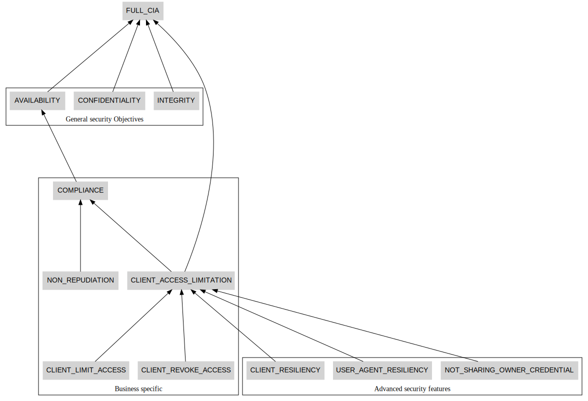
  **Details:**

<dl markdown="block">
<dt>ID</dt><dd><code><a id="OAuth2.FULL_CIA">FULL_CIA</a></code></dd>
<dt markdown="block">Title</dt>
<dd markdown="block">Confidentiality Integrity and availability of a Corda Network</dd>
<dt markdown="block">Description</dt>
<dd markdown="block">Ability to maintain fundamental confidentiality
integrity and availability of the system
</dd>
**Tree of attacks impacting Confidentiality Integrity and availability of a Corda Network **
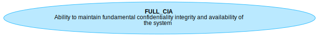

</dl>

<dl markdown="block">
<dt>ID</dt><dd><code><a id="OAuth2.INTEGRITY">INTEGRITY</a></code></dd>
<dt markdown="block">Title</dt>
<dd markdown="block">Data integrity</dd>
<dt markdown="block">Description</dt>
<dd markdown="block">Ability to maintain fundamental integrity of the system
</dd>
  <dt markdown="block"> Contributes to:</dt>
  <dd markdown="block">Contributes to <code><a href="#OAuth2.FULL_CIA">FULL_CIA</a></code> *(Confidentiality Integrity and availability of a Corda Network)*</dd>
**Tree of attacks impacting Data integrity **
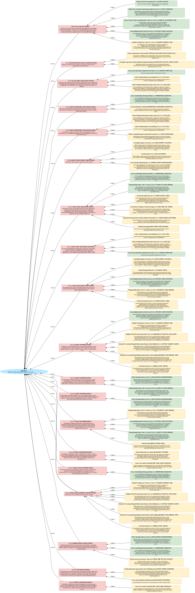

</dl>

<dl markdown="block">
<dt>ID</dt><dd><code><a id="OAuth2.CONFIDENTIALITY">CONFIDENTIALITY</a></code></dd>
<dt markdown="block">Title</dt>
<dd markdown="block">Data confidentiality</dd>
<dt markdown="block">Description</dt>
<dd markdown="block">Ability to maintain fundamental confidentiality of the system data
</dd>
  <dt markdown="block"> Contributes to:</dt>
  <dd markdown="block">Contributes to <code><a href="#OAuth2.FULL_CIA">FULL_CIA</a></code> *(Confidentiality Integrity and availability of a Corda Network)*</dd>
**Tree of attacks impacting Data confidentiality **
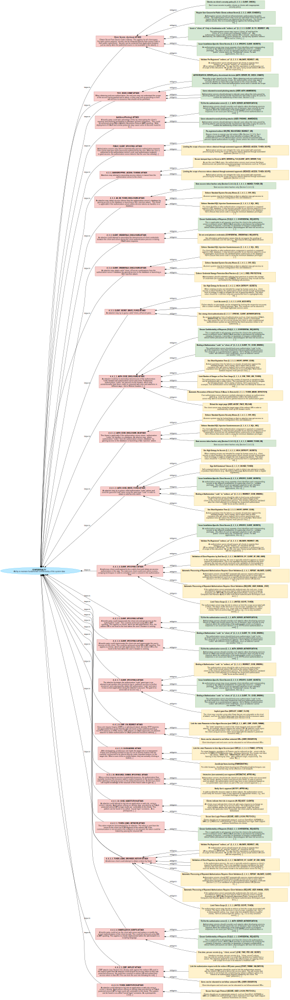

</dl>

<dl markdown="block">
<dt>ID</dt><dd><code><a id="OAuth2.AVAILABILITY">AVAILABILITY</a></code></dd>
<dt markdown="block">Title</dt>
<dd markdown="block">System availability</dd>
<dt markdown="block">Description</dt>
<dd markdown="block">Ability to maintain fundamental availability of the system
</dd>
  <dt markdown="block"> Contributes to:</dt>
  <dd markdown="block">Contributes to <code><a href="#OAuth2.FULL_CIA">FULL_CIA</a></code> *(Confidentiality Integrity and availability of a Corda Network)*</dd>
**Tree of attacks impacting System availability **
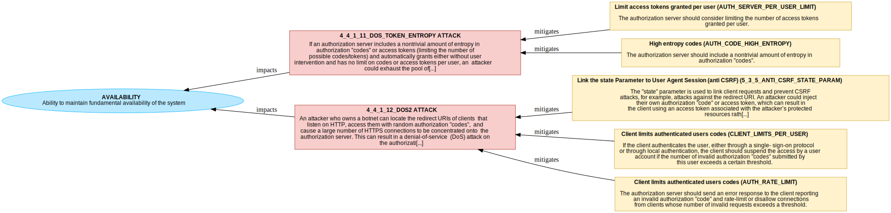

</dl>

<dl markdown="block">
<dt>ID</dt><dd><code><a id="OAuth2.COMPLIANCE">COMPLIANCE</a></code></dd>
<dt markdown="block">Title</dt>
<dd markdown="block">Compliance</dd>
<dt markdown="block">Description</dt>
<dd markdown="block">Ability to obtain and maintain maintain compliance with required regulations
</dd>
  <dt markdown="block"> Contributes to:</dt>
  <dd markdown="block">Contributes to <code><a href="#OAuth2.AVAILABILITY">AVAILABILITY</a></code> *(System availability)*</dd>
**Tree of attacks impacting Compliance **

</dl>

<dl markdown="block">
<dt>ID</dt><dd><code><a id="OAuth2.NON_REPUDIATION">NON_REPUDIATION</a></code></dd>
<dt markdown="block">Title</dt>
<dd markdown="block">Auditability and Non repudiation of resource access</dd>
<dt markdown="block">Description</dt>
<dd markdown="block">Ability to have available evidence of the users and actor mains actions, including:
  - Trackign of CLIENT access to RESOURCE_OWNER's assets and data 
</dd>
  <dt markdown="block"> Contributes to:</dt>
  <dd markdown="block">Contributes to <code><a href="#OAuth2.COMPLIANCE">COMPLIANCE</a></code> *(Compliance)*</dd>
**Tree of attacks impacting Auditability and Non repudiation of resource access **
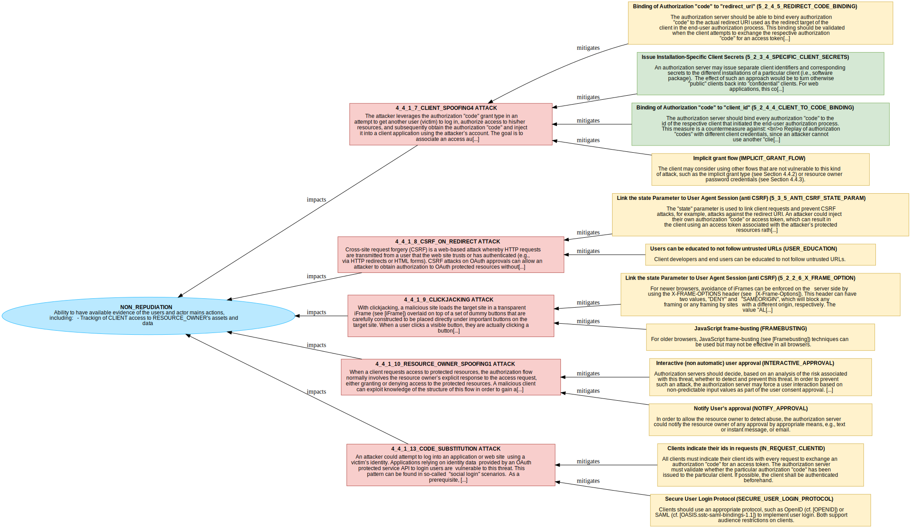

</dl>

<dl markdown="block">
<dt>ID</dt><dd><code><a id="OAuth2.CLIENT_ACCESS_LIMITATION">CLIENT_ACCESS_LIMITATION</a></code></dd>
<dt markdown="block">Title</dt>
<dd markdown="block">Limits CLIENT access to RESOURCE_OWNER's assets and data</dd>
<dt markdown="block">Description</dt>
<dd markdown="block">Limits CLIENT access to RESOURCE_OWNER's assets and data . This includes:

  - Revoke access to CLIENT over time
  - Limit the set of resources accessed by CLIENT (authorization)
</dd>
  <dt markdown="block"> Contributes to:</dt>
  <dd markdown="block">Contributes to <code><a href="#OAuth2.FULL_CIA">FULL_CIA</a></code> *(Confidentiality Integrity and availability of a Corda Network)*</dd>
  <dt markdown="block"> Contributes to:</dt>
  <dd markdown="block">Contributes to <code><a href="#OAuth2.COMPLIANCE">COMPLIANCE</a></code> *(Compliance)*</dd>
**Tree of attacks impacting Limits CLIENT access to RESOURCE_OWNER's assets and data **
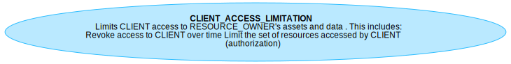

</dl>

<dl markdown="block">
<dt>ID</dt><dd><code><a id="OAuth2.CLIENT_REVOKE_ACCESS">CLIENT_REVOKE_ACCESS</a></code></dd>
<dt markdown="block">Title</dt>
<dd markdown="block">Revoke CLIENT access to RESOURCE_OWNER's assets and data</dd>
<dt markdown="block">Description</dt>
<dd markdown="block">Revoke access to CLIENT over time
</dd>
  <dt markdown="block"> Contributes to:</dt>
  <dd markdown="block">Contributes to <code><a href="#OAuth2.CLIENT_ACCESS_LIMITATION">CLIENT_ACCESS_LIMITATION</a></code> *(Limits CLIENT access to RESOURCE_OWNER's assets and data)*</dd>
**Tree of attacks impacting Revoke CLIENT access to RESOURCE_OWNER's assets and data **

</dl>

<dl markdown="block">
<dt>ID</dt><dd><code><a id="OAuth2.CLIENT_LIMIT_ACCESS">CLIENT_LIMIT_ACCESS</a></code></dd>
<dt markdown="block">Title</dt>
<dd markdown="block">Limits CLIENT access to some RESOURCE_OWNER's assets and data</dd>
<dt markdown="block">Description</dt>
<dd markdown="block">Limit the set of resources accessed by CLIENT (authorization)
</dd>
  <dt markdown="block"> Contributes to:</dt>
  <dd markdown="block">Contributes to <code><a href="#OAuth2.CLIENT_ACCESS_LIMITATION">CLIENT_ACCESS_LIMITATION</a></code> *(Limits CLIENT access to RESOURCE_OWNER's assets and data)*</dd>
**Tree of attacks impacting Limits CLIENT access to some RESOURCE_OWNER's assets and data **

</dl>

<dl markdown="block">
<dt>ID</dt><dd><code><a id="OAuth2.NOT_SHARING_OWNER_CREDENTIAL">NOT_SHARING_OWNER_CREDENTIAL</a></code></dd>
<dt markdown="block">Title</dt>
<dd markdown="block">Not sharing RESOURCE_OWNER credentials</dd>
<dt markdown="block">Description</dt>
<dd markdown="block">Not sharing RESOURCE_OWNER credential with third parties
</dd>
  <dt markdown="block"> Contributes to:</dt>
  <dd markdown="block">Contributes to <code><a href="#OAuth2.CLIENT_ACCESS_LIMITATION">CLIENT_ACCESS_LIMITATION</a></code> *(Limits CLIENT access to RESOURCE_OWNER's assets and data)*</dd>
**Tree of attacks impacting Not sharing RESOURCE_OWNER credentials **

</dl>

<dl markdown="block">
<dt>ID</dt><dd><code><a id="OAuth2.USER_AGENT_RESILIENCY">USER_AGENT_RESILIENCY</a></code></dd>
<dt markdown="block">Title</dt>
<dd markdown="block">Compromised USER_AGENT resiliency</dd>
<dt markdown="block">Description</dt>
<dd markdown="block">Resiliency for RESOURCE_OWNER's USER_AGENT against attacks like XSS
</dd>
  <dt markdown="block"> Contributes to:</dt>
  <dd markdown="block">Contributes to <code><a href="#OAuth2.CLIENT_ACCESS_LIMITATION">CLIENT_ACCESS_LIMITATION</a></code> *(Limits CLIENT access to RESOURCE_OWNER's assets and data)*</dd>
**Tree of attacks impacting Compromised USER_AGENT resiliency **

</dl>

<dl markdown="block">
<dt>ID</dt><dd><code><a id="OAuth2.CLIENT_RESILIENCY">CLIENT_RESILIENCY</a></code></dd>
<dt markdown="block">Title</dt>
<dd markdown="block">Compromised CLIENT resiliency</dd>
<dt markdown="block">Description</dt>
<dd markdown="block">Resiliency for RESOURCE_OWNER's RESOURCES against compromised CLIENT
</dd>
  <dt markdown="block"> Contributes to:</dt>
  <dd markdown="block">Contributes to <code><a href="#OAuth2.CLIENT_ACCESS_LIMITATION">CLIENT_ACCESS_LIMITATION</a></code> *(Limits CLIENT access to RESOURCE_OWNER's assets and data)*</dd>
**Tree of attacks impacting Compromised CLIENT resiliency **

</dl>

  

### Linked threat Models

  - **Client** (ID: OAuth2.Client)
  - **Authorization Server** (ID: OAuth2.AuthorizationServer)
  - **Flows** (ID: OAuth2.Flows)
  - **Authorization "code" flow** (ID: OAuth2.Flows.Flows_AuthCode)
  - **Implicit Grant flow** (ID: OAuth2.Flows.Flows_ImplicitGrant)

### Diagrams

None

> **Note** This section contains the list of attackers, personas, roles and potential threat agents considered to be within the scope of analysis.

### Attackers

**`OAuth2.ANONYMOUS`** (from OAuth2 scope)  
<dl markdown="block">
<dt>Description:</dt><dd markdown="block">Anonymous internet user
</dd>
<dt>In Scope:</dt><dd>Yes</dd>
</dl>

**`OAuth2.RESOURCE_OWNER`** (from OAuth2 scope)  
<dl markdown="block">
<dt>Description:</dt><dd markdown="block">An entity capable of granting access to a protected resource.
When the resource owner is a person, it is referred to as an
end-user.
</dd>
<dt>In Scope:</dt><dd>Yes</dd>
</dl>

**`OAuth2.RESOURCE_SERVER`** (from OAuth2 scope)  
<dl markdown="block">
<dt>Description:</dt><dd markdown="block">The server hosting the protected resources, capable of accepting
and responding to protected resource requests using access tokens.
</dd>
<dt>In Scope:</dt><dd>Yes</dd>
</dl>

**`OAuth2.CLIENT_OPERATOR`** (from OAuth2 scope)  
<dl markdown="block">
<dt>Description:</dt><dd markdown="block">The operators of the CLIENT.
</dd>
<dt>In Scope:</dt><dd>Yes</dd>
</dl>

**`OAuth2.AUTHORIZATION_SERVER_OPERATOR`** (from OAuth2 scope)  
<dl markdown="block">
<dt>Description:</dt><dd markdown="block">The operators in the Authorization Server.
</dd>
<dt>In Scope:</dt><dd>Yes</dd>
</dl>

### Assumptions

<dl markdown="block">
<dt>ATT1</dt><dd>the attacker has full access to the network between the client and
authorization servers and the client and the resource server,
respectively.  The attacker may eavesdrop on any communications
 </dd>
</dl>

<dl markdown="block">
<dt>ATT2</dt><dd>an attacker has unlimited resources to mount an attack.
 </dd>
</dl>

<dl markdown="block">
<dt>ATT3</dt><dd>two of the three parties involved in the OAuth protocol may
collude to mount an attack against the 3rd party.  For example,
the client and authorization server may be under control of an
attacker and collude to trick a user to gain access to resources.
 </dd>
</dl>

<dl markdown="block">
<dt>ARC1</dt><dd>The OAuth protocol leaves deployments with a certain degree of
freedom regarding how to implement and apply the standard.  The core
specification defines the core concepts of an authorization server
and a resource server.  Both servers can be implemented in the same
server entity, or they may also be different entities.  The latter is
typically the case for multi-service providers with a single
authentication and authorization system and is more typical in
middleware architectures.
 </dd>
</dl>

<dl markdown="block">
<dt>ARC2</dt><dd>The following data elements are stored or accessible on the
 authorization server:

 o  usernames and passwords

 o  client ids and secrets

 o  client-specific refresh tokens

 o  client-specific access tokens (in the case of handle-based design;
     see Section 3.1)

 o  HTTPS certificate/key

 o  per-authorization process (in the case of handle-based design;
     Section 3.1): "redirect_uri", "client_id", authorization "code"
 </dd>
</dl>

<dl markdown="block">
<dt>ARC3</dt><dd>The following data elements are stored or accessible on the resource
server:

o  user data (out of scope)

o  HTTPS certificate/key

o  either authorization server credentials (handle-based design; see
    Section 3.1) or authorization server shared secret/public key
    (assertion-based design; see Section 3.1)

o  access tokens (per request)

It is assumed that a resource server has no knowledge of refresh
tokens, user passwords, or client secrets.
 </dd>
</dl>

<dl markdown="block">
<dt>ARC4</dt><dd>In OAuth, a client is an application making protected resource
requests on behalf of the resource owner and with its authorization.
There are different types of clients with different implementation
and security characteristics, such as web, user-agent-based, and
native applications.  A full definition of the different client types
and profiles is given in [RFC6749], Section 2.1.

The following data elements are stored or accessible on the client:

o  client id (and client secret or corresponding client credential)

o  one or more refresh tokens (persistent) and access tokens
    (transient) per end user or other security-context or delegation
    context

o  trusted certification authority (CA) certificates (HTTPS)

o  per-authorization process: "redirect_uri", authorization "code"
 </dd>
</dl>

### Assets

#### Summary Table

<table markdown="block">
<tr><th>Title(ID)</th><th>Type</th><th>In Scope</th></tr>
<tr markdown="block"><td markdown="block">Client <code><strong markdown="block">CLIENT</code>
</td><td>system</td>
</td><td>&#x2714;&#xFE0F;</td>
</tr>
<tr markdown="block"><td markdown="block">Confidential Client <code><strong markdown="block">CONFIDENTIAL_CLIENT</code>
</td><td>system</td>
</td><td>&#x2714;&#xFE0F;</td>
</tr>
<tr markdown="block"><td markdown="block">Confidential Client <code><strong markdown="block">PUBLIC_CLIENT</code>
</td><td>system</td>
</td><td>&#x2714;&#xFE0F;</td>
</tr>
<tr markdown="block"><td markdown="block">Authorization Grant <code><strong markdown="block">AUTHORIZATION_GRANT</code>
</td><td>credential</td>
</td><td>&#x2714;&#xFE0F;</td>
</tr>
<tr markdown="block"><td markdown="block">Access Token <code><strong markdown="block">ACCESS_TOKEN</code>
</td><td>system</td>
</td><td>&#x2714;&#xFE0F;</td>
</tr>
<tr markdown="block"><td markdown="block">Client secret for authentication with AUTH_SERVER <code><strong markdown="block">CLIENT_SECRETS</code>
</td><td>credentials</td>
</td><td>&#x2714;&#xFE0F;</td>
</tr>
<tr markdown="block"><td markdown="block">Authorization server <code><strong markdown="block">AUTH_SERVER</code>
</td><td>system</td>
</td><td>&#x2714;&#xFE0F;</td>
</tr>
<tr markdown="block"><td markdown="block">Auth User Agent Redirection <code><strong markdown="block">DF_AUTH_REDIRECT</code>
</td><td>dataflow</td>
</td><td>&#x2714;&#xFE0F;</td>
</tr>
<tr markdown="block"><td markdown="block">Auth server sending the access token to the client <code><strong markdown="block">DF_ACCESS_TOKEN_CL</code>
</td><td>dataflow</td>
</td><td>&#x2714;&#xFE0F;</td>
</tr>
<tr markdown="block"><td markdown="block">Client requesting Authorization Server for the Access Token <code><strong markdown="block">DF_AUTH_GRANT_AS</code>
</td><td>dataflow</td>
</td><td>&#x2714;&#xFE0F;</td>
</tr>
<tr markdown="block"><td markdown="block">Public Client <code><strong markdown="block">CONFIDENTIAL_CLIENT</code>
</td><td>system</td>
</td><td>&#x2714;&#xFE0F;</td>
</tr>
<tr markdown="block"><td markdown="block">Public Client <code><strong markdown="block">PUBLIC_CLIENT</code>
</td><td>system</td>
</td><td>&#x2714;&#xFE0F;</td>
</tr>
<tr markdown="block"><td markdown="block">Client Identifier <code><strong markdown="block">CLIENT_ID</code>
</td><td>data</td>
</td><td>&#x2714;&#xFE0F;</td>
</tr>
</table>

#### Details

<a name='client-(system-in-scope---id-<code>client</code>)'></a>
##### Client (system in scope - ID: <code>CLIENT</code>) 

 
<dl markdown="block">
An application requesting access from the RESOURCE_OWNER (TODO: refine this description)

</dl>
 

<a name='confidential-client-(system-in-scope---id-<code>confidential_client</code>)'></a>
##### Confidential Client (system in scope - ID: <code>CONFIDENTIAL_CLIENT</code>) 

 
<dl markdown="block">
Clients capable of maintaining the confidentiality of their
credentials (e.g., client implemented on a secure server with
restricted access to the client credentials), or capable of secure
client authentication using other means.

<dt>Specifies, inherit analysis and attribute from:</dt>

<dd markdown="block"> Client  (<a href="#OAuth2.CLIENT">CLIENT</a>) </dd>
</dl>
 

<a name='confidential-client-(system-in-scope---id-<code>public_client</code>)'></a>
##### Confidential Client (system in scope - ID: <code>PUBLIC_CLIENT</code>) 

 
<dl markdown="block">
Clients incapable of maintaining the confidentiality of their
credentials (e.g., clients executing on the device used by the
resource owner, such as an installed native application or a web
browser-based application), and incapable of secure client
authentication via any other means.

<dt>Specifies, inherit analysis and attribute from:</dt>

<dd markdown="block"> Client  (<a href="#OAuth2.CLIENT">CLIENT</a>) </dd>
</dl>
 

<a name='authorization-grant-(credential-in-scope---id-<code>authorization_grant</code>)'></a>
##### Authorization Grant (credential in scope - ID: <code>AUTHORIZATION_GRANT</code>) 

 
<dl markdown="block">
An authorization grant is a credential representing the resource
owner's authorization (to access its protected resources) used by the
client to obtain an access token.  This specification defines four
grant types -- authorization code, implicit, resource owner password
credentials, and client credentials -- as well as an extensibility
mechanism for defining additional types.

</dl>
 

<a name='access-token-(system-in-scope---id-<code>access_token</code>)'></a>
##### Access Token (system in scope - ID: <code>ACCESS_TOKEN</code>) 

 
<dl markdown="block">
Access tokens are credentials used to access protected resources.  An
access token is a string representing an authorization issued to the
client.  The string is usually opaque to the client.  Tokens
represent specific scopes and durations of access, granted by the
resource owner, and enforced by the resource server and authorization
server.

The token may denote an identifier used to retrieve the authorization
information or may self-contain the authorization information in a
verifiable manner (i.e., a token string consisting of some data and a
signature).  Additional authentication credentials, which are beyond
the scope of this specification, may be required in order for the
client to use a token.

The access token provides an abstraction layer, replacing different
authorization constructs (e.g., username and password) with a single
token understood by the resource server.  This abstraction enables
issuing access tokens more restrictive than the authorization grant
used to obtain them, as well as removing the resource server's need
to understand a wide range of authentication methods.

Access tokens can have different formats, structures, and methods of
utilization (e.g., cryptographic properties) based on the resource
server security requirements.  Access token attributes and the
methods used to access protected resources are beyond the scope of
this specification and are defined by companion specifications such
as [RFC6750].

</dl>
 

<a name='client-secret-for-authentication-with-auth_server-(credentials-in-scope---id-<code>client_secrets</code>)'></a>
##### Client secret for authentication with AUTH_SERVER (credentials in scope - ID: <code>CLIENT_SECRETS</code>) 

 
<dl markdown="block">
Secrets held by CLIENT to authentication to the Authorization Server

</dl>
 

<a name='authorization-server-(system-in-scope---id-<code>auth_server</code>)'></a>
##### Authorization server (system in scope - ID: <code>AUTH_SERVER</code>) 

 
<dl markdown="block">
The server issuing access tokens to the client after successfully
authenticating the resource owner and obtaining authorization.

</dl>
 

<a name='auth-user-agent-redirection-(dataflow-in-scope---id-<code>df_auth_redirect</code>)'></a>
##### Auth User Agent Redirection (dataflow in scope - ID: <code>DF_AUTH_REDIRECT</code>) 

 
<dl markdown="block">
User Agent Redirection for Client authorization request. this is part of DF_AUTH_REQUEST
</dl>
 

<a name='auth-server-sending-the-access-token-to-the-client-(dataflow-in-scope---id-<code>df_access_token_cl</code>)'></a>
##### Auth server sending the access token to the client (dataflow in scope - ID: <code>DF_ACCESS_TOKEN_CL</code>) 

 
<dl markdown="block">
Auth server sending the access token to the client after resource owner approval
</dl>
 

<a name='client-requesting-authorization-server-for-the-access-token-(dataflow-in-scope---id-<code>df_auth_grant_as</code>)'></a>
##### Client requesting Authorization Server for the Access Token (dataflow in scope - ID: <code>DF_AUTH_GRANT_AS</code>) 

 
<dl markdown="block">
Client requesting Authorization Server for the Access Token after resource owner approval
</dl>
 

<a name='public-client-(system-in-scope---id-<code>confidential_client</code>)'></a>
##### Public Client (system in scope - ID: <code>CONFIDENTIAL_CLIENT</code>) 

 
<dl markdown="block">
Clients capable of maintaining the confidentiality of their
credentials (e.g., client implemented on a secure server with
restricted access to the client credentials), or capable of secure
client authentication using other means.
For example a web application. A web application is a confidential client running on a web
server.  Resource owners access the client via an HTML user
interface rendered in a user-agent on the device used by the
resource owner.  The client credentials as well as any access
token issued to the client are stored on the web server and are
not exposed to or accessible by the resource owner.

</dl>
 

<a name='public-client-(system-in-scope---id-<code>public_client</code>)'></a>
##### Public Client (system in scope - ID: <code>PUBLIC_CLIENT</code>) 

 
<dl markdown="block">
Clients incapable of maintaining the confidentiality of their
credentials (e.g., clients executing on the device used by the
resource owner, such as an installed native application or a web
browser-based application), and incapable of secure client
authentication via any other means.
For example a user-agent-based application or a native applications.

</dl>
 

<a name='client-identifier-(data-in-scope---id-<code>client_id</code>)'></a>
##### Client Identifier (data in scope - ID: <code>CLIENT_ID</code>) 

 
<dl markdown="block">
The authorization server issues the registered client a client
identifier -- a unique string representing the registration
information provided by the client.  The client identifier is not a
secret; it is exposed to the resource owner and MUST NOT be used
alone for client authentication.  The client identifier is unique to
the authorization server.

The client identifier string size is left undefined by this
specification.  The client should avoid making assumptions about the
identifier size.  The authorization server SHOULD document the size
of any identifier it issues.

</dl>
 

## OAuth 2.0 Analysis

> **Note** This section documents the work performed to identify threats and thier mitigations.#
> It may contains notes from the analysis sessions.
> This analysis section may be omitted in future reports.

None  

## OAuth 2.0 Threats

> **Note** This section contains the threat and mitigations identified during the analysis phase.

  **No threat identified or listed **

  
 

# Client Threat Model

## Client - scope of analysis

### Overview

None 

### Security Objectives

No Security Objectives defined in this scope

### Diagrams

None

> **Note** This section contains the list of attackers, personas, roles and potential threat agents considered to be within the scope of analysis.

### Assets

#### Summary Table

<table markdown="block">
<tr><th>Title(ID)</th><th>Type</th><th>In Scope</th></tr>
</table>

#### Details

## Client Analysis

> **Note** This section documents the work performed to identify threats and thier mitigations.#
> It may contains notes from the analysis sessions.
> This analysis section may be omitted in future reports.

None  

## Client Threats

> **Note** This section contains the threat and mitigations identified during the analysis phase.

### `(Client_Secrets_disclosure)` Client Secrets Disclosure and impersonation

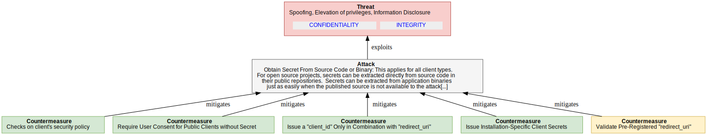

<dl markdown="block">

<dt>Threat Description</dt><dd markdown="block">Obtain Secret From Source Code or Binary:
This applies for all client types.  For open source projects, secrets
can be extracted directly from source code in their public
repositories.  Secrets can be extracted from application binaries
just as easily when the published source is not available to the
attacker.  Even if an application takes significant measures to
obfuscate secrets in their application distribution, one should
consider that the secret can still be reverse-engineered by anyone
with access to a complete functioning application bundle or binary.
</dd>
<dt>Impact</dt><dd markdown="block">- Client authentication of access to the authorization server can be
bypassed.
- Stolen refresh tokens or authorization "codes" can be replayed.
- Client spoofing/impersonation
  <code><a href="#OAuth2.CONFIDENTIALITY">CONFIDENTIALITY</a></code><code><a href="#OAuth2.INTEGRITY">INTEGRITY</a></code></dd>

<dt>CVSS</dt>
<dd>

<strong>Base score:</strong> 6.8 (Medium) 
 
<strong>Vector:</strong><code>CVSS:3.0/AV:N/AC:H/PR:L/UI:N/S:U/C:H/I:H/A:N</code>
</dd>
</dl>

#### Counter-measures for `Client_Secrets_disclosure` 

<dl markdown="block">
    
**`5_2_3_1_CLIENT_CHECK1` Checks on client's security policy** 
<dd markdown="block">
Don't issue secrets to public clients or clients with
inappropriate security policy
</dd>

<dd markdown="block">
<strong>Countermeasure implemented?</strong> 
&#10004;   <strong>Public and disclosable?</strong> 
&#10004;   <strong>Is operational?</strong>&#10004;
    (operated by AUTHORIZATION_SERVER)
</dd>

    
**`5_2_3_2_USER_CONSENT1` Require User Consent for Public Clients without Secret** 
<dd markdown="block">
Authorization servers should not allow automatic authorization for
public clients.  The authorization server may issue an individual
client id but should require that all authorizations are approved by
the end user.  For clients without secrets, this is a countermeasure
against the following threat:
  -  Impersonation of public client applications.
</dd>

<dd markdown="block">
<strong>Countermeasure implemented?</strong> 
&#10004;   <strong>Public and disclosable?</strong> 
&#10004;   <strong>Is operational?</strong>&#10004;
    (operated by AUTHORIZATION_SERVER)
</dd>

    
**`5_2_3_3_CLIENT_ID_TO_REDIRECT_URI` Issue a "client_id" Only in Combination with "redirect_uri"** 
<dd markdown="block">
The authorization server may issue a "client_id" and bind the
  "client_id" to a certain pre-configured "redirect_uri".  Any
  authorization request with another redirect URI is refused
  automatically.  Alternatively, the authorization server should not
  accept any dynamic redirect URI for such a "client_id" and instead
  should always redirect to the well-known pre-configured redirect URI.
  This is a countermeasure for clients without secrets against the
  following threats:

  -  Cross-site scripting attacks

  -  Impersonation of public client applications
</dd>

<dd markdown="block">
<strong>Countermeasure implemented?</strong> 
&#10004;   <strong>Public and disclosable?</strong> 
&#10004;   <strong>Is operational?</strong>&#10004;
    (operated by AUTHORIZATION_SERVER)
</dd>

    
**`5_2_3_4_SPECIFIC_CLIENT_SECRETS` Issue Installation-Specific Client Secrets** 
<dd markdown="block">
An authorization server may issue separate client identifiers and
corresponding secrets to the different installations of a particular
client (i.e., software package).  The effect of such an approach
would be to turn otherwise "public" clients back into "confidential"
clients.

For web applications, this could mean creating one "client_id" and
"client_secret" for each web site on which a software package is
installed.  So, the provider of that particular site could request a
client id and secret from the authorization server during the setup
of the web site.  This would also allow the validation of some of the
properties of that web site, such as redirect URI, web site URL, and
whatever else proves useful.  The web site provider has to ensure the
security of the client secret on the site.

For native applications, things are more complicated because every
copy of a particular application on any device is a different
installation.  Installation-specific secrets in this scenario will
require obtaining a "client_id" and "client_secret" either

1.  during the download process from the application market, or

2.  during installation on the device.

Either approach will require an automated mechanism for issuing
client ids and secrets, which is currently not defined by OAuth.

The first approach would allow the achievement of a certain level of
trust in the authenticity of the application, whereas the second
option only allows the authentication of the installation but not the
validation of properties of the client.  But this would at least help
to prevent several replay attacks.  Moreover, installation-specific
"client_ids" and secrets allow the selective revocation of all
refresh tokens of a specific installation at once.
</dd>

<dd markdown="block">
<strong>Countermeasure implemented?</strong> 
&#10004;   <strong>Public and disclosable?</strong> 
&#10004;   <strong>Is operational?</strong>&#10004;
    (operated by AUTHORIZATION_SERVER_OPERATOR)
</dd>

    
**`5_2_3_5_VALIDATE_REDIRECT_URI` Validate Pre-Registered "redirect_uri"** 
<dd markdown="block">
An authorization server should require all clients to register their
"redirect_uri", and the "redirect_uri" should be the full URI as
defined in [RFC6749].  The way that this registration is performed is
out of scope of this document.  As per the core spec, every actual
redirect URI sent with the respective "client_id" to the end-user
authorization endpoint must match the registered redirect URI.  Where
it does not match, the authorization server should assume that the
inbound GET request has been sent by an attacker and refuse it.
Note: The authorization server should not redirect the user agent
back to the redirect URI of such an authorization request.
Validating the pre-registered "redirect_uri" is a countermeasure
against the following threats:

o  Authorization "code" leakage through counterfeit web site: allows
    authorization servers to detect attack attempts after the first
    redirect to an end-user authorization endpoint (Section 4.4.1.7).

o  Open redirector attack via a client redirection endpoint
    (Section 4.1.5).

o  Open redirector phishing attack via an authorization server
    redirection endpoint (Section 4.2.4).

The underlying assumption of this measure is that an attacker will
need to use another redirect URI in order to get access to the
authorization "code".  Deployments might consider the possibility of
an attacker using spoofing attacks to a victim's device to circumvent
this security measure.

Note: Pre-registering clients might not scale in some deployments
(manual process) or require dynamic client registration (not
specified yet).  With the lack of dynamic client registration, a
pre-registered "redirect_uri" only works for clients bound to certain
deployments at development/configuration time.  As soon as dynamic
resource server discovery is required, the pre-registered
"redirect_uri" may no longer be feasible.
5_Validate_redirect_uri

Note: An invalid redirect URI indicates an
invalid client, whereas a valid redirect URI does not necessarily
indicate a valid client. The level of confidence depends on the
client type. For web applications, the level of confidence is
high, since the redirect URI refers to the globally unique network
endpoint of this application, whose fully qualified domain name
(FQDN) is also validated using HTTPS server authentication by the
user agent. In contrast, for native clients, the redirect URI
typically refers to device local resources, e.g., a custom scheme.
So, a malicious client on a particular device can use the valid
redirect URI the legitimate client uses on all other devices.
</dd>

<dd markdown="block">
<strong>Countermeasure implemented?</strong> 
&#10060;   <strong>Public and disclosable?</strong> 
&#10004;   <strong>Is operational?</strong>&#10004;
    (operated by AUTHORIZATION_SERVER)
</dd>

</dl>

### `(TOO_MUCH_GRANT)` User Unintentionally Grants Too Much Access Scope

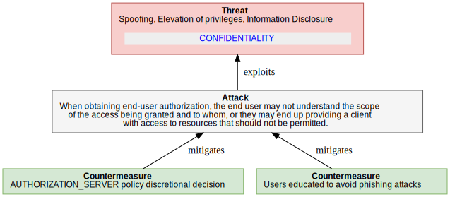

<dl markdown="block">

<dt>Threat Description</dt><dd markdown="block">When obtaining end-user authorization, the end user may not
understand the scope of the access being granted and to whom, or they
may end up providing a client with access to resources that should
not be permitted.
</dd>
<dt>Impact</dt><dd markdown="block">Disclosure of  RESOURCE_OWNER's RESOURCES  <code><a href="#OAuth2.CONFIDENTIALITY">CONFIDENTIALITY</a></code></dd>

<dt>CVSS</dt>
<dd>

<strong>Base score:</strong> 5.3 (Medium) 
 
<strong>Vector:</strong><code>CVSS:3.0/AV:N/AC:H/PR:L/UI:N/S:U/C:H/I:N/A:N</code>
</dd>
</dl>

#### Counter-measures for `TOO_MUCH_GRANT` 

<dl markdown="block">
    
**`AUTH_SERVER_RE_CHECK_GRANTS` AUTHORIZATION_SERVER policy discretional decision** 
<dd markdown="block">
Narrow the scope, based on the client.  When obtaining end-user
authorization and where the client requests scope, the
authorization server may want to consider whether to honor that
scope based on the client identifier.  That decision is between
the client and authorization server and is outside the scope of
this spec.  The authorization server may also want to consider
what scope to grant based on the client type, e.g., providing
lower scope to public clients (Section 5.1.5.1).
</dd>

<dd markdown="block">
<strong>Countermeasure implemented?</strong> 
&#10004;   <strong>Public and disclosable?</strong> 
&#10004;   <strong>Is operational?</strong>&#10004;
    (operated by AUTHORIZATION_SERVER)
</dd>

    
**`USER_AUTH_AWARENESS` Users educated to avoid phishing attacks** 
<dd markdown="block">
Authorization servers should attempt to educate users about the
risks posed by phishing attacks and should provide mechanisms that
make it easy for users to confirm the authenticity of their sites.
Section 5.1.2).
</dd>

<dd markdown="block">
<strong>Countermeasure implemented?</strong> 
&#10004;   <strong>Public and disclosable?</strong> 
&#10004;   <strong>Is operational?</strong>&#10004;
    (operated by AUTHORIZATION_SERVER)
</dd>

</dl>

  
 

# Authorization Server Threat Model

## Authorization Server - scope of analysis

### Overview

None 

### Security Objectives

No Security Objectives defined in this scope

### Diagrams

None

> **Note** This section contains the list of attackers, personas, roles and potential threat agents considered to be within the scope of analysis.

### Attackers

**`OAuth2.AuthorizationServer.ANONYMOUS`** (from OAuth2.AuthorizationServer scope)  
<dl markdown="block">
<dt>Description:</dt><dd markdown="block">Anonymous internet user
</dd>
<dt>In Scope:</dt><dd>Yes</dd>
</dl>

**`OAuth2.AuthorizationServer.CLIENT`** (from OAuth2.AuthorizationServer scope)  
<dl markdown="block">
<dt>Description:</dt><dd markdown="block">Client app
</dd>
<dt>In Scope:</dt><dd>Yes</dd>
</dl>

### Assumptions

<dl markdown="block">
<dt>None</dt><dd>A Auth server may host several ...
 </dd>
</dl>

### Assets

#### Summary Table

<table markdown="block">
<tr><th>Title(ID)</th><th>Type</th><th>In Scope</th></tr>
<tr markdown="block"><td markdown="block">Authorization server token endpoint <code><strong markdown="block">AUTH_SERVER_TOKEN_ENDPOINT</code>
</td><td>endpoint</td>
</td><td>&#x2714;&#xFE0F;</td>
</tr>
<tr markdown="block"><td markdown="block">Authorization endpoint for resource owner <code><strong markdown="block">AUTH_SERVER_AUTH_ENDPOINT</code>
</td><td>endpoint</td>
</td><td>&#x2714;&#xFE0F;</td>
</tr>
</table>

#### Details

<a name='authorization-server-token-endpoint-(endpoint-in-scope---id-<code>auth_server_token_endpoint</code>)'></a>
##### Authorization server token endpoint (endpoint in scope - ID: <code>AUTH_SERVER_TOKEN_ENDPOINT</code>) 

 
<dl markdown="block">
Authorization server's endpoint for DF_AUTH_GRANT_AS and DF_ACCESS_TOKEN_CL

</dl>
 

<a name='authorization-endpoint-for-resource-owner-(endpoint-in-scope---id-<code>auth_server_auth_endpoint</code>)'></a>
##### Authorization endpoint for resource owner (endpoint in scope - ID: <code>AUTH_SERVER_AUTH_ENDPOINT</code>) 

 
<dl markdown="block">
Authorization server's endpoint for DF_AUTH_REDIRECT

</dl>
 

## Authorization Server Analysis

> **Note** This section documents the work performed to identify threats and thier mitigations.#
> It may contains notes from the analysis sessions.
> This analysis section may be omitted in future reports.

None  

## Authorization Server Threats

> **Note** This section contains the threat and mitigations identified during the analysis phase.

### `(AuthServerPhishing1)` Password Phishing by Counterfeit Authorization Server

<dl markdown="block">

<dt>Threat Description</dt><dd markdown="block">A hostile party could take advantage of this
by intercepting the client's requests and returning misleading or
otherwise incorrect responses.  This could be achieved using DNS or
Address Resolution Protocol (ARP) spoofing.  Wide deployment of OAuth
and similar protocols may cause users to become inured to the
practice of being redirected to web sites where they are asked to
enter their passwords.  If users are not careful to verify the
authenticity of these web sites before entering their credentials, it
will be possible for attackers to exploit this practice to steal
users' passwords.
</dd>
<dt>Impact</dt><dd markdown="block">Steal users' passwords  <code><a href="#OAuth2.CONFIDENTIALITY">CONFIDENTIALITY</a></code></dd>

<dt>CVSS</dt>
<dd>

<strong>Base score:</strong> 6.8 (Medium) 
 
<strong>Vector:</strong><code>CVSS:3.0/AV:N/AC:H/PR:L/UI:N/S:U/C:H/I:H/A:N</code>
</dd>
</dl>

#### Counter-measures for `AuthServerPhishing1` 

<dl markdown="block">
    
**`5_1_2_AUTH_SERVER_AUTHENTICATION` TLS for the authorization server** 
<dd markdown="block">
Authorization servers should consider such attacks when developing
services based on OAuth and should require the use of transport-
layer security for any requests where the authenticity of the
authorization server or of request responses is an issue (see
Section 5.1.2).

HTTPS server authentication or similar means can be used to
authenticate the identity of a server. The goal is to reliably bind
the fully qualified domain name of the server to the public key
presented by the server during connection establishment (see
[RFC2818]).
The client should validate the binding of the server to its domain
name. If the server fails to prove that binding, the communication
is considered a man-in-the-middle attack. This security measure
depends on the certification authorities the client trusts for that
purpose. Clients should carefully select those trusted CAs and
protect the storage for trusted CA certificates from modifications.
This is a countermeasure against the following threats:
 o Spoofing
 o Proxying
 o Phishing by counterfeit servers
</dd>

<dd markdown="block">
<strong>Countermeasure implemented?</strong> 
&#10004;   <strong>Public and disclosable?</strong> 
&#10004;   <strong>Is operational?</strong>&#10004;
    (operated by AUTHORIZATION_SERVER)
</dd>

    
**`USER_PHISHING_AWARENESS` Users educated to avoid phishing attacks** 
<dd markdown="block">
Authorization servers should attempt to educate users about the
risks posed by phishing attacks and should provide mechanisms that
make it easy for users to confirm the authenticity of their sites.
Section 5.1.2).
</dd>

<dd markdown="block">
<strong>Countermeasure implemented?</strong> 
&#10004;   <strong>Public and disclosable?</strong> 
&#10004;   <strong>Is operational?</strong>&#10004;
    (operated by AUTHORIZATION_SERVER)
</dd>

</dl>

### `(TOO_MUCH_GRANT)` User Unintentionally Grants Too Much Access Scope

<dl markdown="block">

<dt>Threat Description</dt><dd markdown="block">When obtaining end-user authorization, the end user may not
understand the scope of the access being granted and to whom, or they
may end up providing a client with access to resources that should
not be permitted.
</dd>
<dt>Impact</dt><dd markdown="block">Disclosure of  RESOURCE_OWNER's RESOURCES  <code><a href="#OAuth2.CONFIDENTIALITY">CONFIDENTIALITY</a></code></dd>

<dt>CVSS</dt>
<dd>

<strong>Base score:</strong> 5.3 (Medium) 
 
<strong>Vector:</strong><code>CVSS:3.0/AV:N/AC:H/PR:L/UI:N/S:U/C:H/I:N/A:N</code>
</dd>
</dl>

#### Counter-measures for `TOO_MUCH_GRANT` 

<dl markdown="block">
    
**`AUTH_SERVER_RE_CHECK_GRANTS` AUTHORIZATION_SERVER policy discretional decision** 
<dd markdown="block">
Narrow the scope, based on the client.  When obtaining end-user
authorization and where the client requests scope, the
authorization server may want to consider whether to honor that
scope based on the client identifier.  That decision is between
the client and authorization server and is outside the scope of
this spec.  The authorization server may also want to consider
what scope to grant based on the client type, e.g., providing
lower scope to public clients (Section 5.1.5.1).
</dd>

<dd markdown="block">
<strong>Countermeasure implemented?</strong> 
&#10004;   <strong>Public and disclosable?</strong> 
&#10004;   <strong>Is operational?</strong>&#10004;
    (operated by AUTHORIZATION_SERVER)
</dd>

    
**`USER_AUTH_AWARENESS` Users educated to avoid phishing attacks** 
<dd markdown="block">
Authorization servers should attempt to educate users about the
risks posed by phishing attacks and should provide mechanisms that
make it easy for users to confirm the authenticity of their sites.
Section 5.1.2).
</dd>

<dd markdown="block">
<strong>Countermeasure implemented?</strong> 
&#10004;   <strong>Public and disclosable?</strong> 
&#10004;   <strong>Is operational?</strong>&#10004;
    (operated by AUTHORIZATION_SERVER)
</dd>

</dl>

### `(OPEN_REDIRECTOR)` Authorization server open redirect

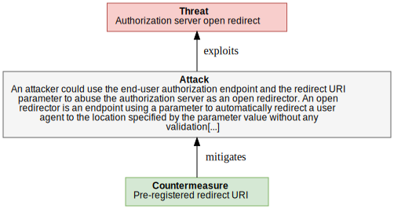

<dl markdown="block">

<dt>Assets (IDs) involved in this threat:</dt>

<dd markdown="block"> - <code><a href="#OAuth2.DF_AUTH_REDIRECT">DF_AUTH_REDIRECT</a></code> - Auth User Agent Redirection</dd>
<dd markdown="block"> - <code><a href="#OAuth2.AUTH_SERVER">AUTH_SERVER</a></code> - Authorization server</dd>
<dd markdown="block"> - <code><a href="#OAuth2.AuthorizationServer.AUTH_SERVER_AUTH_ENDPOINT">AUTH_SERVER_AUTH_ENDPOINT</a></code> - Authorization endpoint for resource owner</dd>

<dt>Threat Description</dt><dd markdown="block">An attacker could use the end-user authorization endpoint and the
redirect URI parameter to abuse the authorization server as an open
redirector. An open redirector is an endpoint using a parameter to
automatically redirect a user agent to the location specified by the
parameter value without any validation.
</dd>
<dt>Impact</dt><dd markdown="block">Phishing attacks can be executed exploiting AUTH_SERVER open redirect  </dd>

<dt>CVSS</dt>
<dd>

<strong>Base score:</strong> 8.2 (High) 
 
<strong>Vector:</strong><code>CVSS:3.1/AV:N/AC:L/PR:N/UI:R/S:C/C:H/I:L/A:N</code>
</dd>
</dl>

#### Counter-measures for `OPEN_REDIRECTOR` 

<dl markdown="block">
    
**`PRE_REGISTERED_REDIRECT_URI` Pre-registered redirect URI** 
<dd markdown="block">
Require clients to register any full redirect URIs (Section 5.2.3.5).
Don’t redirect to a redirect URI if the client identifier or
redirect URI can’t be verified (Section 5.2.3.5).
Authorization servers should not automatically process repeat
authorizations to public clients unless the client is validated
using a pre-registered redirect URI (Section 5.2.3.5).
</dd>

<dd markdown="block">
<strong>Countermeasure implemented?</strong> 
&#10004;   <strong>Public and disclosable?</strong> 
&#10004;  </dd>

</dl>

### `(PUBLIC_CLIENT_SPOOFING1)` Malicious Client Obtains Existing Authorization by Fraud

<dl markdown="block">

<dt>Assets (IDs) involved in this threat:</dt>

<dd markdown="block"> - <code><a href="#OAuth2.DF_AUTH_REDIRECT">DF_AUTH_REDIRECT</a></code> - Auth User Agent Redirection</dd>
<dd markdown="block"> - <code><a href="#OAuth2.AuthorizationServer.AUTH_SERVER_AUTH_ENDPOINT">AUTH_SERVER_AUTH_ENDPOINT</a></code> - Authorization endpoint for resource owner</dd>
<dd markdown="block"> - <code><a href="#OAuth2.PUBLIC_CLIENT">PUBLIC_CLIENT</a></code> - Confidential Client</dd>

<dt>Threat Description</dt><dd markdown="block">Authorization servers may wish to automatically process authorization
requests from clients that have been previously authorized by the
user. When the user is redirected to the authorization server's end-
user authorization endpoint to grant access, the authorization server
detects that the user has already granted access to that particular
client. Instead of prompting the user for approval, the
authorization server automatically redirects the user back to the
client.

A malicious client may exploit that feature and try to obtain such an
authorization "code" instead of the legitimate client.
</dd>
<dt>Impact</dt><dd markdown="block">Disclosure of RESOURCE_OWNER's RESOURCES  <code><a href="#OAuth2.CONFIDENTIALITY">CONFIDENTIALITY</a></code></dd>

<dt>CVSS</dt>
<dd>

<strong>Base score:</strong> 8.1 (High) 
 
<strong>Vector:</strong><code>CVSS:3.1/AV:N/AC:L/PR:N/UI:R/S:U/C:H/I:H/A:N</code>
</dd>
</dl>

#### Counter-measures for `PUBLIC_CLIENT_SPOOFING1` 

<dl markdown="block">
    
**Reference to `OAuth2.AuthorizationServer.OPEN_REDIRECTOR.PRE_REGISTERED_REDIRECT_URI` Pre-registered redirect URI** 
<dd markdown="block">
Require clients to register any full redirect URIs (Section 5.2.3.5).
Don’t redirect to a redirect URI if the client identifier or
redirect URI can’t be verified (Section 5.2.3.5).
Authorization servers should not automatically process repeat
authorizations to public clients unless the client is validated
using a pre-registered redirect URI (Section 5.2.3.5).
</dd>

<dd markdown="block">
<strong>Countermeasure implemented?</strong> 
&#10004;   <strong>Public and disclosable?</strong> 
&#10004;  </dd>

    
**`REDUCED_ACCESS_TOKEN_SCOPE` Limiting the scope of access tokens obtained through automated approvals** 
<dd markdown="block">
Authorization servers can mitigate the risks associated with
automatic processing by limiting the scope of access tokens
obtained through automated approvals (Section 5.1.5.1).
</dd>

<dd markdown="block">
<strong>Countermeasure implemented?</strong> 
&#10060;   <strong>Public and disclosable?</strong> 
&#10004;   <strong>Is operational?</strong>&#10004;
    (operated by AUTHORIZATION_SERVER)
</dd>

</dl>

### `(4_3_1_EAVESDROPPING_ACCESS_TOKENS1)` Eavesdropping Access Tokens

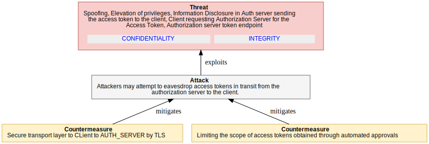

<dl markdown="block">

<dt>Assets (IDs) involved in this threat:</dt>

<dd markdown="block"> - <code><a href="#OAuth2.DF_ACCESS_TOKEN_CL">DF_ACCESS_TOKEN_CL</a></code> - Auth server sending the access token to the client</dd>
<dd markdown="block"> - <code><a href="#OAuth2.DF_AUTH_GRANT_AS">DF_AUTH_GRANT_AS</a></code> - Client requesting Authorization Server for the Access Token</dd>
<dd markdown="block"> - <code><a href="#OAuth2.AuthorizationServer.AUTH_SERVER_TOKEN_ENDPOINT">AUTH_SERVER_TOKEN_ENDPOINT</a></code> - Authorization server token endpoint</dd>

<dt>Threat Description</dt><dd markdown="block">Attackers may attempt to eavesdrop access tokens in transit from the
authorization server to the client.
</dd>
<dt>Impact</dt><dd markdown="block">The attacker is able to access all resources with the
permissions covered by the scope of the particular access token.
  <code><a href="#OAuth2.CONFIDENTIALITY">CONFIDENTIALITY</a></code><code><a href="#OAuth2.INTEGRITY">INTEGRITY</a></code></dd>

<dt>CVSS</dt>
<dd>

<strong>Base score:</strong> 7.4 (High) 
 
<strong>Vector:</strong><code>CVSS:3.1/AV:N/AC:H/PR:N/UI:N/S:U/C:H/I:H/A:N</code>
</dd>
</dl>

#### Counter-measures for `4_3_1_EAVESDROPPING_ACCESS_TOKENS1` 

<dl markdown="block">
    
**`CLIENT_AUTH_SERVER_TLS` Secure transport layer to CLient to AUTH_SERVER by TLS** 
<dd markdown="block">
As per the core OAuth spec, the authorization servers must ensure
that these transmissions are protected using transport-layer
mechanisms such as TLS (see Section 5.1.1).
</dd>

<dd markdown="block">
<strong>Countermeasure implemented?</strong> 
&#10060;   <strong>Public and disclosable?</strong> 
&#10004;   <strong>Is operational?</strong>&#10004;
    (operated by AUTHORIZATION_SERVER)
</dd>

    
**Reference to `OAuth2.AuthorizationServer.PUBLIC_CLIENT_SPOOFING1.REDUCED_ACCESS_TOKEN_SCOPE` Limiting the scope of access tokens obtained through automated approvals** 
<dd markdown="block">
Authorization servers can mitigate the risks associated with
automatic processing by limiting the scope of access tokens
obtained through automated approvals (Section 5.1.5.1).
</dd>

<dd markdown="block">
<strong>Countermeasure implemented?</strong> 
&#10060;   <strong>Public and disclosable?</strong> 
&#10004;   <strong>Is operational?</strong>&#10004;
    (operated by AUTHORIZATION_SERVER)
</dd>

</dl>

### `(4_3_2_AS_DB_TOKEN_DISCLOSURE)` Obtaining Access Tokens from Authorization Server Database

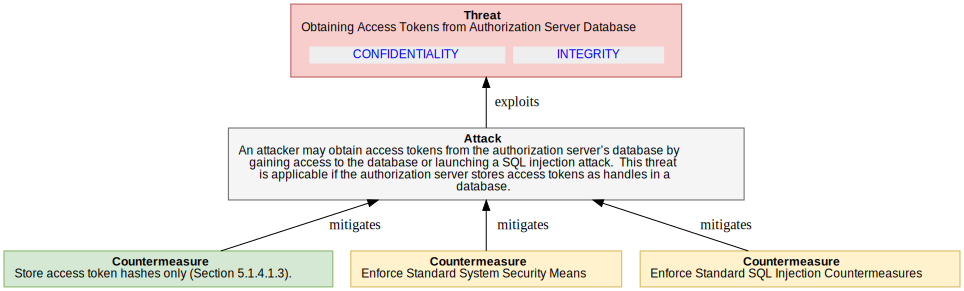

<dl markdown="block">

<dt>Assets (IDs) involved in this threat:</dt>

<dd markdown="block"> - <code><a href="#OAuth2.ACCESS_TOKEN">ACCESS_TOKEN</a></code> - Access Token</dd>
<dd markdown="block"> - <code><a href="#OAuth2.AUTH_SERVER">AUTH_SERVER</a></code> - Authorization server</dd>

<dt>Threat Description</dt><dd markdown="block">An attacker may obtain access
tokens from the authorization server’s database by gaining access to
the database or launching a SQL injection attack. 

This threat is applicable if the authorization server stores access
tokens as handles in a database.
</dd>
<dt>Impact</dt><dd markdown="block">The attacker is able to access all resources for all tokens in Auth Server.
  <code><a href="#OAuth2.CONFIDENTIALITY">CONFIDENTIALITY</a></code><code><a href="#OAuth2.INTEGRITY">INTEGRITY</a></code></dd>

<dt>CVSS</dt>
<dd>

<strong>Base score:</strong> 8.1 (High) 
 
<strong>Vector:</strong><code>CVSS:3.1/AV:N/AC:H/PR:N/UI:N/S:U/C:H/I:H/A:H</code>
</dd>
</dl>

#### Counter-measures for `4_3_2_AS_DB_TOKEN_DISCLOSURE` 

<dl markdown="block">
    
**`5_1_4_1_3_HASHED_TOKEN_DB` Store access token hashes only (Section 5.1.4.1.3).** 
<dd markdown="block">
Store access token hashes only (Section 5.1.4.1.3).
</dd>

<dd markdown="block">
<strong>Countermeasure implemented?</strong> 
&#10004;   <strong>Public and disclosable?</strong> 
&#10004;  </dd>

    
**`5_1_4_1_1_SYS_SEC` Enforce Standard System Security Means** 
<dd markdown="block">
A server system may be locked down so that no attacker may get access
to sensitive configuration files and databases.
</dd>

<dd markdown="block">
<strong>Countermeasure implemented?</strong> 
&#10060;   <strong>Public and disclosable?</strong> 
&#10004;   <strong>Is operational?</strong>&#10004;
    (operated by AUTHORIZATION_SERVER_OPERATOR)
</dd>

    
**`5_1_4_1_2_SQL_SEC` Enforce Standard SQL Injection Countermeasures** 
<dd markdown="block">
If a client identifier or other authentication component is queried
or compared against a SQL database, it may become possible for an
injection attack to occur if parameters received are not validated
before submission to the database.
 o Ensure that server code is using the minimum database privileges
possible to reduce the "surface" of possible attacks.
 o Avoid dynamic SQL using concatenated input. If possible, use
static SQL.
 o When using dynamic SQL, parameterize queries using bind arguments.
Bind arguments eliminate the possibility of SQL injections.
 o Filter and sanitize the input. For example, if an identifier has
a known format, ensure that the supplied value matches the
identifier syntax rules.
</dd>

<dd markdown="block">
<strong>Countermeasure implemented?</strong> 
&#10060;   <strong>Public and disclosable?</strong> 
&#10004;  </dd>

</dl>

### `(4_3_3_CLIENT_CREDENTIALS_DISCLOSURE)` Disclosure of Client Credentials during Transmission

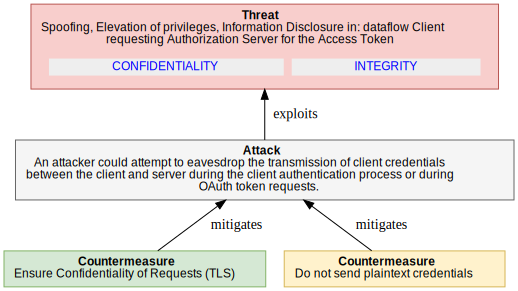

<dl markdown="block">

<dt>Assets (IDs) involved in this threat:</dt>

<dd markdown="block"> - <code><a href="#OAuth2.DF_AUTH_GRANT_AS">DF_AUTH_GRANT_AS</a></code> - Client requesting Authorization Server for the Access Token</dd>

<dt>Threat Description</dt><dd markdown="block">An attacker could attempt to eavesdrop the transmission of client
credentials between the client and server during the client
authentication process or during OAuth token requests.
</dd>
<dt>Impact</dt><dd markdown="block">Revelation of a client credential enabling phishing or impersonation of a client service.
  <code><a href="#OAuth2.CONFIDENTIALITY">CONFIDENTIALITY</a></code><code><a href="#OAuth2.INTEGRITY">INTEGRITY</a></code></dd>

<dt>CVSS</dt>
<dd>

<strong>Base score:</strong> 7.4 (High) 
 
<strong>Vector:</strong><code>CVSS:3.1/AV:N/AC:H/PR:N/UI:N/S:U/C:H/I:H/A:N</code>
</dd>
</dl>

#### Counter-measures for `4_3_3_CLIENT_CREDENTIALS_DISCLOSURE` 

<dl markdown="block">
    
**`5_1_1_CONFIDENTIAL_REQUESTS` Ensure Confidentiality of Requests (TLS)** 
<dd markdown="block">
This is applicable to all requests sent from the client to the
authorization server or resource server. While OAuth provides a
mechanism for verifying the integrity of requests, it provides no
guarantee of request confidentiality. Unless further precautions are
taken, eavesdroppers will have full access to request content and may
be able to mount interception or replay attacks by using the contents
of requests, e.g., secrets or tokens.
Attacks can be mitigated by using transport-layer mechanisms such as
TLS [RFC5246]. A virtual private network (VPN), e.g., based on IPsec
VPNs [RFC4301], may be considered as well.
Note: This document assumes end-to-end TLS protected connections
between the respective protocol entities. Deployments deviating from
this assumption by offloading TLS in between (e.g., on the data
center edge) must refine this threat model in order to account for
the additional (mainly insider) threat this may cause.
This is a countermeasure against the following threats:
 o Replay of access tokens obtained on the token’s endpoint or the
resource server’s endpoint
 o Replay of refresh tokens obtained on the token’s endpoint
Replay of authorization "codes" obtained on the token’s endpoint
(redirect?)
 o Replay of user passwords and client secrets
</dd>

<dd markdown="block">
<strong>Countermeasure implemented?</strong> 
&#10004;   <strong>Public and disclosable?</strong> 
&#10004;   <strong>Is operational?</strong>&#10004;
    (operated by CLIENT_OPERATOR)
</dd>

    
**`CONFIDENTIAL_CREDENTIALS_REQUESTS` Do not send plaintext credentials** 
<dd markdown="block">
Use alternative authentication means that do not require the
sending of plaintext credentials over the wire (e.g., Hash-based
Message Authentication Code).
</dd>

<dd markdown="block">
<strong>Countermeasure implemented?</strong> 
&#10060;   <strong>Public and disclosable?</strong> 
&#10004;  </dd>

</dl>

### `(4_3_4_CLIENT_CREDENTIALS_DISCLOSURE)` Obtaining Client Secret from Authorization Server Database

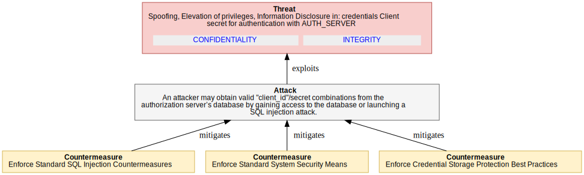

<dl markdown="block">

<dt>Assets (IDs) involved in this threat:</dt>

<dd markdown="block"> - <code><a href="#OAuth2.CLIENT_SECRETS">CLIENT_SECRETS</a></code> - Client secret for authentication with AUTH_SERVER</dd>

<dt>Threat Description</dt><dd markdown="block">An attacker may obtain valid "client_id"/secret combinations from the
authorization server’s database by gaining access to the database or
launching a SQL injection attack.
</dd>
<dt>Impact</dt><dd markdown="block">Disclosure of all "client_id"/secret combinations. This
allows the attacker to act on behalf of legitimate clients.
  <code><a href="#OAuth2.CONFIDENTIALITY">CONFIDENTIALITY</a></code><code><a href="#OAuth2.INTEGRITY">INTEGRITY</a></code></dd>

<dt>CVSS</dt>
<dd>

<strong>Base score:</strong> 7.4 (High) 
 
<strong>Vector:</strong><code>CVSS:3.1/AV:N/AC:H/PR:N/UI:N/S:U/C:H/I:H/A:N</code>
</dd>
</dl>

#### Counter-measures for `4_3_4_CLIENT_CREDENTIALS_DISCLOSURE` 

<dl markdown="block">
    
**Reference to `OAuth2.AuthorizationServer.4_3_2_AS_DB_TOKEN_DISCLOSURE.5_1_4_1_2_SQL_SEC` Enforce Standard SQL Injection Countermeasures** 
<dd markdown="block">
If a client identifier or other authentication component is queried
or compared against a SQL database, it may become possible for an
injection attack to occur if parameters received are not validated
before submission to the database.
 o Ensure that server code is using the minimum database privileges
possible to reduce the "surface" of possible attacks.
 o Avoid dynamic SQL using concatenated input. If possible, use
static SQL.
 o When using dynamic SQL, parameterize queries using bind arguments.
Bind arguments eliminate the possibility of SQL injections.
 o Filter and sanitize the input. For example, if an identifier has
a known format, ensure that the supplied value matches the
identifier syntax rules.
</dd>

<dd markdown="block">
<strong>Countermeasure implemented?</strong> 
&#10060;   <strong>Public and disclosable?</strong> 
&#10004;  </dd>

    
**Reference to `OAuth2.AuthorizationServer.4_3_2_AS_DB_TOKEN_DISCLOSURE.5_1_4_1_1_SYS_SEC` Enforce Standard System Security Means** 
<dd markdown="block">
A server system may be locked down so that no attacker may get access
to sensitive configuration files and databases.
</dd>

<dd markdown="block">
<strong>Countermeasure implemented?</strong> 
&#10060;   <strong>Public and disclosable?</strong> 
&#10004;   <strong>Is operational?</strong>&#10004;
    (operated by AUTHORIZATION_SERVER_OPERATOR)
</dd>

    
**`5_1_4_1_CRED_PROTECTION` Enforce Credential Storage Protection Best Practices** 
<dd markdown="block">
Administrators should undertake industry best practices to protect
the storage of credentials (for example, see [OWASP]). Such
practices may include but are not limited to the following
sub-sections.
</dd>

<dd markdown="block">
<strong>Countermeasure implemented?</strong> 
&#10060;   <strong>Public and disclosable?</strong> 
&#10004;   <strong>Is operational?</strong>&#10004;
    (operated by AUTHORIZATION_SERVER_OPERATOR)
</dd>

</dl>

### `(4_3_5_CLIENT_SECRET_BRUTE_FORCE)` Obtaining Client Secret by Online Guessing

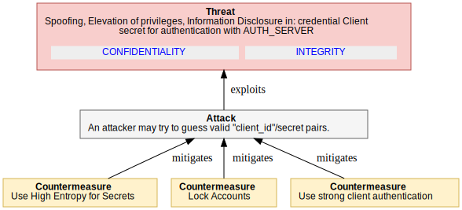

<dl markdown="block">

<dt>Assets (IDs) involved in this threat:</dt>

<dd markdown="block"> - <code><a href="#OAuth2.CLIENT_SECRETS">CLIENT_SECRETS</a></code> - Client secret for authentication with AUTH_SERVER</dd>

  <dt>Attackers/threat agents:</dt>

<dd markdown="block"> - <code><a href="#OAuth2.ANONYMOUS">ANONYMOUS</a></code></dd>
  

<dt>Threat Description</dt><dd markdown="block">An attacker may try to guess valid "client_id"/secret pairs.
</dd>
<dt>Impact</dt><dd markdown="block">Disclosure of a single "client_id"/secret pair.
  <code><a href="#OAuth2.CONFIDENTIALITY">CONFIDENTIALITY</a></code><code><a href="#OAuth2.INTEGRITY">INTEGRITY</a></code></dd>

<dt>CVSS</dt>
<dd>

<strong>Base score:</strong> 7.7 (High) 
 
<strong>Vector:</strong><code>CVSS:3.1/AV:N/AC:H/PR:N/UI:N/S:U/C:H/I:H/A:L</code>
</dd>
</dl>

#### Counter-measures for `4_3_5_CLIENT_SECRET_BRUTE_FORCE` 

<dl markdown="block">
    
**`5_1_4_2_2_HIGH_ENTROPY_SECRETS` Use High Entropy for Secrets** 
<dd markdown="block">
When creating secrets not intended for usage by human users (e.g.,
client secrets or token handles), the authorization server should
include a reasonable level of entropy in order to mitigate the risk
of guessing attacks. The token value should be >=128 bits long and
constructed from a cryptographically strong random or pseudo-random
number sequence (see [RFC4086] for best current practice) generated
by the authorization server.
</dd>

<dd markdown="block">
<strong>Countermeasure implemented?</strong> 
&#10060;   <strong>Public and disclosable?</strong> 
&#10004;  </dd>

    
**`5_1_4_2_3_LOCK_ACCOUNTS` Lock Accounts** 
<dd markdown="block">
Online attacks on passwords can be mitigated by locking the
respective accounts after a certain number of failed attempts.
Note: This measure can be abused to lock down legitimate service users.
</dd>

<dd markdown="block">
<strong>Countermeasure implemented?</strong> 
&#10060;   <strong>Public and disclosable?</strong> 
&#10004;  </dd>

    
**`5_2_3_7_STRONG_CLIENT_AUTHENTICATION` Use strong client authentication** 
<dd markdown="block">
By using an alternative form of authentication such as client
assertion [OAuth-ASSERTIONS], the need to distribute a
"client_secret" is eliminated. This may require the use of a secure
private key store or other supplemental authentication system as
specified by the client assertion issuer in its authentication
process. (e.g., client_assertion/client_token)
</dd>

<dd markdown="block">
<strong>Countermeasure implemented?</strong> 
&#10060;   <strong>Public and disclosable?</strong> 
&#10004;  </dd>

</dl>

  
 

# Flows Threat Model

## Flows - scope of analysis

### Overview

This section covers threats that are specific to certain flows utilized to obtain access tokens. Each flow is characterized by response types and/or grant types on the end-user authorization and token endpoint, respectively. 

### Security Objectives

No Security Objectives defined in this scope

  

### Linked threat Models

  - **Authorization "code" flow** (ID: OAuth2.Flows.Flows_AuthCode)
  - **Implicit Grant flow** (ID: OAuth2.Flows.Flows_ImplicitGrant)

### Diagrams

None

> **Note** This section contains the list of attackers, personas, roles and potential threat agents considered to be within the scope of analysis.

### Assets

#### Summary Table

<table markdown="block">
<tr><th>Title(ID)</th><th>Type</th><th>In Scope</th></tr>
</table>

#### Details

## Flows Analysis

> **Note** This section documents the work performed to identify threats and thier mitigations.#
> It may contains notes from the analysis sessions.
> This analysis section may be omitted in future reports.

None  

## Flows Threats

> **Note** This section contains the threat and mitigations identified during the analysis phase.

  **No threat identified or listed **

  
 

# Authorization "code" flow Threat Model

## Authorization "code" flow - scope of analysis

### Overview

Authorization "code" flow The authorization code is obtained by using an authorization server as an intermediary between the client and resource owner.  Instead of requesting authorization directly from the resource owner, the client directs the resource owner to an authorization server (via its user-agent as defined in [RFC2616]), which in turn directs the resource owner back to the client with the authorization code.
Before directing the resource owner back to the client with the authorization code, the authorization server authenticates the resource owner and obtains authorization.  Because the resource owner only authenticates with the authorization server, the resource owner's credentials are never shared with the client.
The authorization code provides a few important security benefits, such as the ability to authenticate the client, as well as the transmission of the access token directly to the client without passing it through the resource owner's user-agent and potentially exposing it to others, including the resource owner.
**Implicit**
The implicit grant is a simplified authorization code flow optimized for clients implemented in a browser using a scripting language such as JavaScript.  In the implicit flow, instead of issuing the client an authorization code, the client is issued an access token directly (as the result of the resource owner authorization).  The grant type is implicit, as no intermediate credentials (such as an authorization code) are issued (and later used to obtain an access token).
When issuing an access token during the implicit grant flow, the authorization server does not authenticate the client.  In some cases, the client identity can be verified via the redirection URI used to deliver the access token to the client.  The access token may be exposed to the resource owner or other applications with access to the resource owner's user-agent.
Implicit grants improve the responsiveness and efficiency of some clients (such as a client implemented as an in-browser application), since it reduces the number of round trips required to obtain an access token.  However, this convenience should be weighed against the security implications of using implicit grants, such as those described in Sections 10.3 and 10.16, especially when the authorization code grant type is available. 

### Security Objectives

No Security Objectives defined in this scope

### Diagrams

None

> **Note** This section contains the list of attackers, personas, roles and potential threat agents considered to be within the scope of analysis.

### Assumptions

<dl markdown="block">
<dt>USER_AGENT_PROTECTION1</dt><dd>It is not the task of the authorization server to protect
 the end-user’s device from malicious software. This is the
 responsibility of the platform running on the particular device,
 probably in cooperation with other components of the respective
 ecosystem (e.g., an application management infrastructure). The sole
 responsibility of the authorization server is to control access to
 the end-user’s resources maintained in resource servers and to
 prevent unauthorized access to them via the OAuth protocol. Based on
 this assumption, the following countermeasures are available to cope
 with the threat. (REF: 4.4.1.4)
 </dd>
</dl>

### Assets

#### Summary Table

<table markdown="block">
<tr><th>Title(ID)</th><th>Type</th><th>In Scope</th></tr>
<tr markdown="block"><td markdown="block">Auth code is returned to the User Agent from the AUTH_SERVER <code><strong markdown="block">DF_AUTH_CODE_AS</code>
</td><td>dataflow</td>
</td><td>&#x2714;&#xFE0F;</td>
</tr>
<tr markdown="block"><td markdown="block">Auth code redirected to the CLIENT <code><strong markdown="block">DF_AUTH_CODE_CLI</code>
</td><td>dataflow</td>
</td><td>&#x2714;&#xFE0F;</td>
</tr>
</table>

#### Details

<a name='auth-code-is-returned-to-the-user-agent-from-the-auth_server-(dataflow-in-scope---id-<code>df_auth_code_as</code>)'></a>
##### Auth code is returned to the User Agent from the AUTH_SERVER (dataflow in scope - ID: <code>DF_AUTH_CODE_AS</code>) 

 
<dl markdown="block">
AUTH_SERVER response 30x (redirect)
Assuming the resource owner grants access, the authorization
server redirects the user-agent back to the client using the
redirection URI provided earlier (in the request or during
client registration).  The redirection URI includes an
authorization code and any local state provided by the client
earlier.

</dl>
 

<a name='auth-code-redirected-to-the-client-(dataflow-in-scope---id-<code>df_auth_code_cli</code>)'></a>
##### Auth code redirected to the CLIENT (dataflow in scope - ID: <code>DF_AUTH_CODE_CLI</code>) 

 
<dl markdown="block">
USER_AGENT request (redirected from DF_AUTH_CODE_AS 30x response)
Assuming the resource owner grants access, the authorization
server redirects the user-agent back to the client using the
redirection URI provided earlier (in the request or during
client registration).  The redirection URI includes an
authorization code and any local state provided by the client
earlier.

</dl>
 

## Authorization "code" flow Analysis

> **Note** This section documents the work performed to identify threats and thier mitigations.#
> It may contains notes from the analysis sessions.
> This analysis section may be omitted in future reports.

None  

## Authorization "code" flow Threats

> **Note** This section contains the threat and mitigations identified during the analysis phase.

### `(4_4_1_1_AUTH_CODE_DISCLOSURE)` Eavesdropping or Leaking Authorization codes

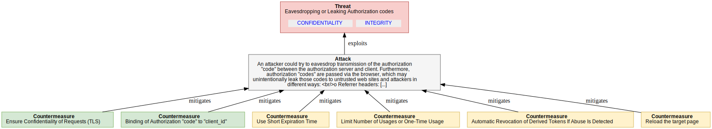

<dl markdown="block">

<dt>Assets (IDs) involved in this threat:</dt>

<dd markdown="block"> - <code><a href="#OAuth2.AUTHORIZATION_GRANT">AUTHORIZATION_GRANT</a></code> - Authorization Grant</dd>

  <dt>Attackers/threat agents:</dt>

<dd markdown="block"> - <code><a href="#OAuth2.ANONYMOUS">ANONYMOUS</a></code></dd>
  

<dt>Threat Description</dt><dd markdown="block">An attacker could try to eavesdrop transmission of the authorization
"code" between the authorization server and client. Furthermore,
authorization "codes" are passed via the browser, which may
unintentionally leak those codes to untrusted web sites and attackers
in different ways:
 o Referrer headers: Browsers frequently pass a "referer" header when
a web page embeds content, or when a user travels from one web
page to another web page. These referrer headers may be sent even
when the origin site does not trust the destination site. The
referrer header is commonly logged for traffic analysis purposes.
 o Request logs: Web server request logs commonly include query
parameters on requests.
 o Open redirectors: Web sites sometimes need to send users to
another destination via a redirector. Open redirectors pose a
particular risk to web-based delegation protocols because the
redirector can leak verification codes to untrusted destination
sites.
 o Browser history: Web browsers commonly record visited URLs in the
browser history. Another user of the same web browser may be able
to view URLs that were visited by previous users.
Note: A description of similar attacks on the SAML protocol can be
found at [OASIS.sstc-saml-bindings-1.1], Section 4.1.1.9.1;
[Sec-Analysis]; and [OASIS.sstc-sec-analysis-response-01].
</dd>
<dt>Impact</dt><dd markdown="block">Auth codes can be used to 
  <code><a href="#OAuth2.CONFIDENTIALITY">CONFIDENTIALITY</a></code><code><a href="#OAuth2.INTEGRITY">INTEGRITY</a></code></dd>

<dt>CVSS</dt>
<dd>

<strong>Base score:</strong> 8.1 (High) 
 
<strong>Vector:</strong><code>CVSS:3.1/AV:N/AC:L/PR:N/UI:R/S:U/C:H/I:H/A:N</code>
</dd>
</dl>

#### Counter-measures for `4_4_1_1_AUTH_CODE_DISCLOSURE` 

<dl markdown="block">
    
**Reference to `OAuth2.AuthorizationServer.4_3_3_CLIENT_CREDENTIALS_DISCLOSURE.5_1_1_CONFIDENTIAL_REQUESTS` Ensure Confidentiality of Requests (TLS)** 
<dd markdown="block">
This is applicable to all requests sent from the client to the
authorization server or resource server. While OAuth provides a
mechanism for verifying the integrity of requests, it provides no
guarantee of request confidentiality. Unless further precautions are
taken, eavesdroppers will have full access to request content and may
be able to mount interception or replay attacks by using the contents
of requests, e.g., secrets or tokens.
Attacks can be mitigated by using transport-layer mechanisms such as
TLS [RFC5246]. A virtual private network (VPN), e.g., based on IPsec
VPNs [RFC4301], may be considered as well.
Note: This document assumes end-to-end TLS protected connections
between the respective protocol entities. Deployments deviating from
this assumption by offloading TLS in between (e.g., on the data
center edge) must refine this threat model in order to account for
the additional (mainly insider) threat this may cause.
This is a countermeasure against the following threats:
 o Replay of access tokens obtained on the token’s endpoint or the
resource server’s endpoint
 o Replay of refresh tokens obtained on the token’s endpoint
Replay of authorization "codes" obtained on the token’s endpoint
(redirect?)
 o Replay of user passwords and client secrets
</dd>

<dd markdown="block">
<strong>Countermeasure implemented?</strong> 
&#10004;   <strong>Public and disclosable?</strong> 
&#10004;   <strong>Is operational?</strong>&#10004;
    (operated by CLIENT_OPERATOR)
</dd>

    
**`5_2_4_4_CLIENT_TO_CODE_BINDING` Binding of Authorization "code" to "client_id"** 
<dd markdown="block">
The authorization server should bind every authorization "code" to
the id of the respective client that initiated the end-user
authorization process. This measure is a countermeasure against:
 o Replay of authorization "codes" with different client credentials,
since an attacker cannot use another "client_id" to exchange an
authorization "code" into a token
 o Online guessing of authorization "codes"
Note: This binding should be protected from unauthorized
modifications (e.g., using protected memory and/or a secure
database).
Also:
The authorization server will require the client to authenticate
wherever possible, so the binding of the authorization "code" to a
certain client can be validated in a reliable way (see
Section 5.2.4.4).
</dd>

<dd markdown="block">
<strong>Countermeasure implemented?</strong> 
&#10004;   <strong>Public and disclosable?</strong> 
&#10004;   <strong>Is operational?</strong>&#10004;
    (operated by AUTHORIZATION_SERVER_OPERATOR)
</dd>

    
**`5_1_5_3_SHORT_EXPIRY_CODE` Use Short Expiration Time** 
<dd markdown="block">
A short expiration time for tokens is a means of protection against
the following threats:
 o replay
 o token leak (a short expiration time will reduce impact)
 o online guessing (a short expiration time will reduce the
likelihood of success)
Note: Short token duration requires more precise clock
synchronization between the authorization server and resource server.
Furthermore, shorter duration may require more token refreshes
(access token) or repeated end-user authorization processes
(authorization "code" and refresh token).
</dd>

<dd markdown="block">
<strong>Countermeasure implemented?</strong> 
&#10060;   <strong>Public and disclosable?</strong> 
&#10004;   <strong>Is operational?</strong>&#10004;
    (operated by AUTHORIZATION_SERVER_OPERATOR)
</dd>

    
**`5_1_5_4_ONE_TIME_USE_TOKEN` Limit Number of Usages or One-Time Usage** 
<dd markdown="block">
The authorization server may restrict the number of requests or
operations that can be performed with a certain token. This
mechanism can be used to mitigate the following threats:
 o replay of tokens
 o guessing
For example, if an authorization server observes more than one
attempt to redeem an authorization "code", the authorization server
may want to revoke all access tokens granted based on the
authorization "code" as well as reject the current request.
As with the authorization "code", access tokens may also have a
limited number of operations. This either forces client applications
to re-authenticate and use a refresh token to obtain a fresh access
token, or forces the client to re-authorize the access token by
involving the user.
</dd>

<dd markdown="block">
<strong>Countermeasure implemented?</strong> 
&#10060;   <strong>Public and disclosable?</strong> 
&#10004;   <strong>Is operational?</strong>&#10004;
    (operated by AUTHORIZATION_SERVER_OPERATOR)
</dd>

    
**`5_2_1_1_TOKEN_ABUSE_DETECTION` Automatic Revocation of Derived Tokens If Abuse Is Detected** 
<dd markdown="block">
If an authorization server observes multiple attempts to redeem an
authorization grant (e.g., such as an authorization "code"), the
authorization server may want to revoke all tokens granted based on
the authorization grant
</dd>

<dd markdown="block">
<strong>Countermeasure implemented?</strong> 
&#10060;   <strong>Public and disclosable?</strong> 
&#10004;   <strong>Is operational?</strong>&#10004;
    (operated by AUTHORIZATION_SERVER_OPERATOR)
</dd>

    
**`USER_AGENT_PAGE_RELOAD` Reload the target page** 
<dd markdown="block">
The client server may reload the target page of the redirect URI
in order to automatically clean up the browser cache.
</dd>

<dd markdown="block">
<strong>Countermeasure implemented?</strong> 
&#10060;   <strong>Public and disclosable?</strong> 
&#10004;   <strong>Is operational?</strong>&#10004;
    (operated by CLIENT_OPERATOR)
</dd>

</dl>

### `(4_4_1_2_AUTH_CODE_DISCLOSURE_DB)` Obtaining Authorization codes from AuthorizationServer Database

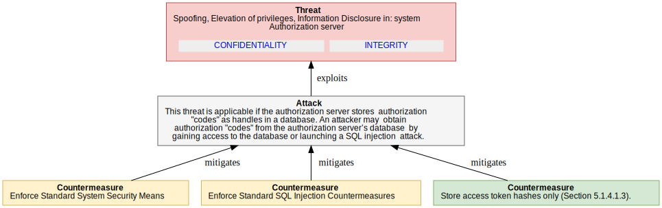

<dl markdown="block">

<dt>Assets (IDs) involved in this threat:</dt>

<dd markdown="block"> - <code><a href="#OAuth2.AUTH_SERVER">AUTH_SERVER</a></code> - Authorization server</dd>

  <dt>Attackers/threat agents:</dt>

<dd markdown="block"> - <code><a href="#OAuth2.ANONYMOUS">ANONYMOUS</a></code></dd>
  

<dt>Threat Description</dt><dd markdown="block">This threat is applicable if the authorization server stores
 authorization "codes" as handles in a database. An attacker may
 obtain authorization "codes" from the authorization server’s database
 by gaining access to the database or launching a SQL injection
 attack.
</dd>
<dt>Impact</dt><dd markdown="block">Disclosure of all authorization "codes", most likely along
 with the respective "redirect_uri" and "client_id" values.
  <code><a href="#OAuth2.CONFIDENTIALITY">CONFIDENTIALITY</a></code><code><a href="#OAuth2.INTEGRITY">INTEGRITY</a></code></dd>

<dt>CVSS</dt>
<dd>

<strong>Base score:</strong> 7.4 (High) 
 
<strong>Vector:</strong><code>CVSS:3.1/AV:N/AC:H/PR:N/UI:N/S:U/C:H/I:H/A:N</code>
</dd>
</dl>

#### Counter-measures for `4_4_1_2_AUTH_CODE_DISCLOSURE_DB` 

<dl markdown="block">
    
**Reference to `OAuth2.AuthorizationServer.4_3_2_AS_DB_TOKEN_DISCLOSURE.5_1_4_1_1_SYS_SEC` Enforce Standard System Security Means** 
<dd markdown="block">
A server system may be locked down so that no attacker may get access
to sensitive configuration files and databases.
</dd>

<dd markdown="block">
<strong>Countermeasure implemented?</strong> 
&#10060;   <strong>Public and disclosable?</strong> 
&#10004;   <strong>Is operational?</strong>&#10004;
    (operated by AUTHORIZATION_SERVER_OPERATOR)
</dd>

    
**Reference to `OAuth2.AuthorizationServer.4_3_2_AS_DB_TOKEN_DISCLOSURE.5_1_4_1_2_SQL_SEC` Enforce Standard SQL Injection Countermeasures** 
<dd markdown="block">
If a client identifier or other authentication component is queried
or compared against a SQL database, it may become possible for an
injection attack to occur if parameters received are not validated
before submission to the database.
 o Ensure that server code is using the minimum database privileges
possible to reduce the "surface" of possible attacks.
 o Avoid dynamic SQL using concatenated input. If possible, use
static SQL.
 o When using dynamic SQL, parameterize queries using bind arguments.
Bind arguments eliminate the possibility of SQL injections.
 o Filter and sanitize the input. For example, if an identifier has
a known format, ensure that the supplied value matches the
identifier syntax rules.
</dd>

<dd markdown="block">
<strong>Countermeasure implemented?</strong> 
&#10060;   <strong>Public and disclosable?</strong> 
&#10004;  </dd>

    
**Reference to `OAuth2.AuthorizationServer.4_3_2_AS_DB_TOKEN_DISCLOSURE.5_1_4_1_3_HASHED_TOKEN_DB` Store access token hashes only (Section 5.1.4.1.3).** 
<dd markdown="block">
Store access token hashes only (Section 5.1.4.1.3).
</dd>

<dd markdown="block">
<strong>Countermeasure implemented?</strong> 
&#10004;   <strong>Public and disclosable?</strong> 
&#10004;  </dd>

</dl>

### `(4_4_1_3_AUTH_CODE_BRUTE_FORCE)` Online Guessing of Authorization codes

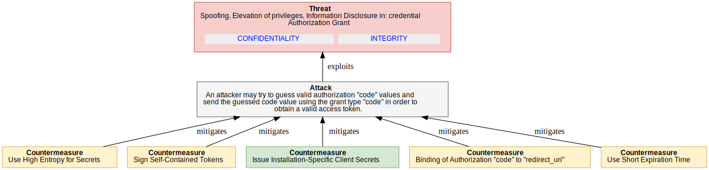

<dl markdown="block">

<dt>Assets (IDs) involved in this threat:</dt>

<dd markdown="block"> - <code><a href="#OAuth2.AUTHORIZATION_GRANT">AUTHORIZATION_GRANT</a></code> - Authorization Grant</dd>

  <dt>Attackers/threat agents:</dt>

<dd markdown="block"> - <code><a href="#OAuth2.ANONYMOUS">ANONYMOUS</a></code></dd>
  

<dt>Threat Description</dt><dd markdown="block">An attacker may try to guess valid authorization "code" values and
 send the guessed code value using the grant type "code" in order to
 obtain a valid access token.
</dd>
<dt>Impact</dt><dd markdown="block">Disclosure of a single access token and probably also an
 associated refresh token.
  <code><a href="#OAuth2.CONFIDENTIALITY">CONFIDENTIALITY</a></code><code><a href="#OAuth2.INTEGRITY">INTEGRITY</a></code></dd>

<dt>CVSS</dt>
<dd>

<strong>Base score:</strong> 7.4 (High) 
 
<strong>Vector:</strong><code>CVSS:3.1/AV:N/AC:H/PR:N/UI:N/S:U/C:H/I:H/A:N</code>
</dd>
</dl>

#### Counter-measures for `4_4_1_3_AUTH_CODE_BRUTE_FORCE` 

<dl markdown="block">
    
**Reference to `OAuth2.AuthorizationServer.4_3_5_CLIENT_SECRET_BRUTE_FORCE.5_1_4_2_2_HIGH_ENTROPY_SECRETS` Use High Entropy for Secrets** 
<dd markdown="block">
When creating secrets not intended for usage by human users (e.g.,
client secrets or token handles), the authorization server should
include a reasonable level of entropy in order to mitigate the risk
of guessing attacks. The token value should be >=128 bits long and
constructed from a cryptographically strong random or pseudo-random
number sequence (see [RFC4086] for best current practice) generated
by the authorization server.
</dd>

<dd markdown="block">
<strong>Countermeasure implemented?</strong> 
&#10060;   <strong>Public and disclosable?</strong> 
&#10004;  </dd>

    
**`5_1_5_9_SIGNED_TOKEN` Sign Self-Contained Tokens** 
<dd markdown="block">
Self-contained tokens should be signed in order to detect any attempt
to modify or produce faked tokens (e.g., Hash-based Message
Authentication Code or digital signatures).
</dd>

<dd markdown="block">
<strong>Countermeasure implemented?</strong> 
&#10060;   <strong>Public and disclosable?</strong> 
&#10004;   <strong>Is operational?</strong>&#10004;
    (operated by AUTHORIZATION_SERVER_OPERATOR)
</dd>

    
**Reference to `OAuth2.Client.Client_Secrets_disclosure.5_2_3_4_SPECIFIC_CLIENT_SECRETS` Issue Installation-Specific Client Secrets** 
<dd markdown="block">
An authorization server may issue separate client identifiers and
corresponding secrets to the different installations of a particular
client (i.e., software package).  The effect of such an approach
would be to turn otherwise "public" clients back into "confidential"
clients.

For web applications, this could mean creating one "client_id" and
"client_secret" for each web site on which a software package is
installed.  So, the provider of that particular site could request a
client id and secret from the authorization server during the setup
of the web site.  This would also allow the validation of some of the
properties of that web site, such as redirect URI, web site URL, and
whatever else proves useful.  The web site provider has to ensure the
security of the client secret on the site.

For native applications, things are more complicated because every
copy of a particular application on any device is a different
installation.  Installation-specific secrets in this scenario will
require obtaining a "client_id" and "client_secret" either

1.  during the download process from the application market, or

2.  during installation on the device.

Either approach will require an automated mechanism for issuing
client ids and secrets, which is currently not defined by OAuth.

The first approach would allow the achievement of a certain level of
trust in the authenticity of the application, whereas the second
option only allows the authentication of the installation but not the
validation of properties of the client.  But this would at least help
to prevent several replay attacks.  Moreover, installation-specific
"client_ids" and secrets allow the selective revocation of all
refresh tokens of a specific installation at once.
</dd>

<dd markdown="block">
<strong>Countermeasure implemented?</strong> 
&#10004;   <strong>Public and disclosable?</strong> 
&#10004;   <strong>Is operational?</strong>&#10004;
    (operated by AUTHORIZATION_SERVER_OPERATOR)
</dd>

    
**`5_2_4_5_REDIRECT_CODE_BINDING` Binding of Authorization "code" to "redirect_uri"** 
<dd markdown="block">
The authorization server should be able to bind every authorization
"code" to the actual redirect URI used as the redirect target of the
client in the end-user authorization process. This binding should be
validated when the client attempts to exchange the respective
authorization "code" for an access token. This measure is a
countermeasure against authorization "code" leakage through
counterfeit web sites, since an attacker cannot use another redirect
URI to exchange an authorization "code" into a token.
</dd>

<dd markdown="block">
<strong>Countermeasure implemented?</strong> 
&#10060;   <strong>Public and disclosable?</strong> 
&#10004;   <strong>Is operational?</strong>&#10004;
    (operated by AUTHORIZATION_SERVER_OPERATOR)
</dd>

    
**Reference to `OAuth2.Flows.Flows_AuthCode.4_4_1_1_AUTH_CODE_DISCLOSURE.5_1_5_3_SHORT_EXPIRY_CODE` Use Short Expiration Time** 
<dd markdown="block">
A short expiration time for tokens is a means of protection against
the following threats:
 o replay
 o token leak (a short expiration time will reduce impact)
 o online guessing (a short expiration time will reduce the
likelihood of success)
Note: Short token duration requires more precise clock
synchronization between the authorization server and resource server.
Furthermore, shorter duration may require more token refreshes
(access token) or repeated end-user authorization processes
(authorization "code" and refresh token).
</dd>

<dd markdown="block">
<strong>Countermeasure implemented?</strong> 
&#10060;   <strong>Public and disclosable?</strong> 
&#10004;   <strong>Is operational?</strong>&#10004;
    (operated by AUTHORIZATION_SERVER_OPERATOR)
</dd>

</dl>

### `(4_4_1_4_CLIENT_SPOOFING1)` Malicious Client Obtains Authorization

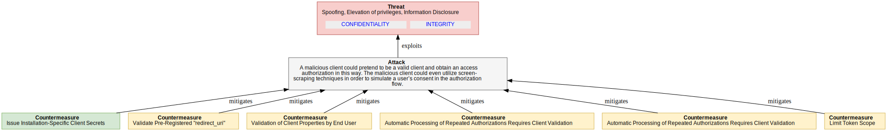

<dl markdown="block">

  <dt>Attackers/threat agents:</dt>

<dd markdown="block"> - <code><a href="#OAuth2.ANONYMOUS">ANONYMOUS</a></code></dd>
  

<dt>Threat Description</dt><dd markdown="block">A malicious client could pretend to be a valid client and obtain an
access authorization in this way. The malicious client could even
utilize screen-scraping techniques in order to simulate a user’s
consent in the authorization flow.
</dd>
<dt>Impact</dt><dd markdown="block">Disclosure of a single access token and probably also an associated refresh token.
  <code><a href="#OAuth2.CONFIDENTIALITY">CONFIDENTIALITY</a></code><code><a href="#OAuth2.INTEGRITY">INTEGRITY</a></code></dd>

<dt>CVSS</dt>
<dd>

<strong>Base score:</strong> 7.4 (High) 
 
<strong>Vector:</strong><code>CVSS:3.1/AV:N/AC:H/PR:N/UI:N/S:U/C:H/I:H/A:N</code>
</dd>
</dl>

#### Counter-measures for `4_4_1_4_CLIENT_SPOOFING1` 

<dl markdown="block">
    
**Reference to `OAuth2.Client.Client_Secrets_disclosure.5_2_3_4_SPECIFIC_CLIENT_SECRETS` Issue Installation-Specific Client Secrets** 
<dd markdown="block">
An authorization server may issue separate client identifiers and
corresponding secrets to the different installations of a particular
client (i.e., software package).  The effect of such an approach
would be to turn otherwise "public" clients back into "confidential"
clients.

For web applications, this could mean creating one "client_id" and
"client_secret" for each web site on which a software package is
installed.  So, the provider of that particular site could request a
client id and secret from the authorization server during the setup
of the web site.  This would also allow the validation of some of the
properties of that web site, such as redirect URI, web site URL, and
whatever else proves useful.  The web site provider has to ensure the
security of the client secret on the site.

For native applications, things are more complicated because every
copy of a particular application on any device is a different
installation.  Installation-specific secrets in this scenario will
require obtaining a "client_id" and "client_secret" either

1.  during the download process from the application market, or

2.  during installation on the device.

Either approach will require an automated mechanism for issuing
client ids and secrets, which is currently not defined by OAuth.

The first approach would allow the achievement of a certain level of
trust in the authenticity of the application, whereas the second
option only allows the authentication of the installation but not the
validation of properties of the client.  But this would at least help
to prevent several replay attacks.  Moreover, installation-specific
"client_ids" and secrets allow the selective revocation of all
refresh tokens of a specific installation at once.
</dd>

<dd markdown="block">
<strong>Countermeasure implemented?</strong> 
&#10004;   <strong>Public and disclosable?</strong> 
&#10004;   <strong>Is operational?</strong>&#10004;
    (operated by AUTHORIZATION_SERVER_OPERATOR)
</dd>

    
**Reference to `OAuth2.Client.Client_Secrets_disclosure.5_2_3_5_VALIDATE_REDIRECT_URI` Validate Pre-Registered "redirect_uri"** 
<dd markdown="block">
An authorization server should require all clients to register their
"redirect_uri", and the "redirect_uri" should be the full URI as
defined in [RFC6749].  The way that this registration is performed is
out of scope of this document.  As per the core spec, every actual
redirect URI sent with the respective "client_id" to the end-user
authorization endpoint must match the registered redirect URI.  Where
it does not match, the authorization server should assume that the
inbound GET request has been sent by an attacker and refuse it.
Note: The authorization server should not redirect the user agent
back to the redirect URI of such an authorization request.
Validating the pre-registered "redirect_uri" is a countermeasure
against the following threats:

o  Authorization "code" leakage through counterfeit web site: allows
    authorization servers to detect attack attempts after the first
    redirect to an end-user authorization endpoint (Section 4.4.1.7).

o  Open redirector attack via a client redirection endpoint
    (Section 4.1.5).

o  Open redirector phishing attack via an authorization server
    redirection endpoint (Section 4.2.4).

The underlying assumption of this measure is that an attacker will
need to use another redirect URI in order to get access to the
authorization "code".  Deployments might consider the possibility of
an attacker using spoofing attacks to a victim's device to circumvent
this security measure.

Note: Pre-registering clients might not scale in some deployments
(manual process) or require dynamic client registration (not
specified yet).  With the lack of dynamic client registration, a
pre-registered "redirect_uri" only works for clients bound to certain
deployments at development/configuration time.  As soon as dynamic
resource server discovery is required, the pre-registered
"redirect_uri" may no longer be feasible.
5_Validate_redirect_uri

Note: An invalid redirect URI indicates an
invalid client, whereas a valid redirect URI does not necessarily
indicate a valid client. The level of confidence depends on the
client type. For web applications, the level of confidence is
high, since the redirect URI refers to the globally unique network
endpoint of this application, whose fully qualified domain name
(FQDN) is also validated using HTTPS server authentication by the
user agent. In contrast, for native clients, the redirect URI
typically refers to device local resources, e.g., a custom scheme.
So, a malicious client on a particular device can use the valid
redirect URI the legitimate client uses on all other devices.
</dd>

<dd markdown="block">
<strong>Countermeasure implemented?</strong> 
&#10060;   <strong>Public and disclosable?</strong> 
&#10004;   <strong>Is operational?</strong>&#10004;
    (operated by AUTHORIZATION_SERVER)
</dd>

    
**`5_2_4_3_VALIDATION_OF_CLIENT_BY_END_USER` Validation of Client Properties by End User** 
<dd markdown="block">
In the authorization process, the user is typically asked to approve
a client’s request for authorization. This is an important security
mechanism by itself because the end user can be involved in the
validation of client properties, such as whether the client name
known to the authorization server fits the name of the web site or
the application the end user is using. This measure is especially
helpful in situations where the authorization server is unable to
authenticate the client. It is a countermeasure against:
 o A malicious application
 o A client application masquerading as another client
</dd>

<dd markdown="block">
<strong>Countermeasure implemented?</strong> 
&#10060;   <strong>Public and disclosable?</strong> 
&#10004;   <strong>Is operational?</strong>&#10004;
    (operated by RESOURCE_OWNER)
</dd>

    
**`5_2_4_1_REPEAT_VALIDATE_CLIENT` Automatic Processing of Repeated Authorizations Requires Client Validation** 
<dd markdown="block">
Authorization servers should NOT automatically process repeat
authorizations where the client is not authenticated through a client
secret or some other authentication mechanism such as a signed
authentication assertion certificate (Section 5.2.3.7) or validation
of a pre-registered redirect URI (Section 5.2.3.5).
</dd>

<dd markdown="block">
<strong>Countermeasure implemented?</strong> 
&#10060;   <strong>Public and disclosable?</strong> 
&#10004;   <strong>Is operational?</strong>&#10004;
    (operated by AUTHORIZATION_SERVER_OPERATOR)
</dd>

    
**`REQUIRE_USER_MANUAL_STEP` Automatic Processing of Repeated Authorizations Requires Client Validation** 
<dd markdown="block">
If the authorization server automatically authenticates the end
user, it may nevertheless require some user input in order to
prevent screen scraping. Examples are CAPTCHAs (Completely
Automated Public Turing tests to tell Computers and Humans Apart)
or other multi-factor authentication techniques such as random
questions, token code generators, etc.
</dd>

<dd markdown="block">
<strong>Countermeasure implemented?</strong> 
&#10060;   <strong>Public and disclosable?</strong> 
&#10004;   <strong>Is operational?</strong>&#10004;
    (operated by AUTHORIZATION_SERVER_OPERATOR)
</dd>

    
**`5_1_5_1_LIMITED_SCOPE_TOKEN` Limit Token Scope** 
<dd markdown="block">
The authorization server may decide to reduce or limit the scope
associated with a token. The basis of this decision is out of scope;
examples are:

 o a client-specific policy, e.g., issue only less powerful tokens to
public clients,
 o a service-specific policy, e.g., it is a very sensitive service,
 o a resource-owner-specific setting, or
 o combinations of such policies and preferences.

The authorization server may allow different scopes dependent on the
grant type. For example, end-user authorization via direct
interaction with the end user (authorization "code") might be
considered more reliable than direct authorization via grant type
"username"/"password". This means will reduce the impact of the
following threats:
 o token leakage
 o token issuance to malicious software
 o unintended issuance of powerful tokens with resource owner
credentials flow
</dd>

<dd markdown="block">
<strong>Countermeasure implemented?</strong> 
&#10060;   <strong>Public and disclosable?</strong> 
&#10004;   <strong>Is operational?</strong>&#10004;
    (operated by AUTHORIZATION_SERVER_OPERATOR)
</dd>

</dl>

### `(4_4_1_5_CLIENT_SPOOFING2)` Authorization code Phishing

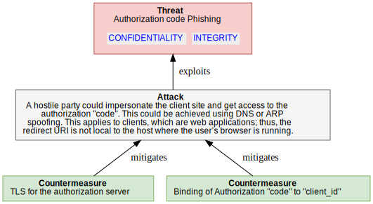

<dl markdown="block">

  <dt>Attackers/threat agents:</dt>

<dd markdown="block"> - <code><a href="#OAuth2.ANONYMOUS">ANONYMOUS</a></code></dd>
  

<dt>Threat Description</dt><dd markdown="block">A hostile party could impersonate the client site and get access to
the authorization "code". This could be achieved using DNS or ARP
spoofing. This applies to clients, which are web applications; thus,
the redirect URI is not local to the host where the user’s browser is
running.
</dd>
<dt>Impact</dt><dd markdown="block">This affects web applications and may lead to a disclosure of
authorization "codes" and, potentially, the corresponding access and
refresh tokens.
  <code><a href="#OAuth2.CONFIDENTIALITY">CONFIDENTIALITY</a></code><code><a href="#OAuth2.INTEGRITY">INTEGRITY</a></code></dd>

<dt>CVSS</dt>
<dd>

<strong>Base score:</strong> 6.9 (Medium) 
 
<strong>Vector:</strong><code>CVSS:3.1/AV:L/AC:H/PR:N/UI:N/S:U/C:H/I:H/A:L</code>
</dd>
</dl>

#### Counter-measures for `4_4_1_5_CLIENT_SPOOFING2` 

<dl markdown="block">
    
**Reference to `OAuth2.AuthorizationServer.AuthServerPhishing1.5_1_2_AUTH_SERVER_AUTHENTICATION` TLS for the authorization server** 
<dd markdown="block">
Authorization servers should consider such attacks when developing
services based on OAuth and should require the use of transport-
layer security for any requests where the authenticity of the
authorization server or of request responses is an issue (see
Section 5.1.2).

HTTPS server authentication or similar means can be used to
authenticate the identity of a server. The goal is to reliably bind
the fully qualified domain name of the server to the public key
presented by the server during connection establishment (see
[RFC2818]).
The client should validate the binding of the server to its domain
name. If the server fails to prove that binding, the communication
is considered a man-in-the-middle attack. This security measure
depends on the certification authorities the client trusts for that
purpose. Clients should carefully select those trusted CAs and
protect the storage for trusted CA certificates from modifications.
This is a countermeasure against the following threats:
 o Spoofing
 o Proxying
 o Phishing by counterfeit servers
</dd>

<dd markdown="block">
<strong>Countermeasure implemented?</strong> 
&#10004;   <strong>Public and disclosable?</strong> 
&#10004;   <strong>Is operational?</strong>&#10004;
    (operated by AUTHORIZATION_SERVER)
</dd>

    
**Reference to `OAuth2.Flows.Flows_AuthCode.4_4_1_1_AUTH_CODE_DISCLOSURE.5_2_4_4_CLIENT_TO_CODE_BINDING` Binding of Authorization "code" to "client_id"** 
<dd markdown="block">
The authorization server should bind every authorization "code" to
the id of the respective client that initiated the end-user
authorization process. This measure is a countermeasure against:
 o Replay of authorization "codes" with different client credentials,
since an attacker cannot use another "client_id" to exchange an
authorization "code" into a token
 o Online guessing of authorization "codes"
Note: This binding should be protected from unauthorized
modifications (e.g., using protected memory and/or a secure
database).
Also:
The authorization server will require the client to authenticate
wherever possible, so the binding of the authorization "code" to a
certain client can be validated in a reliable way (see
Section 5.2.4.4).
</dd>

<dd markdown="block">
<strong>Countermeasure implemented?</strong> 
&#10004;   <strong>Public and disclosable?</strong> 
&#10004;   <strong>Is operational?</strong>&#10004;
    (operated by AUTHORIZATION_SERVER_OPERATOR)
</dd>

</dl>

### `(4_4_1_6_CLIENT_SPOOFING3)` Authorization code Phishing

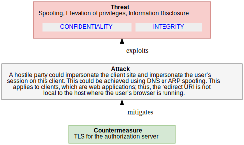

<dl markdown="block">

  <dt>Attackers/threat agents:</dt>

<dd markdown="block"> - <code><a href="#OAuth2.ANONYMOUS">ANONYMOUS</a></code></dd>
  

<dt>Threat Description</dt><dd markdown="block">A hostile party could impersonate the client site and impersonate the
user’s session on this client. This could be achieved using DNS or
ARP spoofing. This applies to clients, which are web applications;
thus, the redirect URI is not local to the host where the user’s
browser is running.
</dd>
<dt>Impact</dt><dd markdown="block">An attacker who intercepts the authorization "code" as it is
sent by the browser to the callback endpoint can gain access to
protected resources by submitting the authorization "code" to the
client. The client will exchange the authorization "code" for an
access token and use the access token to access protected resources
for the benefit of the attacker, delivering protected resources to
the attacker, or modifying protected resources as directed by the
attacker. If OAuth is used by the client to delegate authentication
to a social site (e.g., as in the implementation of a "Login" button
on a third-party social network site), the attacker can use the
intercepted authorization "code" to log into the client as the user.
Note: Authenticating the client during authorization "code" exchange
will not help to detect such an attack, as it is the legitimate
client that obtains the tokens.
  <code><a href="#OAuth2.CONFIDENTIALITY">CONFIDENTIALITY</a></code><code><a href="#OAuth2.INTEGRITY">INTEGRITY</a></code></dd>

<dt>CVSS</dt>
<dd>

<strong>Base score:</strong> 6.9 (Medium) 
 
<strong>Vector:</strong><code>CVSS:3.1/AV:L/AC:H/PR:N/UI:N/S:U/C:H/I:H/A:L</code>
</dd>
</dl>

#### Counter-measures for `4_4_1_6_CLIENT_SPOOFING3` 

<dl markdown="block">
    
**Reference to `OAuth2.AuthorizationServer.AuthServerPhishing1.5_1_2_AUTH_SERVER_AUTHENTICATION` TLS for the authorization server** 
<dd markdown="block">
Authorization servers should consider such attacks when developing
services based on OAuth and should require the use of transport-
layer security for any requests where the authenticity of the
authorization server or of request responses is an issue (see
Section 5.1.2).

HTTPS server authentication or similar means can be used to
authenticate the identity of a server. The goal is to reliably bind
the fully qualified domain name of the server to the public key
presented by the server during connection establishment (see
[RFC2818]).
The client should validate the binding of the server to its domain
name. If the server fails to prove that binding, the communication
is considered a man-in-the-middle attack. This security measure
depends on the certification authorities the client trusts for that
purpose. Clients should carefully select those trusted CAs and
protect the storage for trusted CA certificates from modifications.
This is a countermeasure against the following threats:
 o Spoofing
 o Proxying
 o Phishing by counterfeit servers
</dd>

<dd markdown="block">
<strong>Countermeasure implemented?</strong> 
&#10004;   <strong>Public and disclosable?</strong> 
&#10004;   <strong>Is operational?</strong>&#10004;
    (operated by AUTHORIZATION_SERVER)
</dd>

</dl>

### `(4_4_1_7_CLIENT_SPOOFING4)` Authorization code Leakage through Counterfeit Client

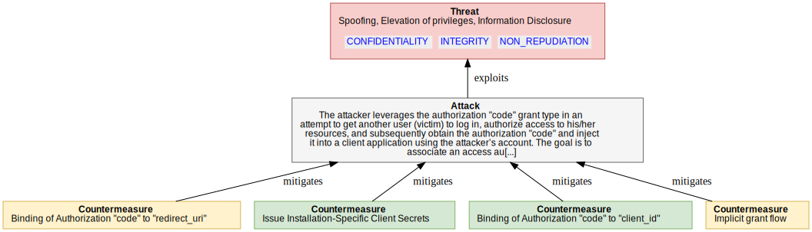

<dl markdown="block">

  <dt>Attackers/threat agents:</dt>

<dd markdown="block"> - <code><a href="#OAuth2.CLIENT_OPERATOR">CLIENT_OPERATOR</a></code></dd>
  

<dt>Threat Description</dt><dd markdown="block">The attacker leverages the authorization "code" grant type in an
attempt to get another user (victim) to log in, authorize access to
his/her resources, and subsequently obtain the authorization "code"
and inject it into a client application using the attacker’s account.
The goal is to associate an access authorization for resources of the
victim with the user account of the attacker on a client site.
The attacker abuses an existing client application and combines it
with his own counterfeit client web site. The attacker depends on
the victim expecting the client application to request access to a
certain resource server. The victim, seeing only a normal request
from an expected application, approves the request. The attacker
then uses the victim’s authorization to gain access to the
information unknowingly authorized by the victim.
The attacker conducts the following flow:

1. The attacker accesses the client web site (or application) and
initiates data access to a particular resource server. The
client web site in turn initiates an authorization request to the
resource server’s authorization server. Instead of proceeding
with the authorization process, the attacker modifies the
authorization server end-user authorization URL as constructed by
the client to include a redirect URI parameter referring to a web
site under his control (attacker’s web site).

2. The attacker tricks another user (the victim) into opening that
modified end-user authorization URI and authorizing access (e.g.,
via an email link or blog link). The way the attacker achieves
this goal is out of scope.

3. Having clicked the link, the victim is requested to authenticate
and authorize the client site to have access.

4. After completion of the authorization process, the authorization
server redirects the user agent to the attacker’s web site
instead of the original client web site.

5. The attacker obtains the authorization "code" from his web site
by means that are out of scope of this document.

6. He then constructs a redirect URI to the target web site (or
application) based on the original authorization request’s
redirect URI and the newly obtained authorization "code", and
directs his user agent to this URL. The authorization "code" is
injected into the original client site (or application).

7. The client site uses the authorization "code" to fetch a token
from the authorization server and associates this token with the
attacker’s user account on this site.

8. The attacker may now access the victim’s resources using the
client site.
</dd>
<dt>Impact</dt><dd markdown="block">The attacker gains access to the victim’s resources as associated with his account on the client site.
  <code><a href="#OAuth2.CONFIDENTIALITY">CONFIDENTIALITY</a></code><code><a href="#OAuth2.INTEGRITY">INTEGRITY</a></code><code><a href="#OAuth2.NON_REPUDIATION">NON_REPUDIATION</a></code></dd>

<dt>CVSS</dt>
<dd>

<strong>Base score:</strong> 6.5 (Medium) 
 
<strong>Vector:</strong><code>CVSS:3.1/AV:N/AC:L/PR:H/UI:N/S:U/C:H/I:H/A:N</code>
</dd>
</dl>

#### Counter-measures for `4_4_1_7_CLIENT_SPOOFING4` 

<dl markdown="block">
    
**Reference to `OAuth2.Flows.Flows_AuthCode.4_4_1_3_AUTH_CODE_BRUTE_FORCE.5_2_4_5_REDIRECT_CODE_BINDING` Binding of Authorization "code" to "redirect_uri"** 
<dd markdown="block">
The authorization server should be able to bind every authorization
"code" to the actual redirect URI used as the redirect target of the
client in the end-user authorization process. This binding should be
validated when the client attempts to exchange the respective
authorization "code" for an access token. This measure is a
countermeasure against authorization "code" leakage through
counterfeit web sites, since an attacker cannot use another redirect
URI to exchange an authorization "code" into a token.
</dd>

<dd markdown="block">
<strong>Countermeasure implemented?</strong> 
&#10060;   <strong>Public and disclosable?</strong> 
&#10004;   <strong>Is operational?</strong>&#10004;
    (operated by AUTHORIZATION_SERVER_OPERATOR)
</dd>

    
**Reference to `OAuth2.Client.Client_Secrets_disclosure.5_2_3_4_SPECIFIC_CLIENT_SECRETS` Issue Installation-Specific Client Secrets** 
<dd markdown="block">
An authorization server may issue separate client identifiers and
corresponding secrets to the different installations of a particular
client (i.e., software package).  The effect of such an approach
would be to turn otherwise "public" clients back into "confidential"
clients.

For web applications, this could mean creating one "client_id" and
"client_secret" for each web site on which a software package is
installed.  So, the provider of that particular site could request a
client id and secret from the authorization server during the setup
of the web site.  This would also allow the validation of some of the
properties of that web site, such as redirect URI, web site URL, and
whatever else proves useful.  The web site provider has to ensure the
security of the client secret on the site.

For native applications, things are more complicated because every
copy of a particular application on any device is a different
installation.  Installation-specific secrets in this scenario will
require obtaining a "client_id" and "client_secret" either

1.  during the download process from the application market, or

2.  during installation on the device.

Either approach will require an automated mechanism for issuing
client ids and secrets, which is currently not defined by OAuth.

The first approach would allow the achievement of a certain level of
trust in the authenticity of the application, whereas the second
option only allows the authentication of the installation but not the
validation of properties of the client.  But this would at least help
to prevent several replay attacks.  Moreover, installation-specific
"client_ids" and secrets allow the selective revocation of all
refresh tokens of a specific installation at once.
</dd>

<dd markdown="block">
<strong>Countermeasure implemented?</strong> 
&#10004;   <strong>Public and disclosable?</strong> 
&#10004;   <strong>Is operational?</strong>&#10004;
    (operated by AUTHORIZATION_SERVER_OPERATOR)
</dd>

    
**Reference to `OAuth2.Flows.Flows_AuthCode.4_4_1_1_AUTH_CODE_DISCLOSURE.5_2_4_4_CLIENT_TO_CODE_BINDING` Binding of Authorization "code" to "client_id"** 
<dd markdown="block">
The authorization server should bind every authorization "code" to
the id of the respective client that initiated the end-user
authorization process. This measure is a countermeasure against:
 o Replay of authorization "codes" with different client credentials,
since an attacker cannot use another "client_id" to exchange an
authorization "code" into a token
 o Online guessing of authorization "codes"
Note: This binding should be protected from unauthorized
modifications (e.g., using protected memory and/or a secure
database).
Also:
The authorization server will require the client to authenticate
wherever possible, so the binding of the authorization "code" to a
certain client can be validated in a reliable way (see
Section 5.2.4.4).
</dd>

<dd markdown="block">
<strong>Countermeasure implemented?</strong> 
&#10004;   <strong>Public and disclosable?</strong> 
&#10004;   <strong>Is operational?</strong>&#10004;
    (operated by AUTHORIZATION_SERVER_OPERATOR)
</dd>

    
**`IMPLICIT_GRANT_FLOW` Implicit grant flow** 
<dd markdown="block">
The client may consider using other flows that are not vulnerable
to this kind of attack, such as the implicit grant type (see
Section 4.4.2) or resource owner password credentials (see
Section 4.4.3).
</dd>

<dd markdown="block">
<strong>Countermeasure implemented?</strong> 
&#10060;   <strong>Public and disclosable?</strong> 
&#10004;  </dd>

</dl>

### `(4_4_1_8_CSRF_ON_REDIRECT)` CSRF Attack against redirect-uri

<dl markdown="block">

<dt>Assets (IDs) involved in this threat:</dt>

<dd markdown="block"> - <code><a href="#OAuth2.DF_AUTH_REDIRECT">DF_AUTH_REDIRECT</a></code> - Auth User Agent Redirection</dd>

  <dt>Attackers/threat agents:</dt>

<dd markdown="block"> - <code><a href="#OAuth2.ANONYMOUS">ANONYMOUS</a></code></dd>
  

<dt>Threat Description</dt><dd markdown="block">Cross-site request forgery (CSRF) is a web-based attack whereby HTTP
requests are transmitted from a user that the web site trusts or has
authenticated (e.g., via HTTP redirects or HTML forms). CSRF attacks
on OAuth approvals can allow an attacker to obtain authorization to
OAuth protected resources without the consent of the user.
This attack works against the redirect URI used in the authorization
"code" flow. An attacker could authorize an authorization "code" to
their own protected resources on an authorization server. He then
aborts the redirect flow back to the client on his device and tricks
the victim into executing the redirect back to the client. The
client receives the redirect, fetches the token(s) from the
authorization server, and associates the victim’s client session with
the resources accessible using the token.
</dd>
<dt>Impact</dt><dd markdown="block">The user accesses resources on behalf of the attacker. The
effective impact depends on the type of resource accessed. For
example, the user may upload private items to an attacker’s
resources. Or, when using OAuth in 3rd-party login scenarios, the
user may associate his client account with the attacker’s identity at
the external Identity Provider. In this way, the attacker could
easily access the victim’s data at the client by logging in from
another device with his credentials at the external Identity
Provider.
  <code><a href="#OAuth2.CONFIDENTIALITY">CONFIDENTIALITY</a></code><code><a href="#OAuth2.NON_REPUDIATION">NON_REPUDIATION</a></code></dd>

<dt>CVSS</dt>
<dd>

<strong>Base score:</strong> 8.1 (High) 
 
<strong>Vector:</strong><code>CVSS:3.1/AV:N/AC:L/PR:N/UI:R/S:U/C:H/I:H/A:N</code>
</dd>
</dl>

#### Counter-measures for `4_4_1_8_CSRF_ON_REDIRECT` 

<dl markdown="block">
    
**`5_3_5_ANTI_CSRF_STATE_PARAM` Link the state Parameter to User Agent Session (anti CSRF)** 
<dd markdown="block">
The "state" parameter is used to link client requests and prevent CSRF attacks, for example, attacks against the redirect URI. An attacker could inject their own authorization "code" or access token, which can result in the client using an access token associated with the attacker’s protected resources rather than the victim’s (e.g., save the victim’s bank account information to a protected resource controlled by the attacker). The client should utilize the "state" request parameter to send the authorization server a value that binds the request to the user agent’s authenticated state (e.g., a hash of the session cookie used to authenticate the user agent) when making an authorization request. Once authorization has been obtained from the end user, the authorization server redirects the end-user’s user agent back to the client with the required binding value contained in the "state" parameter. The binding value enables the client to verify the validity of the request by matching the binding value to the user agent’s authenticated state.</dd>

<dd markdown="block">
<strong>Countermeasure implemented?</strong> 
&#10060;   <strong>Public and disclosable?</strong> 
&#10004;   <strong>Is operational?</strong>&#10004;
    (operated by CLIENT_OPERATOR)
</dd>

    
**`USER_EDUCATION` Users can be educated to not follow untrusted URLs** 
<dd markdown="block">
Client developers and end users can be educated to not follow
untrusted URLs.    
</dd>

<dd markdown="block">
<strong>Countermeasure implemented?</strong> 
&#10060;   <strong>Public and disclosable?</strong> 
&#10004;   <strong>Is operational?</strong>&#10004;
    (operated by AUTHORIZATION_SERVER_OPERATOR)
</dd>

</dl>

### `(4_4_1_9_CLICKJACKING)` Clickjacking Attack against Authorization

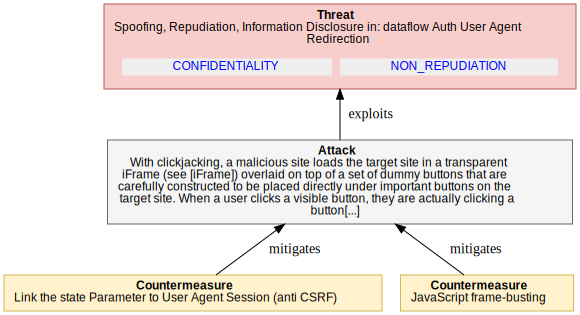

<dl markdown="block">

<dt>Assets (IDs) involved in this threat:</dt>

<dd markdown="block"> - <code><a href="#OAuth2.DF_AUTH_REDIRECT">DF_AUTH_REDIRECT</a></code> - Auth User Agent Redirection</dd>

  <dt>Attackers/threat agents:</dt>

<dd markdown="block"> - <code><a href="#OAuth2.ANONYMOUS">ANONYMOUS</a></code></dd>
  

<dt>Threat Description</dt><dd markdown="block">With clickjacking, a malicious site loads the target site in a
transparent iFrame (see [iFrame]) overlaid on top of a set of dummy
buttons that are carefully constructed to be placed directly under
important buttons on the target site. When a user clicks a visible
button, they are actually clicking a button (such as an "Authorize"
button) on the hidden page.
</dd>
<dt>Impact</dt><dd markdown="block">An attacker can steal a user’s authentication credentials and access their resources.
  <code><a href="#OAuth2.CONFIDENTIALITY">CONFIDENTIALITY</a></code><code><a href="#OAuth2.NON_REPUDIATION">NON_REPUDIATION</a></code></dd>

<dt>CVSS</dt>
<dd>

<strong>Base score:</strong> 8.1 (High) 
 
<strong>Vector:</strong><code>CVSS:3.1/AV:N/AC:L/PR:N/UI:R/S:U/C:H/I:H/A:N</code>
</dd>
</dl>

#### Counter-measures for `4_4_1_9_CLICKJACKING` 

<dl markdown="block">
    
**`5_2_2_6_X_FRAME_OPTION` Link the state Parameter to User Agent Session (anti CSRF)** 
<dd markdown="block">
For newer browsers, avoidance of iFrames can be enforced on the
  server side by using the X-FRAME-OPTIONS header (see
  [X-Frame-Options]). This header can have two values, "DENY" and
  "SAMEORIGIN", which will block any framing or any framing by sites
  with a different origin, respectively. The value "ALLOW-FROM"
  specifies a list of trusted origins that iFrames may originate from.
   This is a countermeasure against the following threat:

  o Clickjacking attacks
</dd>

<dd markdown="block">
<strong>Countermeasure implemented?</strong> 
&#10060;   <strong>Public and disclosable?</strong> 
&#10004;   <strong>Is operational?</strong>&#10004;
    (operated by AUTHORIZATION_SERVER_OPERATOR)
</dd>

    
**`FRAMEBUSTING` JavaScript frame-busting** 
<dd markdown="block">
For older browsers, JavaScript frame-busting (see [Framebusting])
techniques can be used but may not be effective in all browsers. 
</dd>

<dd markdown="block">
<strong>Countermeasure implemented?</strong> 
&#10060;   <strong>Public and disclosable?</strong> 
&#10004;   <strong>Is operational?</strong>&#10004;
    (operated by AUTHORIZATION_SERVER_OPERATOR)
</dd>

</dl>

### `(4_4_1_10_RESOURCE_OWNER_SPOOFING1)` Resource Owner Impersonation

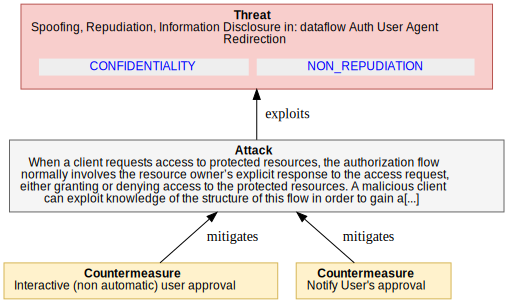

<dl markdown="block">

<dt>Assets (IDs) involved in this threat:</dt>

<dd markdown="block"> - <code><a href="#OAuth2.DF_AUTH_REDIRECT">DF_AUTH_REDIRECT</a></code> - Auth User Agent Redirection</dd>

  <dt>Attackers/threat agents:</dt>

<dd markdown="block"> - <code><a href="#OAuth2.CLIENT_OPERATOR">CLIENT_OPERATOR</a></code></dd>
  

<dt>Threat Description</dt><dd markdown="block">When a client requests access to protected resources, the
authorization flow normally involves the resource owner’s explicit
response to the access request, either granting or denying access to
the protected resources. A malicious client can exploit knowledge of
the structure of this flow in order to gain authorization without the
resource owner’s consent, by transmitting the necessary requests
programmatically and simulating the flow against the authorization
server. That way, the client may gain access to the victim’s
resources without her approval. An authorization server will be
vulnerable to this threat if it uses non-interactive authentication
mechanisms or splits the authorization flow across multiple pages.
The malicious client might embed a hidden HTML user agent, interpret
the HTML forms sent by the authorization server, and automatically
send the corresponding form HTTP POST requests. As a prerequisite,
the attacker must be able to execute the authorization process in the
context of an already-authenticated session of the resource owner
with the authorization server. There are different ways to achieve
this:

o The malicious client could abuse an existing session in an
external browser or cross-browser cookies on the particular
device.

  o The malicious client could also request authorization for an
initial scope acceptable to the user and then silently abuse the
resulting session in his browser instance to "silently" request
another scope.

o Alternatively, the attacker might exploit an authorization
server’s ability to authenticate the resource owner automatically
and without user interactions, e.g., based on certificates.
In all cases, such an attack is limited to clients running on the
victim’s device, either within the user agent or as a native app.
Please note: Such attacks cannot be prevented using CSRF
countermeasures, since the attacker just "executes" the URLs as
prepared by the authorization server including any nonce, etc.
</dd>
<dt>Impact</dt><dd markdown="block"><code><a href="#OAuth2.CONFIDENTIALITY">CONFIDENTIALITY</a></code><code><a href="#OAuth2.NON_REPUDIATION">NON_REPUDIATION</a></code></dd>

<dt>CVSS</dt>
<dd>

<strong>Base score:</strong> 8.1 (High) 
 
<strong>Vector:</strong><code>CVSS:3.1/AV:N/AC:L/PR:N/UI:R/S:U/C:H/I:H/A:N</code>
</dd>
</dl>

#### Counter-measures for `4_4_1_10_RESOURCE_OWNER_SPOOFING1` 

<dl markdown="block">
    
**`INTERACTIVE_APPROVAL` Interactive (non automatic) user approval** 
<dd markdown="block">
Authorization servers should decide, based on an analysis of the risk
associated with this threat, whether to detect and prevent this
threat.
In order to prevent such an attack, the authorization server may
force a user interaction based on non-predictable input values as
part of the user consent approval. The authorization server could

o combine password authentication and user consent in a single form,

o make use of CAPTCHAs, or

o use one-time secrets sent out of band to the resource owner (e.g.,
via text or instant message).
</dd>

<dd markdown="block">
<strong>Countermeasure implemented?</strong> 
&#10060;   <strong>Public and disclosable?</strong> 
&#10004;   <strong>Is operational?</strong>&#10004;
    (operated by AUTHORIZATION_SERVER_OPERATOR)
</dd>

    
**`NOTIFY_APPROVAL` Notify User's approval** 
<dd markdown="block">
In order to allow the resource owner to detect abuse,
the authorization server could notify the resource owner of any
approval by appropriate means, e.g., text or instant message, or
email.
</dd>

<dd markdown="block">
<strong>Countermeasure implemented?</strong> 
&#10060;   <strong>Public and disclosable?</strong> 
&#10004;   <strong>Is operational?</strong>&#10004;
    (operated by AUTHORIZATION_SERVER_OPERATOR)
</dd>

</dl>

### `(4_4_1_11_DOS_TOKEN_ENTROPY)` Resource Owner Impersonation

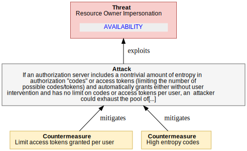

<dl markdown="block">

<dt>Assets (IDs) involved in this threat:</dt>

<dd markdown="block"> - <code><a href="#OAuth2.DF_AUTH_REDIRECT">DF_AUTH_REDIRECT</a></code> - Auth User Agent Redirection</dd>

  <dt>Attackers/threat agents:</dt>

<dd markdown="block"> - <code><a href="#OAuth2.CLIENT_OPERATOR">CLIENT_OPERATOR</a></code></dd>
  

<dt>Threat Description</dt><dd markdown="block">If an authorization server includes a nontrivial amount of entropy in
 authorization "codes" or access tokens (limiting the number of
 possible codes/tokens) and automatically grants either without user
 intervention and has no limit on codes or access tokens per user, an
 attacker could exhaust the pool of authorization "codes" by
 repeatedly directing the user’s browser to request authorization
  "codes" or access tokens.
</dd>
<dt>Impact</dt><dd markdown="block"><code><a href="#OAuth2.AVAILABILITY">AVAILABILITY</a></code></dd>

<dt>CVSS</dt>
<dd>

<strong>Base score:</strong> 6.5 (Medium) 
 
<strong>Vector:</strong><code>CVSS:3.1/AV:N/AC:L/PR:L/UI:N/S:U/C:N/I:N/A:H</code>
</dd>
</dl>

#### Counter-measures for `4_4_1_11_DOS_TOKEN_ENTROPY` 

<dl markdown="block">
    
**`AUTH_SERVER_PER_USER_LIMIT` Limit access tokens granted per user** 
<dd markdown="block">
The authorization server should consider limiting the number of
access tokens granted per user.
</dd>

<dd markdown="block">
<strong>Countermeasure implemented?</strong> 
&#10060;   <strong>Public and disclosable?</strong> 
&#10004;   <strong>Is operational?</strong>&#10004;
    (operated by AUTHORIZATION_SERVER_OPERATOR)
</dd>

    
**`AUTH_CODE_HIGH_ENTROPY` High entropy codes** 
<dd markdown="block">
The authorization server should include a nontrivial amount of
entropy in authorization "codes".
</dd>

<dd markdown="block">
<strong>Countermeasure implemented?</strong> 
&#10060;   <strong>Public and disclosable?</strong> 
&#10004;  </dd>

</dl>

### `(4_4_1_12_DOS2)` DoS Using Manufactured Authorization "codes"

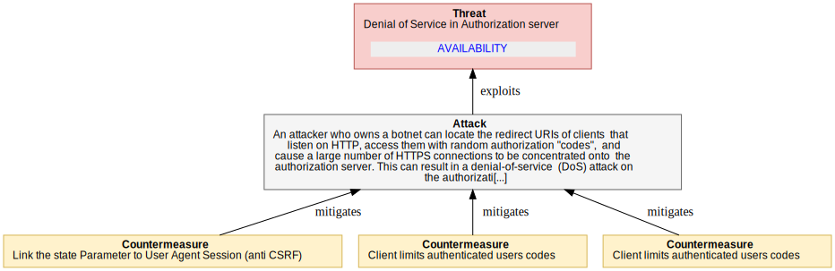

<dl markdown="block">

<dt>Assets (IDs) involved in this threat:</dt>

<dd markdown="block"> - <code><a href="#OAuth2.AUTH_SERVER">AUTH_SERVER</a></code> - Authorization server</dd>

  <dt>Attackers/threat agents:</dt>

<dd markdown="block"> - <code><a href="#OAuth2.CLIENT_OPERATOR">CLIENT_OPERATOR</a></code></dd>
  

<dt>Threat Description</dt><dd markdown="block">An attacker who owns a botnet can locate the redirect URIs of clients
 that listen on HTTP, access them with random authorization "codes",
 and cause a large number of HTTPS connections to be concentrated onto
 the authorization server. This can result in a denial-of-service
 (DoS) attack on the authorization server.
 This attack can still be effective even when CSRF defense/the "state"
 parameter (see Section 4.4.1.8) is deployed on the client side. With
 such a defense, the attacker might need to incur an additional HTTP
 request to obtain a valid CSRF code/"state" parameter. This
 apparently cuts down the effectiveness of the attack by a factor of
 2. However, if the HTTPS/HTTP cost ratio is higher than 2 (the cost
 factor is estimated to be around 3.5x at [SSL-Latency]), the attacker
 still achieves a magnification of resource utilization at the expense
 of the authorization server.
</dd>
<dt>Impact</dt><dd markdown="block">There are a few effects that the attacker can accomplish with
this OAuth flow that they cannot easily achieve otherwise.
1. Connection laundering: With the clients as the relay between the
attacker and the authorization server, the authorization server
learns little or no information about the identity of the
attacker. Defenses such as rate-limiting on the offending
attacker machines are less effective because it is difficult to
identify the attacking machines. Although an attacker could also
launder its connections through an anonymizing system such as
Tor, the effectiveness of that approach depends on the capacity
of the anonymizing system. On the other hand, a potentially
large number of OAuth clients could be utilized for this attack.
2. Asymmetric resource utilization: The attacker incurs the cost of
an HTTP connection and causes an HTTPS connection to be made on
the authorization server; the attacker can coordinate the timing
of such HTTPS connections across multiple clients relatively
easily. Although the attacker could achieve something similar,
say, by including an iFrame pointing to the HTTPS URL of the
authorization server in an HTTP web page and luring web users to
visit that page, timing attacks using such a scheme may be more
difficult, as it seems nontrivial to synchronize a large number
of users to simultaneously visit a particular site under the
attacker’s control.
  <code><a href="#OAuth2.AVAILABILITY">AVAILABILITY</a></code></dd>

<dt>CVSS</dt>
<dd>

<strong>Base score:</strong> 5.3 (Medium) 
 
<strong>Vector:</strong><code>CVSS:3.1/AV:N/AC:H/PR:L/UI:N/S:U/C:N/I:N/A:H</code>
</dd>
</dl>

#### Counter-measures for `4_4_1_12_DOS2` 

<dl markdown="block">
    
**Reference to `OAuth2.Flows.Flows_AuthCode.4_4_1_8_CSRF_ON_REDIRECT.5_3_5_ANTI_CSRF_STATE_PARAM` Link the state Parameter to User Agent Session (anti CSRF)** 
<dd markdown="block">
The "state" parameter is used to link client requests and prevent CSRF attacks, for example, attacks against the redirect URI. An attacker could inject their own authorization "code" or access token, which can result in the client using an access token associated with the attacker’s protected resources rather than the victim’s (e.g., save the victim’s bank account information to a protected resource controlled by the attacker). The client should utilize the "state" request parameter to send the authorization server a value that binds the request to the user agent’s authenticated state (e.g., a hash of the session cookie used to authenticate the user agent) when making an authorization request. Once authorization has been obtained from the end user, the authorization server redirects the end-user’s user agent back to the client with the required binding value contained in the "state" parameter. The binding value enables the client to verify the validity of the request by matching the binding value to the user agent’s authenticated state.</dd>

<dd markdown="block">
<strong>Countermeasure implemented?</strong> 
&#10060;   <strong>Public and disclosable?</strong> 
&#10004;   <strong>Is operational?</strong>&#10004;
    (operated by CLIENT_OPERATOR)
</dd>

    
**`CLIENT_LIMITS_PER_USER` Client limits authenticated users codes** 
<dd markdown="block">
If the client authenticates the user, either through a single-
sign-on protocol or through local authentication, the client
should suspend the access by a user account if the number of
invalid authorization "codes" submitted by this user exceeds a
certain threshold.
</dd>

<dd markdown="block">
<strong>Countermeasure implemented?</strong> 
&#10060;   <strong>Public and disclosable?</strong> 
&#10004;   <strong>Is operational?</strong>&#10004;
    (operated by CLIENT_OPERATOR)
</dd>

    
**`AUTH_RATE_LIMIT` Client limits authenticated users codes** 
<dd markdown="block">
The authorization server should send an error response to the
client reporting an invalid authorization "code" and rate-limit or
disallow connections from clients whose number of invalid requests
exceeds a threshold.
</dd>

<dd markdown="block">
<strong>Countermeasure implemented?</strong> 
&#10060;   <strong>Public and disclosable?</strong> 
&#10004;   <strong>Is operational?</strong>&#10004;
    (operated by AUTHORIZATION_SERVER_OPERATOR)
</dd>

</dl>

### `(4_4_1_13_CODE_SUBSTITUTION)` DoS Using Manufactured Authorization "codes"

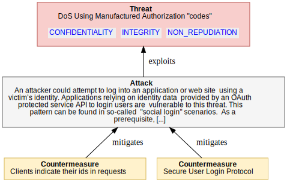

<dl markdown="block">

  <dt>Attackers/threat agents:</dt>

<dd markdown="block"> - <code><a href="#OAuth2.CLIENT_OPERATOR">CLIENT_OPERATOR</a></code></dd>
  

<dt>Threat Description</dt><dd markdown="block">An attacker could attempt to log into an application or web site
 using a victim’s identity. Applications relying on identity data
 provided by an OAuth protected service API to login users are
 vulnerable to this threat. This pattern can be found in so-called
 "social login" scenarios.
 As a prerequisite, a resource server offers an API to obtain personal
 information about a user that could be interpreted as having obtained
 a user identity. In this sense, the client is treating the resource
 server API as an "identity" API. A client utilizes OAuth to obtain
 an access token for the identity API. It then queries the identity
 API for an identifier and uses it to look up its internal user
 account data (login). The client assumes that, because it was able
 to obtain information about the user, the user has been
 authenticated.
 If the client uses the grant type "code", the attacker needs to
 gather a valid authorization "code" of the respective victim from the
 same Identity Provider used by the target client application. The
 attacker tricks the victim into logging into a malicious app (which
 may appear to be legitimate to the Identity Provider) using the same
 Identity Provider as the target application. This results in the
 Identity Provider’s authorization server issuing an authorizatio
 "code" for the respective identity API. The malicious app then sends
 this code to the attacker, which in turn triggers a login process
 within the target application. The attacker now manipulates the
 authorization response and substitutes their code (bound to their
 identity) for the victim’s code. This code is then exchanged by the
 client for an access token, which in turn is accepted by the identity
 API, since the audience, with respect to the resource server, is
 correct. But since the identifier returned by the identity API is
 determined by the identity in the access token (issued based on the
 victim’s code), the attacker is logged into the target application
 under the victim’s identity.
</dd>
<dt>Impact</dt><dd markdown="block">The attacker gains access to an application and user-specific
data within the application.
  <code><a href="#OAuth2.CONFIDENTIALITY">CONFIDENTIALITY</a></code><code><a href="#OAuth2.INTEGRITY">INTEGRITY</a></code><code><a href="#OAuth2.NON_REPUDIATION">NON_REPUDIATION</a></code></dd>

<dt>CVSS</dt>
<dd>

<strong>Base score:</strong> 5.4 (Medium) 
 
<strong>Vector:</strong><code>CVSS:3.1/AV:N/AC:H/PR:L/UI:R/S:U/C:H/I:L/A:N</code>
</dd>
</dl>

#### Counter-measures for `4_4_1_13_CODE_SUBSTITUTION` 

<dl markdown="block">
    
**`IN_REQUEST_CLIENTID` Clients indicate their ids in requests** 
<dd markdown="block">
All clients must indicate their client ids with every request to
exchange an authorization "code" for an access token. The
authorization server must validate whether the particular
authorization "code" has been issued to the particular client. If
possible, the client shall be authenticated beforehand.
</dd>

<dd markdown="block">
<strong>Countermeasure implemented?</strong> 
&#10060;   <strong>Public and disclosable?</strong> 
&#10004;   <strong>Is operational?</strong>&#10004;
    (operated by AUTHORIZATION_SERVER_OPERATOR)
</dd>

    
**`SECURE_USER_LOGIN_PROTOCOL` Secure User Login Protocol** 
<dd markdown="block">
Clients should use an appropriate protocol, such as OpenID (cf.
[OPENID]) or SAML (cf. [OASIS.sstc-saml-bindings-1.1]) to
implement user login. Both support audience restrictions on
clients.
</dd>

<dd markdown="block">
<strong>Countermeasure implemented?</strong> 
&#10060;   <strong>Public and disclosable?</strong> 
&#10004;   <strong>Is operational?</strong>&#10004;
    (operated by CLIENT_OPERATOR)
</dd>

</dl>

  
 

# Implicit Grant flow Threat Model

## Implicit Grant flow - scope of analysis

### Overview

In the implicit grant type flow, the access token is directly
returned to the client as a fragment part of the redirect URI. It is
assumed that the token is not sent to the redirect URI target, as
HTTP user agents do not send the fragment part of URIs to HTTP
servers. Thus, an attacker cannot eavesdrop the access token on this
communication path, and the token cannot leak through HTTP referrer
headers.
 

### Security Objectives

No Security Objectives defined in this scope

### Diagrams

None

> **Note** This section contains the list of attackers, personas, roles and potential threat agents considered to be within the scope of analysis.

### Assets

#### Summary Table

<table markdown="block">
<tr><th>Title(ID)</th><th>Type</th><th>In Scope</th></tr>
</table>

#### Details

## Implicit Grant flow Analysis

> **Note** This section documents the work performed to identify threats and thier mitigations.#
> It may contains notes from the analysis sessions.
> This analysis section may be omitted in future reports.

None  

## Implicit Grant flow Threats

> **Note** This section contains the threat and mitigations identified during the analysis phase.

### `(4_4_2_1_TOKEN_LEAK1_NETWORK)` Access Token Leak in Transport/Endpoints

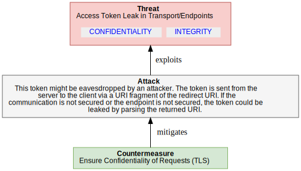

<dl markdown="block">

<dt>Assets (IDs) involved in this threat:</dt>

<dd markdown="block"> - <code><a href="#OAuth2.AUTHORIZATION_GRANT">AUTHORIZATION_GRANT</a></code> - Authorization Grant</dd>

  <dt>Attackers/threat agents:</dt>

<dd markdown="block"> - <code><a href="#OAuth2.ANONYMOUS">ANONYMOUS</a></code></dd>
  

<dt>Threat Description</dt><dd markdown="block">This token might be eavesdropped by an attacker. The token is sent
from the server to the client via a URI fragment of the redirect URI.
If the communication is not secured or the endpoint is not secured,
the token could be leaked by parsing the returned URI.
</dd>
<dt>Impact</dt><dd markdown="block">The attacker would be able to assume the same rights granted
by the token.
  <code><a href="#OAuth2.CONFIDENTIALITY">CONFIDENTIALITY</a></code><code><a href="#OAuth2.INTEGRITY">INTEGRITY</a></code></dd>

<dt>CVSS</dt>
<dd>

<strong>Base score:</strong> 5.9 (Medium) 
 
<strong>Vector:</strong><code>CVSS:3.1/AV:A/AC:H/PR:N/UI:N/S:U/C:H/I:L/A:N</code>
</dd>
</dl>

#### Counter-measures for `4_4_2_1_TOKEN_LEAK1_NETWORK` 

<dl markdown="block">
    
**Reference to `OAuth2.AuthorizationServer.4_3_3_CLIENT_CREDENTIALS_DISCLOSURE.5_1_1_CONFIDENTIAL_REQUESTS` Ensure Confidentiality of Requests (TLS)** 
<dd markdown="block">
This is applicable to all requests sent from the client to the
authorization server or resource server. While OAuth provides a
mechanism for verifying the integrity of requests, it provides no
guarantee of request confidentiality. Unless further precautions are
taken, eavesdroppers will have full access to request content and may
be able to mount interception or replay attacks by using the contents
of requests, e.g., secrets or tokens.
Attacks can be mitigated by using transport-layer mechanisms such as
TLS [RFC5246]. A virtual private network (VPN), e.g., based on IPsec
VPNs [RFC4301], may be considered as well.
Note: This document assumes end-to-end TLS protected connections
between the respective protocol entities. Deployments deviating from
this assumption by offloading TLS in between (e.g., on the data
center edge) must refine this threat model in order to account for
the additional (mainly insider) threat this may cause.
This is a countermeasure against the following threats:
 o Replay of access tokens obtained on the token’s endpoint or the
resource server’s endpoint
 o Replay of refresh tokens obtained on the token’s endpoint
Replay of authorization "codes" obtained on the token’s endpoint
(redirect?)
 o Replay of user passwords and client secrets
</dd>

<dd markdown="block">
<strong>Countermeasure implemented?</strong> 
&#10004;   <strong>Public and disclosable?</strong> 
&#10004;   <strong>Is operational?</strong>&#10004;
    (operated by CLIENT_OPERATOR)
</dd>

</dl>

### `(4_4_2_2_TOKEN_LEAK2_BROWSER_HISTORY)` Access Token Leak in Browser History

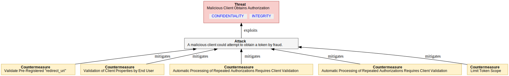

<dl markdown="block">

<dt>Assets (IDs) involved in this threat:</dt>

<dd markdown="block"> - <code><a href="#OAuth2.AUTHORIZATION_GRANT">AUTHORIZATION_GRANT</a></code> - Authorization Grant</dd>

  <dt>Attackers/threat agents:</dt>

<dd markdown="block"> - <code><a href="#OAuth2.ANONYMOUS">ANONYMOUS</a></code></dd>
  

<dt>Threat Description</dt><dd markdown="block">An attacker could obtain the token from the browser’s history. Note
that this means the attacker needs access to the particular device.
</dd>
<dt>Impact</dt><dd markdown="block">The attacker would be able to assume the same rights granted
by the token. 
  <code><a href="#OAuth2.CONFIDENTIALITY">CONFIDENTIALITY</a></code><code><a href="#OAuth2.INTEGRITY">INTEGRITY</a></code></dd>

<dt>CVSS</dt>
<dd>

<strong>Base score:</strong> 6.1 (Medium) 
 
<strong>Vector:</strong><code>CVSS:3.1/AV:L/AC:L/PR:L/UI:N/S:U/C:H/I:L/A:N</code>
</dd>
</dl>

#### Counter-measures for `4_4_2_2_TOKEN_LEAK2_BROWSER_HISTORY` 

<dl markdown="block">
    
**Reference to `OAuth2.Flows.Flows_AuthCode.4_4_1_1_AUTH_CODE_DISCLOSURE.5_1_5_3_SHORT_EXPIRY_CODE` Use Short Expiration Time** 
<dd markdown="block">
A short expiration time for tokens is a means of protection against
the following threats:
 o replay
 o token leak (a short expiration time will reduce impact)
 o online guessing (a short expiration time will reduce the
likelihood of success)
Note: Short token duration requires more precise clock
synchronization between the authorization server and resource server.
Furthermore, shorter duration may require more token refreshes
(access token) or repeated end-user authorization processes
(authorization "code" and refresh token).
</dd>

<dd markdown="block">
<strong>Countermeasure implemented?</strong> 
&#10060;   <strong>Public and disclosable?</strong> 
&#10004;   <strong>Is operational?</strong>&#10004;
    (operated by AUTHORIZATION_SERVER_OPERATOR)
</dd>

    
**`NON_CACHEABLE_RESPONSES` Make responses non-cacheable.** 
<dd markdown="block">
Make responses non-cacheable.
</dd>

<dd markdown="block">
<strong>Countermeasure implemented?</strong> 
&#10060;   <strong>Public and disclosable?</strong> 
&#10004;   <strong>Is operational?</strong>&#10004;
    (operated by AUTHORIZATION_SERVER_OPERATOR)
</dd>

</dl>

### `(4_4_2_2_TOKEN_LEAK2_BROWSER_HISTORY)` Malicious Client Obtains Authorization

<dl markdown="block">

<dt>Assets (IDs) involved in this threat:</dt>

<dd markdown="block"> - <code><a href="#OAuth2.AUTHORIZATION_GRANT">AUTHORIZATION_GRANT</a></code> - Authorization Grant</dd>

  <dt>Attackers/threat agents:</dt>

<dd markdown="block"> - <code><a href="#OAuth2.ANONYMOUS">ANONYMOUS</a></code></dd>
  

<dt>Threat Description</dt><dd markdown="block">A malicious client could attempt to obtain a token by fraud.
</dd>
<dt>Impact</dt><dd markdown="block">The attacker would be able to assume the same rights granted
by the token. 
  <code><a href="#OAuth2.CONFIDENTIALITY">CONFIDENTIALITY</a></code><code><a href="#OAuth2.INTEGRITY">INTEGRITY</a></code></dd>

<dt>CVSS</dt>
<dd>

<strong>Base score:</strong> 7.4 (High) 
 
<strong>Vector:</strong><code>CVSS:3.1/AV:N/AC:H/PR:N/UI:N/S:U/C:H/I:H/A:N</code>
</dd>
</dl>

#### Counter-measures for `4_4_2_2_TOKEN_LEAK2_BROWSER_HISTORY` 

<dl markdown="block">
    
**Reference to `OAuth2.Client.Client_Secrets_disclosure.5_2_3_5_VALIDATE_REDIRECT_URI` Validate Pre-Registered "redirect_uri"** 
<dd markdown="block">
An authorization server should require all clients to register their
"redirect_uri", and the "redirect_uri" should be the full URI as
defined in [RFC6749].  The way that this registration is performed is
out of scope of this document.  As per the core spec, every actual
redirect URI sent with the respective "client_id" to the end-user
authorization endpoint must match the registered redirect URI.  Where
it does not match, the authorization server should assume that the
inbound GET request has been sent by an attacker and refuse it.
Note: The authorization server should not redirect the user agent
back to the redirect URI of such an authorization request.
Validating the pre-registered "redirect_uri" is a countermeasure
against the following threats:

o  Authorization "code" leakage through counterfeit web site: allows
    authorization servers to detect attack attempts after the first
    redirect to an end-user authorization endpoint (Section 4.4.1.7).

o  Open redirector attack via a client redirection endpoint
    (Section 4.1.5).

o  Open redirector phishing attack via an authorization server
    redirection endpoint (Section 4.2.4).

The underlying assumption of this measure is that an attacker will
need to use another redirect URI in order to get access to the
authorization "code".  Deployments might consider the possibility of
an attacker using spoofing attacks to a victim's device to circumvent
this security measure.

Note: Pre-registering clients might not scale in some deployments
(manual process) or require dynamic client registration (not
specified yet).  With the lack of dynamic client registration, a
pre-registered "redirect_uri" only works for clients bound to certain
deployments at development/configuration time.  As soon as dynamic
resource server discovery is required, the pre-registered
"redirect_uri" may no longer be feasible.
5_Validate_redirect_uri

Note: An invalid redirect URI indicates an
invalid client, whereas a valid redirect URI does not necessarily
indicate a valid client. The level of confidence depends on the
client type. For web applications, the level of confidence is
high, since the redirect URI refers to the globally unique network
endpoint of this application, whose fully qualified domain name
(FQDN) is also validated using HTTPS server authentication by the
user agent. In contrast, for native clients, the redirect URI
typically refers to device local resources, e.g., a custom scheme.
So, a malicious client on a particular device can use the valid
redirect URI the legitimate client uses on all other devices.
</dd>

<dd markdown="block">
<strong>Countermeasure implemented?</strong> 
&#10060;   <strong>Public and disclosable?</strong> 
&#10004;   <strong>Is operational?</strong>&#10004;
    (operated by AUTHORIZATION_SERVER)
</dd>

    
**Reference to `OAuth2.Flows.Flows_AuthCode.4_4_1_4_CLIENT_SPOOFING1.5_2_4_3_VALIDATION_OF_CLIENT_BY_END_USER` Validation of Client Properties by End User** 
<dd markdown="block">
In the authorization process, the user is typically asked to approve
a client’s request for authorization. This is an important security
mechanism by itself because the end user can be involved in the
validation of client properties, such as whether the client name
known to the authorization server fits the name of the web site or
the application the end user is using. This measure is especially
helpful in situations where the authorization server is unable to
authenticate the client. It is a countermeasure against:
 o A malicious application
 o A client application masquerading as another client
</dd>

<dd markdown="block">
<strong>Countermeasure implemented?</strong> 
&#10060;   <strong>Public and disclosable?</strong> 
&#10004;   <strong>Is operational?</strong>&#10004;
    (operated by RESOURCE_OWNER)
</dd>

    
**Reference to `OAuth2.Flows.Flows_AuthCode.4_4_1_4_CLIENT_SPOOFING1.5_2_4_1_REPEAT_VALIDATE_CLIENT` Automatic Processing of Repeated Authorizations Requires Client Validation** 
<dd markdown="block">
Authorization servers should NOT automatically process repeat
authorizations where the client is not authenticated through a client
secret or some other authentication mechanism such as a signed
authentication assertion certificate (Section 5.2.3.7) or validation
of a pre-registered redirect URI (Section 5.2.3.5).
</dd>

<dd markdown="block">
<strong>Countermeasure implemented?</strong> 
&#10060;   <strong>Public and disclosable?</strong> 
&#10004;   <strong>Is operational?</strong>&#10004;
    (operated by AUTHORIZATION_SERVER_OPERATOR)
</dd>

    
**Reference to `OAuth2.Flows.Flows_AuthCode.4_4_1_4_CLIENT_SPOOFING1.REQUIRE_USER_MANUAL_STEP` Automatic Processing of Repeated Authorizations Requires Client Validation** 
<dd markdown="block">
If the authorization server automatically authenticates the end
user, it may nevertheless require some user input in order to
prevent screen scraping. Examples are CAPTCHAs (Completely
Automated Public Turing tests to tell Computers and Humans Apart)
or other multi-factor authentication techniques such as random
questions, token code generators, etc.
</dd>

<dd markdown="block">
<strong>Countermeasure implemented?</strong> 
&#10060;   <strong>Public and disclosable?</strong> 
&#10004;   <strong>Is operational?</strong>&#10004;
    (operated by AUTHORIZATION_SERVER_OPERATOR)
</dd>

    
**Reference to `OAuth2.Flows.Flows_AuthCode.4_4_1_4_CLIENT_SPOOFING1.5_1_5_1_LIMITED_SCOPE_TOKEN` Limit Token Scope** 
<dd markdown="block">
The authorization server may decide to reduce or limit the scope
associated with a token. The basis of this decision is out of scope;
examples are:

 o a client-specific policy, e.g., issue only less powerful tokens to
public clients,
 o a service-specific policy, e.g., it is a very sensitive service,
 o a resource-owner-specific setting, or
 o combinations of such policies and preferences.

The authorization server may allow different scopes dependent on the
grant type. For example, end-user authorization via direct
interaction with the end user (authorization "code") might be
considered more reliable than direct authorization via grant type
"username"/"password". This means will reduce the impact of the
following threats:
 o token leakage
 o token issuance to malicious software
 o unintended issuance of powerful tokens with resource owner
credentials flow
</dd>

<dd markdown="block">
<strong>Countermeasure implemented?</strong> 
&#10060;   <strong>Public and disclosable?</strong> 
&#10004;   <strong>Is operational?</strong>&#10004;
    (operated by AUTHORIZATION_SERVER_OPERATOR)
</dd>

</dl>

### `(4_4_2_4_MANIPULATION_SCRIPTS)` Manipulation of Scripts

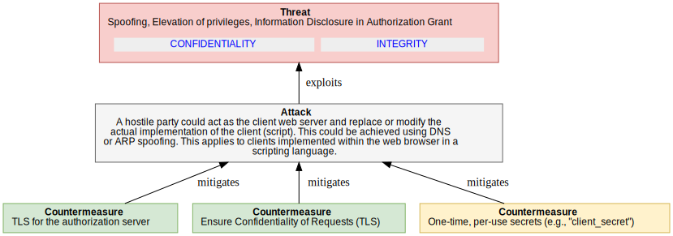

<dl markdown="block">

<dt>Assets (IDs) involved in this threat:</dt>

<dd markdown="block"> - <code><a href="#OAuth2.AUTHORIZATION_GRANT">AUTHORIZATION_GRANT</a></code> - Authorization Grant</dd>

  <dt>Attackers/threat agents:</dt>

<dd markdown="block"> - <code><a href="#OAuth2.ANONYMOUS">ANONYMOUS</a></code></dd>
  

<dt>Threat Description</dt><dd markdown="block">A hostile party could act as the client web server and replace or
modify the actual implementation of the client (script). This could
be achieved using DNS or ARP spoofing. This applies to clients
implemented within the web browser in a scripting language.
</dd>
<dt>Impact</dt><dd markdown="block">The attacker could obtain user credential information and
assume the full identity of the user.
  <code><a href="#OAuth2.CONFIDENTIALITY">CONFIDENTIALITY</a></code><code><a href="#OAuth2.INTEGRITY">INTEGRITY</a></code></dd>

<dt>CVSS</dt>
<dd>

<strong>Base score:</strong> 5.4 (Medium) 
 
<strong>Vector:</strong><code>CVSS:3.1/AV:A/AC:H/PR:L/UI:N/S:U/C:H/I:L/A:N</code>
</dd>
</dl>

#### Counter-measures for `4_4_2_4_MANIPULATION_SCRIPTS` 

<dl markdown="block">
    
**Reference to `OAuth2.AuthorizationServer.AuthServerPhishing1.5_1_2_AUTH_SERVER_AUTHENTICATION` TLS for the authorization server** 
<dd markdown="block">
Authorization servers should consider such attacks when developing
services based on OAuth and should require the use of transport-
layer security for any requests where the authenticity of the
authorization server or of request responses is an issue (see
Section 5.1.2).

HTTPS server authentication or similar means can be used to
authenticate the identity of a server. The goal is to reliably bind
the fully qualified domain name of the server to the public key
presented by the server during connection establishment (see
[RFC2818]).
The client should validate the binding of the server to its domain
name. If the server fails to prove that binding, the communication
is considered a man-in-the-middle attack. This security measure
depends on the certification authorities the client trusts for that
purpose. Clients should carefully select those trusted CAs and
protect the storage for trusted CA certificates from modifications.
This is a countermeasure against the following threats:
 o Spoofing
 o Proxying
 o Phishing by counterfeit servers
</dd>

<dd markdown="block">
<strong>Countermeasure implemented?</strong> 
&#10004;   <strong>Public and disclosable?</strong> 
&#10004;   <strong>Is operational?</strong>&#10004;
    (operated by AUTHORIZATION_SERVER)
</dd>

    
**Reference to `OAuth2.AuthorizationServer.4_3_3_CLIENT_CREDENTIALS_DISCLOSURE.5_1_1_CONFIDENTIAL_REQUESTS` Ensure Confidentiality of Requests (TLS)** 
<dd markdown="block">
This is applicable to all requests sent from the client to the
authorization server or resource server. While OAuth provides a
mechanism for verifying the integrity of requests, it provides no
guarantee of request confidentiality. Unless further precautions are
taken, eavesdroppers will have full access to request content and may
be able to mount interception or replay attacks by using the contents
of requests, e.g., secrets or tokens.
Attacks can be mitigated by using transport-layer mechanisms such as
TLS [RFC5246]. A virtual private network (VPN), e.g., based on IPsec
VPNs [RFC4301], may be considered as well.
Note: This document assumes end-to-end TLS protected connections
between the respective protocol entities. Deployments deviating from
this assumption by offloading TLS in between (e.g., on the data
center edge) must refine this threat model in order to account for
the additional (mainly insider) threat this may cause.
This is a countermeasure against the following threats:
 o Replay of access tokens obtained on the token’s endpoint or the
resource server’s endpoint
 o Replay of refresh tokens obtained on the token’s endpoint
Replay of authorization "codes" obtained on the token’s endpoint
(redirect?)
 o Replay of user passwords and client secrets
</dd>

<dd markdown="block">
<strong>Countermeasure implemented?</strong> 
&#10004;   <strong>Public and disclosable?</strong> 
&#10004;   <strong>Is operational?</strong>&#10004;
    (operated by CLIENT_OPERATOR)
</dd>

    
**`ONE_TIME_PER_USE_SECRET` One-time, per-use secrets (e.g., "client_secret")** 
<dd markdown="block">
Introduce one-time, per-use secrets (e.g., "client_secret") values
that can only be used by scripts in a small time window once
loaded from a server. The intention would be to reduce the
effectiveness of copying client-side scripts for re-use in an
attacker’s modified code.
</dd>

<dd markdown="block">
<strong>Countermeasure implemented?</strong> 
&#10060;   <strong>Public and disclosable?</strong> 
&#10004;   <strong>Is operational?</strong>&#10004;
    (operated by CLIENT_OPERATOR)
</dd>

</dl>

### `(4_4_2_5_CSRF_IMPLICIT)` CSRF Attack against redirect-uri

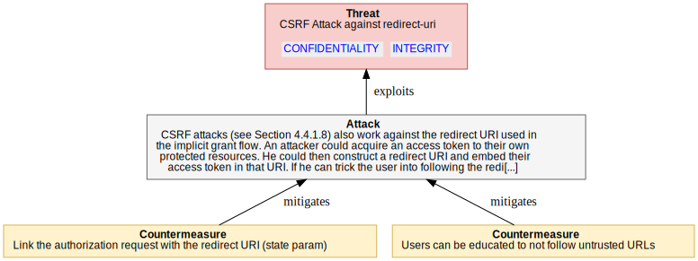

<dl markdown="block">

<dt>Assets (IDs) involved in this threat:</dt>

<dd markdown="block"> - <code><a href="#OAuth2.AUTHORIZATION_GRANT">AUTHORIZATION_GRANT</a></code> - Authorization Grant</dd>

  <dt>Attackers/threat agents:</dt>

<dd markdown="block"> - <code><a href="#OAuth2.ANONYMOUS">ANONYMOUS</a></code></dd>
  

<dt>Threat Description</dt><dd markdown="block">CSRF attacks (see Section 4.4.1.8) also work against the redirect URI
used in the implicit grant flow. An attacker could acquire an access
token to their own protected resources. He could then construct a
redirect URI and embed their access token in that URI. If he can
trick the user into following the redirect URI and the client does
not have protection against this attack, the user may have the
attacker’s access token authorized within their client.
</dd>
<dt>Impact</dt><dd markdown="block">The user accesses resources on behalf of the attacker. The
effective impact depends on the type of resource accessed. For
example, the user may upload private items to an attacker’s
resources. Or, when using OAuth in 3rd-party login scenarios, the
user may associate his client account with the attacker’s identity at
the external Identity Provider. In this way, the attacker could
easily access the victim’s data at the client by logging in from
another device with his credentials at the external Identity
Provider.
  <code><a href="#OAuth2.CONFIDENTIALITY">CONFIDENTIALITY</a></code><code><a href="#OAuth2.INTEGRITY">INTEGRITY</a></code></dd>

<dt>CVSS</dt>
<dd>

<strong>Base score:</strong> 5.4 (Medium) 
 
<strong>Vector:</strong><code>CVSS:3.1/AV:A/AC:H/PR:L/UI:N/S:U/C:H/I:L/A:N</code>
</dd>
</dl>

#### Counter-measures for `4_4_2_5_CSRF_IMPLICIT` 

<dl markdown="block">
    
**`STATE_PARAM_VALIDATION` Link the authorization request with the redirect URI (state param)** 
<dd markdown="block">
The "state" parameter should be used to link the authorization
request with the redirect URI used to deliver the access token.
This will ensure that the client is not tricked into completing
any redirect callback unless it is linked to an authorization
request initiated by the client. The "state" parameter should not
be guessable, and the client should be capable of keeping the
"state" parameter secret.
</dd>

<dd markdown="block">
<strong>Countermeasure implemented?</strong> 
&#10060;   <strong>Public and disclosable?</strong> 
&#10004;   <strong>Is operational?</strong>&#10004;
    (operated by CLIENT_OPERATOR)
</dd>

    
**Reference to `OAuth2.Flows.Flows_AuthCode.4_4_1_8_CSRF_ON_REDIRECT.USER_EDUCATION` Users can be educated to not follow untrusted URLs** 
<dd markdown="block">
Client developers and end users can be educated to not follow
untrusted URLs.    
</dd>

<dd markdown="block">
<strong>Countermeasure implemented?</strong> 
&#10060;   <strong>Public and disclosable?</strong> 
&#10004;   <strong>Is operational?</strong>&#10004;
    (operated by AUTHORIZATION_SERVER_OPERATOR)
</dd>

</dl>

### `(4_4_2_6_TOKEN_SUBSTITUTION)` Token Substitution (OAuth Login)

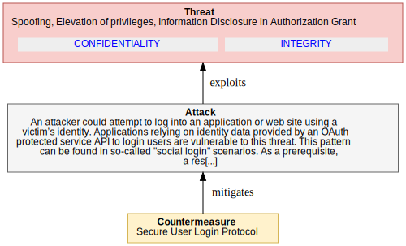

<dl markdown="block">

<dt>Assets (IDs) involved in this threat:</dt>

<dd markdown="block"> - <code><a href="#OAuth2.AUTHORIZATION_GRANT">AUTHORIZATION_GRANT</a></code> - Authorization Grant</dd>

  <dt>Attackers/threat agents:</dt>

<dd markdown="block"> - <code><a href="#OAuth2.ANONYMOUS">ANONYMOUS</a></code></dd>
  

<dt>Threat Description</dt><dd markdown="block">An attacker could attempt to log into an application or web site
using a victim’s identity. Applications relying on identity data
provided by an OAuth protected service API to login users are
vulnerable to this threat. This pattern can be found in so-called
"social login" scenarios.
As a prerequisite, a resource server offers an API to obtain personal
information about a user that could be interpreted as having obtained
a user identity. In this sense, the client is treating the resource
server API as an "identity" API. A client utilizes OAuth to obtain
an access token for the identity API. It then queries the identity
API for an identifier and uses it to look up its internal user
account data (login). The client assumes that, because it was able
to obtain information about the user, the user has been
authenticated.
To succeed, the attacker needs to gather a valid access token of the
respective victim from the same Identity Provider used by the target
client application. The attacker tricks the victim into logging into
a malicious app (which may appear to be legitimate to the Identity
Provider) using the same Identity Provider as the target application.
This results in the Identity Provider’s authorization server issuing
an access token for the respective identity API. The malicious app
then sends this access token to the attacker, which in turn triggers
a login process within the target application. The attacker now
manipulates the authorization response and substitutes their access
token (bound to their identity) for the victim’s access token. This
token is accepted by the identity API, since the audience, with
respect to the resource server, is correct. But since the identifier
returned by the identity API is determined by the identity in the
access token, the attacker is logged into the target application
under the victim’s identity.
</dd>
<dt>Impact</dt><dd markdown="block">The attacker gains access to an application and user-specific
 data within the application.
  <code><a href="#OAuth2.CONFIDENTIALITY">CONFIDENTIALITY</a></code><code><a href="#OAuth2.INTEGRITY">INTEGRITY</a></code></dd>

<dt>CVSS</dt>
<dd>

<strong>Base score:</strong> 5.4 (Medium) 
 
<strong>Vector:</strong><code>CVSS:3.1/AV:N/AC:H/PR:L/UI:R/S:U/C:H/I:L/A:N</code>
</dd>
</dl>

#### Counter-measures for `4_4_2_6_TOKEN_SUBSTITUTION` 

<dl markdown="block">
    
**Reference to `OAuth2.Flows.Flows_AuthCode.4_4_1_13_CODE_SUBSTITUTION.SECURE_USER_LOGIN_PROTOCOL` Secure User Login Protocol** 
<dd markdown="block">
Clients should use an appropriate protocol, such as OpenID (cf.
[OPENID]) or SAML (cf. [OASIS.sstc-saml-bindings-1.1]) to
implement user login. Both support audience restrictions on
clients.
</dd>

<dd markdown="block">
<strong>Countermeasure implemented?</strong> 
&#10060;   <strong>Public and disclosable?</strong> 
&#10004;   <strong>Is operational?</strong>&#10004;
    (operated by CLIENT_OPERATOR)
</dd>

</dl>

## Requests For Information

<ol></ol>

# Annex 1

 

 
 

# Corda NextGen operational security hardening guides

# Operational guide for AUTHORIZATION_SERVER

## Limiting the scope of access tokens obtained through automated approvals

**ID:** `OAuth2.AuthorizationServer.PUBLIC_CLIENT_SPOOFING1.REDUCED_ACCESS_TOKEN_SCOPE`

**Mitigates:** Malicious Client Obtains Existing Authorization by Fraud

**Operated by: **AUTHORIZATION_SERVER

Authorization servers can mitigate the risks associated with
automatic processing by limiting the scope of access tokens
obtained through automated approvals (Section 5.1.5.1).

## Secure transport layer to client to auth_server by tls

**ID:** `OAuth2.AuthorizationServer.4_3_1_EAVESDROPPING_ACCESS_TOKENS1.CLIENT_AUTH_SERVER_TLS`

**Mitigates:** Eavesdropping Access Tokens

**Operated by: **AUTHORIZATION_SERVER

As per the core OAuth spec, the authorization servers must ensure
that these transmissions are protected using transport-layer
mechanisms such as TLS (see Section 5.1.1).

## Checks on client's security policy

**ID:** `OAuth2.Client.Client_Secrets_disclosure.5_2_3_1_CLIENT_CHECK1`

**Mitigates:** Client Secrets Disclosure and impersonation

**Operated by: **AUTHORIZATION_SERVER

Don't issue secrets to public clients or clients with
inappropriate security policy

## Require user consent for public clients without secret

**ID:** `OAuth2.Client.Client_Secrets_disclosure.5_2_3_2_USER_CONSENT1`

**Mitigates:** Client Secrets Disclosure and impersonation

**Operated by: **AUTHORIZATION_SERVER

Authorization servers should not allow automatic authorization for
public clients.  The authorization server may issue an individual
client id but should require that all authorizations are approved by
the end user.  For clients without secrets, this is a countermeasure
against the following threat:
  -  Impersonation of public client applications.

## Issue a "client_id" only in combination with "redirect_uri"

**ID:** `OAuth2.Client.Client_Secrets_disclosure.5_2_3_3_CLIENT_ID_TO_REDIRECT_URI`

**Mitigates:** Client Secrets Disclosure and impersonation

**Operated by: **AUTHORIZATION_SERVER

The authorization server may issue a "client_id" and bind the
  "client_id" to a certain pre-configured "redirect_uri".  Any
  authorization request with another redirect URI is refused
  automatically.  Alternatively, the authorization server should not
  accept any dynamic redirect URI for such a "client_id" and instead
  should always redirect to the well-known pre-configured redirect URI.
  This is a countermeasure for clients without secrets against the
  following threats:

  -  Cross-site scripting attacks

  -  Impersonation of public client applications

## Validate pre-registered "redirect_uri"

**ID:** `OAuth2.Client.Client_Secrets_disclosure.5_2_3_5_VALIDATE_REDIRECT_URI`

**Mitigates:** Client Secrets Disclosure and impersonation

**Operated by: **AUTHORIZATION_SERVER

An authorization server should require all clients to register their
"redirect_uri", and the "redirect_uri" should be the full URI as
defined in [RFC6749].  The way that this registration is performed is
out of scope of this document.  As per the core spec, every actual
redirect URI sent with the respective "client_id" to the end-user
authorization endpoint must match the registered redirect URI.  Where
it does not match, the authorization server should assume that the
inbound GET request has been sent by an attacker and refuse it.
Note: The authorization server should not redirect the user agent
back to the redirect URI of such an authorization request.
Validating the pre-registered "redirect_uri" is a countermeasure
against the following threats:

o  Authorization "code" leakage through counterfeit web site: allows
    authorization servers to detect attack attempts after the first
    redirect to an end-user authorization endpoint (Section 4.4.1.7).

o  Open redirector attack via a client redirection endpoint
    (Section 4.1.5).

o  Open redirector phishing attack via an authorization server
    redirection endpoint (Section 4.2.4).

The underlying assumption of this measure is that an attacker will
need to use another redirect URI in order to get access to the
authorization "code".  Deployments might consider the possibility of
an attacker using spoofing attacks to a victim's device to circumvent
this security measure.

Note: Pre-registering clients might not scale in some deployments
(manual process) or require dynamic client registration (not
specified yet).  With the lack of dynamic client registration, a
pre-registered "redirect_uri" only works for clients bound to certain
deployments at development/configuration time.  As soon as dynamic
resource server discovery is required, the pre-registered
"redirect_uri" may no longer be feasible.
5_Validate_redirect_uri

Note: An invalid redirect URI indicates an
invalid client, whereas a valid redirect URI does not necessarily
indicate a valid client. The level of confidence depends on the
client type. For web applications, the level of confidence is
high, since the redirect URI refers to the globally unique network
endpoint of this application, whose fully qualified domain name
(FQDN) is also validated using HTTPS server authentication by the
user agent. In contrast, for native clients, the redirect URI
typically refers to device local resources, e.g., a custom scheme.
So, a malicious client on a particular device can use the valid
redirect URI the legitimate client uses on all other devices.

## Tls for the authorization server

**ID:** `OAuth2.AuthorizationServer.AuthServerPhishing1.5_1_2_AUTH_SERVER_AUTHENTICATION`

**Mitigates:** Password Phishing by Counterfeit Authorization Server

**Operated by: **AUTHORIZATION_SERVER

Authorization servers should consider such attacks when developing
services based on OAuth and should require the use of transport-
layer security for any requests where the authenticity of the
authorization server or of request responses is an issue (see
Section 5.1.2).

HTTPS server authentication or similar means can be used to
authenticate the identity of a server. The goal is to reliably bind
the fully qualified domain name of the server to the public key
presented by the server during connection establishment (see
[RFC2818]).
The client should validate the binding of the server to its domain
name. If the server fails to prove that binding, the communication
is considered a man-in-the-middle attack. This security measure
depends on the certification authorities the client trusts for that
purpose. Clients should carefully select those trusted CAs and
protect the storage for trusted CA certificates from modifications.
This is a countermeasure against the following threats:
 o Spoofing
 o Proxying
 o Phishing by counterfeit servers

## Users educated to avoid phishing attacks

**ID:** `OAuth2.AuthorizationServer.AuthServerPhishing1.USER_PHISHING_AWARENESS`

**Mitigates:** Password Phishing by Counterfeit Authorization Server

**Operated by: **AUTHORIZATION_SERVER

Authorization servers should attempt to educate users about the
risks posed by phishing attacks and should provide mechanisms that
make it easy for users to confirm the authenticity of their sites.
Section 5.1.2).

## Authorization_server policy discretional decision

**ID:** `OAuth2.Client.TOO_MUCH_GRANT.AUTH_SERVER_RE_CHECK_GRANTS`

**Mitigates:** User Unintentionally Grants Too Much Access Scope

**Operated by: **AUTHORIZATION_SERVER

Narrow the scope, based on the client.  When obtaining end-user
authorization and where the client requests scope, the
authorization server may want to consider whether to honor that
scope based on the client identifier.  That decision is between
the client and authorization server and is outside the scope of
this spec.  The authorization server may also want to consider
what scope to grant based on the client type, e.g., providing
lower scope to public clients (Section 5.1.5.1).

## Users educated to avoid phishing attacks

**ID:** `OAuth2.Client.TOO_MUCH_GRANT.USER_AUTH_AWARENESS`

**Mitigates:** User Unintentionally Grants Too Much Access Scope

**Operated by: **AUTHORIZATION_SERVER

Authorization servers should attempt to educate users about the
risks posed by phishing attacks and should provide mechanisms that
make it easy for users to confirm the authenticity of their sites.
Section 5.1.2).

## Authorization_server policy discretional decision

**ID:** `OAuth2.AuthorizationServer.TOO_MUCH_GRANT.AUTH_SERVER_RE_CHECK_GRANTS`

**Mitigates:** User Unintentionally Grants Too Much Access Scope

**Operated by: **AUTHORIZATION_SERVER

Narrow the scope, based on the client.  When obtaining end-user
authorization and where the client requests scope, the
authorization server may want to consider whether to honor that
scope based on the client identifier.  That decision is between
the client and authorization server and is outside the scope of
this spec.  The authorization server may also want to consider
what scope to grant based on the client type, e.g., providing
lower scope to public clients (Section 5.1.5.1).

## Users educated to avoid phishing attacks

**ID:** `OAuth2.AuthorizationServer.TOO_MUCH_GRANT.USER_AUTH_AWARENESS`

**Mitigates:** User Unintentionally Grants Too Much Access Scope

**Operated by: **AUTHORIZATION_SERVER

Authorization servers should attempt to educate users about the
risks posed by phishing attacks and should provide mechanisms that
make it easy for users to confirm the authenticity of their sites.
Section 5.1.2).

# Operational guide for The operators in the Authorization Server.
[...]

## Enforce standard system security means

**ID:** `OAuth2.AuthorizationServer.4_3_2_AS_DB_TOKEN_DISCLOSURE.5_1_4_1_1_SYS_SEC`

**Mitigates:** Obtaining Access Tokens from Authorization Server Database

**Operated by: **AUTHORIZATION_SERVER_OPERATOR

A server system may be locked down so that no attacker may get access
to sensitive configuration files and databases.

## Binding of authorization "code" to "client_id"

**ID:** `OAuth2.Flows.Flows_AuthCode.4_4_1_1_AUTH_CODE_DISCLOSURE.5_2_4_4_CLIENT_TO_CODE_BINDING`

**Mitigates:** Eavesdropping or Leaking Authorization codes

**Operated by: **AUTHORIZATION_SERVER_OPERATOR

The authorization server should bind every authorization "code" to
the id of the respective client that initiated the end-user
authorization process. This measure is a countermeasure against:
 o Replay of authorization "codes" with different client credentials,
since an attacker cannot use another "client_id" to exchange an
authorization "code" into a token
 o Online guessing of authorization "codes"
Note: This binding should be protected from unauthorized
modifications (e.g., using protected memory and/or a secure
database).
Also:
The authorization server will require the client to authenticate
wherever possible, so the binding of the authorization "code" to a
certain client can be validated in a reliable way (see
Section 5.2.4.4).

## Use short expiration time

**ID:** `OAuth2.Flows.Flows_AuthCode.4_4_1_1_AUTH_CODE_DISCLOSURE.5_1_5_3_SHORT_EXPIRY_CODE`

**Mitigates:** Eavesdropping or Leaking Authorization codes

**Operated by: **AUTHORIZATION_SERVER_OPERATOR

A short expiration time for tokens is a means of protection against
the following threats:
 o replay
 o token leak (a short expiration time will reduce impact)
 o online guessing (a short expiration time will reduce the
likelihood of success)
Note: Short token duration requires more precise clock
synchronization between the authorization server and resource server.
Furthermore, shorter duration may require more token refreshes
(access token) or repeated end-user authorization processes
(authorization "code" and refresh token).

## Limit number of usages or one-time usage

**ID:** `OAuth2.Flows.Flows_AuthCode.4_4_1_1_AUTH_CODE_DISCLOSURE.5_1_5_4_ONE_TIME_USE_TOKEN`

**Mitigates:** Eavesdropping or Leaking Authorization codes

**Operated by: **AUTHORIZATION_SERVER_OPERATOR

The authorization server may restrict the number of requests or
operations that can be performed with a certain token. This
mechanism can be used to mitigate the following threats:
 o replay of tokens
 o guessing
For example, if an authorization server observes more than one
attempt to redeem an authorization "code", the authorization server
may want to revoke all access tokens granted based on the
authorization "code" as well as reject the current request.
As with the authorization "code", access tokens may also have a
limited number of operations. This either forces client applications
to re-authenticate and use a refresh token to obtain a fresh access
token, or forces the client to re-authorize the access token by
involving the user.

## Automatic revocation of derived tokens if abuse is detected

**ID:** `OAuth2.Flows.Flows_AuthCode.4_4_1_1_AUTH_CODE_DISCLOSURE.5_2_1_1_TOKEN_ABUSE_DETECTION`

**Mitigates:** Eavesdropping or Leaking Authorization codes

**Operated by: **AUTHORIZATION_SERVER_OPERATOR

If an authorization server observes multiple attempts to redeem an
authorization grant (e.g., such as an authorization "code"), the
authorization server may want to revoke all tokens granted based on
the authorization grant

## Users can be educated to not follow untrusted urls

**ID:** `OAuth2.Flows.Flows_AuthCode.4_4_1_8_CSRF_ON_REDIRECT.USER_EDUCATION`

**Mitigates:** CSRF Attack against redirect-uri

**Operated by: **AUTHORIZATION_SERVER_OPERATOR

Client developers and end users can be educated to not follow
untrusted URLs.    

## Link the state parameter to user agent session (anti csrf)

**ID:** `OAuth2.Flows.Flows_AuthCode.4_4_1_9_CLICKJACKING.5_2_2_6_X_FRAME_OPTION`

**Mitigates:** Clickjacking Attack against Authorization

**Operated by: **AUTHORIZATION_SERVER_OPERATOR

For newer browsers, avoidance of iFrames can be enforced on the
  server side by using the X-FRAME-OPTIONS header (see
  [X-Frame-Options]). This header can have two values, "DENY" and
  "SAMEORIGIN", which will block any framing or any framing by sites
  with a different origin, respectively. The value "ALLOW-FROM"
  specifies a list of trusted origins that iFrames may originate from.
   This is a countermeasure against the following threat:

  o Clickjacking attacks

## Javascript frame-busting

**ID:** `OAuth2.Flows.Flows_AuthCode.4_4_1_9_CLICKJACKING.FRAMEBUSTING`

**Mitigates:** Clickjacking Attack against Authorization

**Operated by: **AUTHORIZATION_SERVER_OPERATOR

For older browsers, JavaScript frame-busting (see [Framebusting])
techniques can be used but may not be effective in all browsers. 

## Interactive (non automatic) user approval

**ID:** `OAuth2.Flows.Flows_AuthCode.4_4_1_10_RESOURCE_OWNER_SPOOFING1.INTERACTIVE_APPROVAL`

**Mitigates:** Resource Owner Impersonation

**Operated by: **AUTHORIZATION_SERVER_OPERATOR

Authorization servers should decide, based on an analysis of the risk
associated with this threat, whether to detect and prevent this
threat.
In order to prevent such an attack, the authorization server may
force a user interaction based on non-predictable input values as
part of the user consent approval. The authorization server could

o combine password authentication and user consent in a single form,

o make use of CAPTCHAs, or

o use one-time secrets sent out of band to the resource owner (e.g.,
via text or instant message).

## Notify user's approval

**ID:** `OAuth2.Flows.Flows_AuthCode.4_4_1_10_RESOURCE_OWNER_SPOOFING1.NOTIFY_APPROVAL`

**Mitigates:** Resource Owner Impersonation

**Operated by: **AUTHORIZATION_SERVER_OPERATOR

In order to allow the resource owner to detect abuse,
the authorization server could notify the resource owner of any
approval by appropriate means, e.g., text or instant message, or
email.

## Enforce credential storage protection best practices

**ID:** `OAuth2.AuthorizationServer.4_3_4_CLIENT_CREDENTIALS_DISCLOSURE.5_1_4_1_CRED_PROTECTION`

**Mitigates:** Obtaining Client Secret from Authorization Server Database

**Operated by: **AUTHORIZATION_SERVER_OPERATOR

Administrators should undertake industry best practices to protect
the storage of credentials (for example, see [OWASP]). Such
practices may include but are not limited to the following
sub-sections.

## Sign self-contained tokens

**ID:** `OAuth2.Flows.Flows_AuthCode.4_4_1_3_AUTH_CODE_BRUTE_FORCE.5_1_5_9_SIGNED_TOKEN`

**Mitigates:** Online Guessing of Authorization codes

**Operated by: **AUTHORIZATION_SERVER_OPERATOR

Self-contained tokens should be signed in order to detect any attempt
to modify or produce faked tokens (e.g., Hash-based Message
Authentication Code or digital signatures).

## Binding of authorization "code" to "redirect_uri"

**ID:** `OAuth2.Flows.Flows_AuthCode.4_4_1_3_AUTH_CODE_BRUTE_FORCE.5_2_4_5_REDIRECT_CODE_BINDING`

**Mitigates:** Online Guessing of Authorization codes

**Operated by: **AUTHORIZATION_SERVER_OPERATOR

The authorization server should be able to bind every authorization
"code" to the actual redirect URI used as the redirect target of the
client in the end-user authorization process. This binding should be
validated when the client attempts to exchange the respective
authorization "code" for an access token. This measure is a
countermeasure against authorization "code" leakage through
counterfeit web sites, since an attacker cannot use another redirect
URI to exchange an authorization "code" into a token.

## Automatic processing of repeated authorizations requires client validation

**ID:** `OAuth2.Flows.Flows_AuthCode.4_4_1_4_CLIENT_SPOOFING1.5_2_4_1_REPEAT_VALIDATE_CLIENT`

**Mitigates:** Malicious Client Obtains Authorization

**Operated by: **AUTHORIZATION_SERVER_OPERATOR

Authorization servers should NOT automatically process repeat
authorizations where the client is not authenticated through a client
secret or some other authentication mechanism such as a signed
authentication assertion certificate (Section 5.2.3.7) or validation
of a pre-registered redirect URI (Section 5.2.3.5).

## Automatic processing of repeated authorizations requires client validation

**ID:** `OAuth2.Flows.Flows_AuthCode.4_4_1_4_CLIENT_SPOOFING1.REQUIRE_USER_MANUAL_STEP`

**Mitigates:** Malicious Client Obtains Authorization

**Operated by: **AUTHORIZATION_SERVER_OPERATOR

If the authorization server automatically authenticates the end
user, it may nevertheless require some user input in order to
prevent screen scraping. Examples are CAPTCHAs (Completely
Automated Public Turing tests to tell Computers and Humans Apart)
or other multi-factor authentication techniques such as random
questions, token code generators, etc.

## Limit token scope

**ID:** `OAuth2.Flows.Flows_AuthCode.4_4_1_4_CLIENT_SPOOFING1.5_1_5_1_LIMITED_SCOPE_TOKEN`

**Mitigates:** Malicious Client Obtains Authorization

**Operated by: **AUTHORIZATION_SERVER_OPERATOR

The authorization server may decide to reduce or limit the scope
associated with a token. The basis of this decision is out of scope;
examples are:

 o a client-specific policy, e.g., issue only less powerful tokens to
public clients,
 o a service-specific policy, e.g., it is a very sensitive service,
 o a resource-owner-specific setting, or
 o combinations of such policies and preferences.

The authorization server may allow different scopes dependent on the
grant type. For example, end-user authorization via direct
interaction with the end user (authorization "code") might be
considered more reliable than direct authorization via grant type
"username"/"password". This means will reduce the impact of the
following threats:
 o token leakage
 o token issuance to malicious software
 o unintended issuance of powerful tokens with resource owner
credentials flow

## Issue installation-specific client secrets

**ID:** `OAuth2.Client.Client_Secrets_disclosure.5_2_3_4_SPECIFIC_CLIENT_SECRETS`

**Mitigates:** Client Secrets Disclosure and impersonation

**Operated by: **AUTHORIZATION_SERVER_OPERATOR

An authorization server may issue separate client identifiers and
corresponding secrets to the different installations of a particular
client (i.e., software package).  The effect of such an approach
would be to turn otherwise "public" clients back into "confidential"
clients.

For web applications, this could mean creating one "client_id" and
"client_secret" for each web site on which a software package is
installed.  So, the provider of that particular site could request a
client id and secret from the authorization server during the setup
of the web site.  This would also allow the validation of some of the
properties of that web site, such as redirect URI, web site URL, and
whatever else proves useful.  The web site provider has to ensure the
security of the client secret on the site.

For native applications, things are more complicated because every
copy of a particular application on any device is a different
installation.  Installation-specific secrets in this scenario will
require obtaining a "client_id" and "client_secret" either

1.  during the download process from the application market, or

2.  during installation on the device.

Either approach will require an automated mechanism for issuing
client ids and secrets, which is currently not defined by OAuth.

The first approach would allow the achievement of a certain level of
trust in the authenticity of the application, whereas the second
option only allows the authentication of the installation but not the
validation of properties of the client.  But this would at least help
to prevent several replay attacks.  Moreover, installation-specific
"client_ids" and secrets allow the selective revocation of all
refresh tokens of a specific installation at once.

## Limit access tokens granted per user

**ID:** `OAuth2.Flows.Flows_AuthCode.4_4_1_11_DOS_TOKEN_ENTROPY.AUTH_SERVER_PER_USER_LIMIT`

**Mitigates:** Resource Owner Impersonation

**Operated by: **AUTHORIZATION_SERVER_OPERATOR

The authorization server should consider limiting the number of
access tokens granted per user.

## Make responses non-cacheable.

**ID:** `OAuth2.Flows.Flows_ImplicitGrant.4_4_2_2_TOKEN_LEAK2_BROWSER_HISTORY.NON_CACHEABLE_RESPONSES`

**Mitigates:** Access Token Leak in Browser History

**Operated by: **AUTHORIZATION_SERVER_OPERATOR

Make responses non-cacheable.

## Clients indicate their ids in requests

**ID:** `OAuth2.Flows.Flows_AuthCode.4_4_1_13_CODE_SUBSTITUTION.IN_REQUEST_CLIENTID`

**Mitigates:** DoS Using Manufactured Authorization "codes"

**Operated by: **AUTHORIZATION_SERVER_OPERATOR

All clients must indicate their client ids with every request to
exchange an authorization "code" for an access token. The
authorization server must validate whether the particular
authorization "code" has been issued to the particular client. If
possible, the client shall be authenticated beforehand.

## Client limits authenticated users codes

**ID:** `OAuth2.Flows.Flows_AuthCode.4_4_1_12_DOS2.AUTH_RATE_LIMIT`

**Mitigates:** DoS Using Manufactured Authorization "codes"

**Operated by: **AUTHORIZATION_SERVER_OPERATOR

The authorization server should send an error response to the
client reporting an invalid authorization "code" and rate-limit or
disallow connections from clients whose number of invalid requests
exceeds a threshold.

# Operational guide for The operators of the CLIENT.
[...]

## Reload the target page

**ID:** `OAuth2.Flows.Flows_AuthCode.4_4_1_1_AUTH_CODE_DISCLOSURE.USER_AGENT_PAGE_RELOAD`

**Mitigates:** Eavesdropping or Leaking Authorization codes

**Operated by: **CLIENT_OPERATOR

The client server may reload the target page of the redirect URI
in order to automatically clean up the browser cache.

## Link the state parameter to user agent session (anti csrf)

**ID:** `OAuth2.Flows.Flows_AuthCode.4_4_1_8_CSRF_ON_REDIRECT.5_3_5_ANTI_CSRF_STATE_PARAM`

**Mitigates:** CSRF Attack against redirect-uri

**Operated by: **CLIENT_OPERATOR

The "state" parameter is used to link client requests and prevent CSRF attacks, for example, attacks against the redirect URI. An attacker could inject their own authorization "code" or access token, which can result in the client using an access token associated with the attacker’s protected resources rather than the victim’s (e.g., save the victim’s bank account information to a protected resource controlled by the attacker). The client should utilize the "state" request parameter to send the authorization server a value that binds the request to the user agent’s authenticated state (e.g., a hash of the session cookie used to authenticate the user agent) when making an authorization request. Once authorization has been obtained from the end user, the authorization server redirects the end-user’s user agent back to the client with the required binding value contained in the "state" parameter. The binding value enables the client to verify the validity of the request by matching the binding value to the user agent’s authenticated state.

## Ensure confidentiality of requests (tls)

**ID:** `OAuth2.AuthorizationServer.4_3_3_CLIENT_CREDENTIALS_DISCLOSURE.5_1_1_CONFIDENTIAL_REQUESTS`

**Mitigates:** Disclosure of Client Credentials during Transmission

**Operated by: **CLIENT_OPERATOR

This is applicable to all requests sent from the client to the
authorization server or resource server. While OAuth provides a
mechanism for verifying the integrity of requests, it provides no
guarantee of request confidentiality. Unless further precautions are
taken, eavesdroppers will have full access to request content and may
be able to mount interception or replay attacks by using the contents
of requests, e.g., secrets or tokens.
Attacks can be mitigated by using transport-layer mechanisms such as
TLS [RFC5246]. A virtual private network (VPN), e.g., based on IPsec
VPNs [RFC4301], may be considered as well.
Note: This document assumes end-to-end TLS protected connections
between the respective protocol entities. Deployments deviating from
this assumption by offloading TLS in between (e.g., on the data
center edge) must refine this threat model in order to account for
the additional (mainly insider) threat this may cause.
This is a countermeasure against the following threats:
 o Replay of access tokens obtained on the token’s endpoint or the
resource server’s endpoint
 o Replay of refresh tokens obtained on the token’s endpoint
Replay of authorization "codes" obtained on the token’s endpoint
(redirect?)
 o Replay of user passwords and client secrets

## Secure user login protocol

**ID:** `OAuth2.Flows.Flows_AuthCode.4_4_1_13_CODE_SUBSTITUTION.SECURE_USER_LOGIN_PROTOCOL`

**Mitigates:** DoS Using Manufactured Authorization "codes"

**Operated by: **CLIENT_OPERATOR

Clients should use an appropriate protocol, such as OpenID (cf.
[OPENID]) or SAML (cf. [OASIS.sstc-saml-bindings-1.1]) to
implement user login. Both support audience restrictions on
clients.

## One-time, per-use secrets (e.g., "client_secret")

**ID:** `OAuth2.Flows.Flows_ImplicitGrant.4_4_2_4_MANIPULATION_SCRIPTS.ONE_TIME_PER_USE_SECRET`

**Mitigates:** Manipulation of Scripts

**Operated by: **CLIENT_OPERATOR

Introduce one-time, per-use secrets (e.g., "client_secret") values
that can only be used by scripts in a small time window once
loaded from a server. The intention would be to reduce the
effectiveness of copying client-side scripts for re-use in an
attacker’s modified code.

## Link the authorization request with the redirect uri (state param)

**ID:** `OAuth2.Flows.Flows_ImplicitGrant.4_4_2_5_CSRF_IMPLICIT.STATE_PARAM_VALIDATION`

**Mitigates:** CSRF Attack against redirect-uri

**Operated by: **CLIENT_OPERATOR

The "state" parameter should be used to link the authorization
request with the redirect URI used to deliver the access token.
This will ensure that the client is not tricked into completing
any redirect callback unless it is linked to an authorization
request initiated by the client. The "state" parameter should not
be guessable, and the client should be capable of keeping the
"state" parameter secret.

## Client limits authenticated users codes

**ID:** `OAuth2.Flows.Flows_AuthCode.4_4_1_12_DOS2.CLIENT_LIMITS_PER_USER`

**Mitigates:** DoS Using Manufactured Authorization "codes"

**Operated by: **CLIENT_OPERATOR

If the client authenticates the user, either through a single-
sign-on protocol or through local authentication, the client
should suspend the access by a user account if the number of
invalid authorization "codes" submitted by this user exceeds a
certain threshold.

# Operational guide for An entity capable of granting access to a protecte[...]

## Validation of client properties by end user

**ID:** `OAuth2.Flows.Flows_AuthCode.4_4_1_4_CLIENT_SPOOFING1.5_2_4_3_VALIDATION_OF_CLIENT_BY_END_USER`

**Mitigates:** Malicious Client Obtains Authorization

**Operated by: **RESOURCE_OWNER

In the authorization process, the user is typically asked to approve
a client’s request for authorization. This is an important security
mechanism by itself because the end user can be involved in the
validation of client properties, such as whether the client name
known to the authorization server fits the name of the web site or
the application the end user is using. This measure is especially
helpful in situations where the authorization server is unable to
authenticate the client. It is a countermeasure against:
 o A malicious application
 o A client application masquerading as another client

# Annex 2

 

 

# Keys classification

  

## Credentials

  

<table markdown="block" style="print-color-adjust: exact; -webkit-print-color-adjust: exact;">
  <tr>
    <th>Title (ID)</th><th>Description</th><th>Properties</th>
  </tr>

  <tr>
    <td><strong><a href="#OAuth2.AUTHORIZATION_GRANT">Authorization Grant</a></strong></td>
    <td><b>
    
    credential
    </b> An authorization grant is a credential representing the resource
owner's authorization (to access its protected resources) used by the
client to obtain an access token.  This specification defines four
grant types -- authorization code, implicit, resource owner password
credentials, and client credentials -- as well as an extensibility
mechanism for defining additional types.
</td>
    <td></td>
  </tr>
</table>

